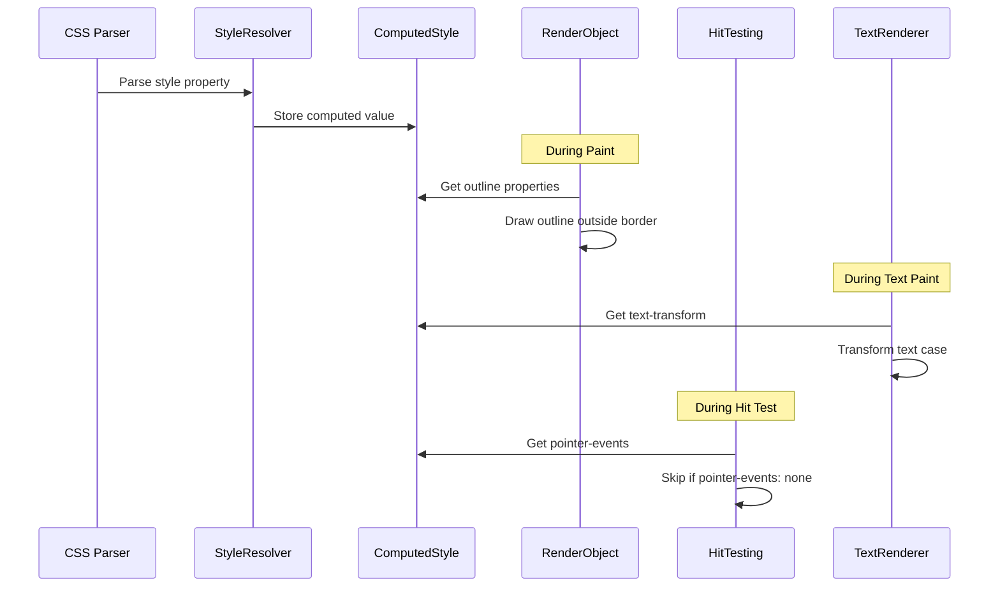

# Design Document: CSS Basic Interaction Properties

## Overview

This design document describes the implementation of Phase 1 CSS properties for the MBink rendering engine: `outline`, `text-transform`, `pointer-events`, `user-select`, and `word-break`. These properties are essential for proper focus states, text formatting, and user interaction control in modern web applications.

The implementation follows the existing architecture patterns in MBink, extending the `ComputedStyle` structure, `StyleResolver` parsing, and rendering pipeline.

## Architecture

### High-Level Architecture

```
┌─────────────────────────────────────────────────────────────────┐
│                        CSS Properties Flow                       │
├─────────────────────────────────────────────────────────────────┤
│                                                                  │
│  CSS Input ──► StyleResolver ──► ComputedStyle ──► Rendering    │
│                    │                   │              │          │
│                    ▼                   ▼              ▼          │
│              ParseStyleProperty   Store Values   Apply Effects   │
│                                                                  │
│  Properties:                                                     │
│  ┌──────────────┬────────────────┬─────────────────────────┐    │
│  │ outline-*    │ ComputedStyle  │ RenderObject::Paint()   │    │
│  │ text-transform│ ComputedStyle │ TextRenderer::Paint()   │    │
│  │ pointer-events│ ComputedStyle │ HitTesting::HitTest()   │    │
│  │ user-select  │ ComputedStyle  │ TextSelection (future)  │    │
│  │ word-break   │ ComputedStyle  │ TextLayout (Taffy)      │    │
│  └──────────────┴────────────────┴─────────────────────────┘    │
│                                                                  │
└─────────────────────────────────────────────────────────────────┘
```

### Component Interaction



## Components and Interfaces

### 1. ComputedStyle Extensions

The `ComputedStyle` structure in `core/render/render_object.h` already has outline properties defined. We need to add the remaining properties:

```cpp
// Already exists in ComputedStyle:
// CSSLength outline_width;
// std::string outline_style = "none";
// SkColor outline_color = SK_ColorBLACK;
// CSSLength outline_offset;

// New properties to add:
std::string text_transform = "none";     // none, uppercase, lowercase, capitalize
std::string pointer_events = "auto";     // auto, none
std::string user_select = "auto";        // auto, none, text, all
std::string word_break = "normal";       // normal, break-all, keep-all, break-word
```

### 2. StyleResolver Extensions

Add parsing logic in `StyleResolver::ParseStyleProperty()`:

```cpp
// Outline shorthand parsing
void ParseOutlineShorthand(ComputedStyle& style, const std::string& value);

// Individual property parsing
void ParseOutlineWidth(ComputedStyle& style, const std::string& value);
void ParseOutlineStyle(ComputedStyle& style, const std::string& value);
void ParseOutlineColor(ComputedStyle& style, const std::string& value);
void ParseOutlineOffset(ComputedStyle& style, const std::string& value);

// Text and interaction properties
void ParseTextTransform(ComputedStyle& style, const std::string& value);
void ParsePointerEvents(ComputedStyle& style, const std::string& value);
void ParseUserSelect(ComputedStyle& style, const std::string& value);
void ParseWordBreak(ComputedStyle& style, const std::string& value);
```

### 3. Rendering Components

#### 3.1 Outline Rendering

Add outline painting in `RenderObject::Paint()` after border painting:

```cpp
void RenderObject::PaintOutline(SkCanvas* canvas) {
    const auto& style = GetComputedStyle();
    
    if (style.outline_style == "none") return;
    
    float outline_width = style.outline_width.ToPx(style.font_size);
    if (outline_width <= 0) return;
    
    float offset = style.outline_offset.ToPx(style.font_size);
    
    // Draw outline outside border + offset
    SkRect outline_rect = GetLayoutInfo().border_rect;
    outline_rect.outset(offset + outline_width / 2, offset + outline_width / 2);
    
    SkPaint paint;
    paint.setStyle(SkPaint::kStroke_Style);
    paint.setStrokeWidth(outline_width);
    paint.setColor(style.outline_color);
    
    // Apply outline style (solid, dashed, dotted)
    ApplyOutlineStyle(paint, style.outline_style);
    
    canvas->drawRect(outline_rect, paint);
}
```

#### 3.2 Text Transform

Add text transformation in `TextRenderer` or `RenderText::Paint()`:

```cpp
std::string TransformText(const std::string& text, const std::string& transform) {
    if (transform == "uppercase") {
        return ToUpperCase(text);
    } else if (transform == "lowercase") {
        return ToLowerCase(text);
    } else if (transform == "capitalize") {
        return Capitalize(text);
    }
    return text;  // "none" or unknown
}
```

### 4. Hit Testing Extensions

Modify `HitTesting::HitTestRecursive()` to check `pointer-events`:

```cpp
bool HitTesting::HitTestRecursive(...) {
    // ... existing code ...
    
    const auto& style = render_object->GetComputedStyle();
    
    // Check pointer-events property
    if (style.pointer_events == "none") {
        // Skip this element, but still check children
        // (children may have pointer-events: auto)
        for (auto it = children.rbegin(); it != children.rend(); ++it) {
            if (HitTestRecursive(*it, ...)) {
                return true;
            }
        }
        return false;  // Don't return this element as hit target
    }
    
    // ... rest of existing code ...
}
```

### 5. Inheritance Configuration

Add new inheritable properties in `StyleResolver` constructor:

```cpp
StyleResolver::StyleResolver() {
    inheritable_properties_ = {
        // ... existing properties ...
        "pointer-events",
        "user-select",
        "word-break",
        // Note: text-transform is NOT inherited by default in CSS
        // Note: outline properties are NOT inherited
    };
}
```

## Data Models

### Outline Style Enum (Optional Enhancement)

```cpp
enum class CSSOutlineStyle {
    NONE,
    SOLID,
    DASHED,
    DOTTED,
    DOUBLE
};
```

### Text Transform Enum (Optional Enhancement)

```cpp
enum class CSSTextTransform {
    NONE,
    UPPERCASE,
    LOWERCASE,
    CAPITALIZE
};
```

### Pointer Events Enum (Optional Enhancement)

```cpp
enum class CSSPointerEvents {
    AUTO,
    NONE
    // Future: visiblePainted, visibleFill, visibleStroke, visible, painted, fill, stroke, all
};
```

## Correctness Properties

*A property is a characteristic or behavior that should hold true across all valid executions of a system-essentially, a formal statement about what the system should do. Properties serve as the bridge between human-readable specifications and machine-verifiable correctness guarantees.*

### Property 1: Outline Property Parsing Round-Trip
*For any* valid outline shorthand value (e.g., "2px solid red"), parsing it and then reconstructing the shorthand from the stored components should produce an equivalent value.
**Validates: Requirements 1.1, 1.2, 1.4, 1.5**

### Property 2: Outline Does Not Affect Layout
*For any* element with outline properties set, the element's layout dimensions (width, height, margin, padding, border) should be identical to the same element without outline.
**Validates: Requirements 1.7**

### Property 3: Text Transform Preserves Length for Uppercase/Lowercase
*For any* ASCII text string, applying uppercase or lowercase text-transform should produce a string of the same length as the original.
**Validates: Requirements 2.1, 2.2**

### Property 4: Text Transform Capitalize First Characters
*For any* text string with words separated by whitespace, applying capitalize text-transform should result in each word's first character being uppercase (if it's a letter).
**Validates: Requirements 2.3**

### Property 5: Text Transform None is Identity
*For any* text string, applying text-transform: none should produce output identical to the input.
**Validates: Requirements 2.4**

### Property 6: Text Transform Does Not Modify DOM
*For any* element with text-transform applied, the DOM textContent should remain unchanged after rendering.
**Validates: Requirements 2.5**

### Property 7: Pointer Events None Skips Element in Hit Test
*For any* element with pointer-events: none positioned over another element, hit testing at the overlapping position should return the element underneath, not the one with pointer-events: none.
**Validates: Requirements 3.1, 3.3**

### Property 8: Pointer Events Inheritance
*For any* parent element with pointer-events value, child elements without explicit pointer-events should inherit the parent's value.
**Validates: Requirements 3.4**

### Property 9: User Select Inheritance
*For any* parent element with user-select value, child elements without explicit user-select should inherit the parent's value.
**Validates: Requirements 4.5**

### Property 10: Word Break Normal Preserves Words
*For any* text with word-break: normal, line breaks should only occur at whitespace or hyphenation points, never within a word.
**Validates: Requirements 5.1**

### Property 11: Word Break All Allows Any Break
*For any* text with word-break: break-all in a constrained container, the text should fit within the container width by breaking at any character position if necessary.
**Validates: Requirements 5.2**

## Error Handling

### Invalid Property Values

When parsing CSS properties, invalid values should be ignored and the property should retain its default or inherited value:

```cpp
void StyleResolver::ParseOutlineStyle(ComputedStyle& style, const std::string& value) {
    if (value == "none" || value == "solid" || value == "dashed" || 
        value == "dotted" || value == "double") {
        style.outline_style = value;
    }
    // Invalid values are silently ignored (CSS behavior)
}
```

### Edge Cases

1. **Empty outline-width**: Treat as 0, which means no outline is drawn
2. **Negative outline-offset**: Valid in CSS, outline moves inward
3. **text-transform on non-text elements**: No effect, but property is stored
4. **pointer-events on elements with no children**: Element becomes "click-through"
5. **word-break on single-character text**: No effect needed

## Testing Strategy

### Dual Testing Approach

This implementation uses both unit tests and property-based tests:

1. **Unit Tests**: Verify specific examples and edge cases
2. **Property-Based Tests**: Verify universal properties across random inputs

### Property-Based Testing Framework

Use **RapidCheck** for C++ property-based testing:
- Library: https://github.com/emil-e/rapidcheck
- Minimum iterations: 100 per property test
- Each test tagged with: `**Feature: css-basic-interaction-properties, Property N: <property_text>**`

### Test Categories

#### 1. Parsing Tests (Unit + Property)
- Test outline shorthand parsing with various combinations
- Test individual property parsing with valid/invalid values
- Property test: round-trip parsing consistency

#### 2. Rendering Tests (Unit)
- Test outline is drawn at correct position
- Test outline respects offset
- Test outline style variations (solid, dashed, dotted)

#### 3. Text Transform Tests (Property)
- Test uppercase/lowercase transformations
- Test capitalize with various word boundaries
- Test DOM content remains unchanged

#### 4. Hit Testing Tests (Property)
- Test pointer-events: none skips element
- Test pointer-events inheritance
- Test nested elements with mixed pointer-events

#### 5. Layout Tests (Property)
- Test outline does not affect layout
- Test word-break affects line breaking

### Test File Structure

```
tests/
├── unit/
│   └── render/
│       ├── test_outline_parsing.cpp
│       ├── test_text_transform.cpp
│       ├── test_pointer_events.cpp
│       └── test_word_break.cpp
└── property/
    └── render/
        ├── test_outline_properties.cpp
        ├── test_text_transform_properties.cpp
        └── test_pointer_events_properties.cpp
```

### Property Test Example

```cpp
// **Feature: css-basic-interaction-properties, Property 3: Text Transform Preserves Length**
RC_GTEST_PROP(TextTransform, PreservesLengthForUpperLower, (std::string text)) {
    // Filter to ASCII text only
    RC_PRE(std::all_of(text.begin(), text.end(), [](char c) { 
        return c >= 0 && c < 128; 
    }));
    
    std::string upper = TransformText(text, "uppercase");
    std::string lower = TransformText(text, "lowercase");
    
    RC_ASSERT(upper.length() == text.length());
    RC_ASSERT(lower.length() == text.length());
}
```
