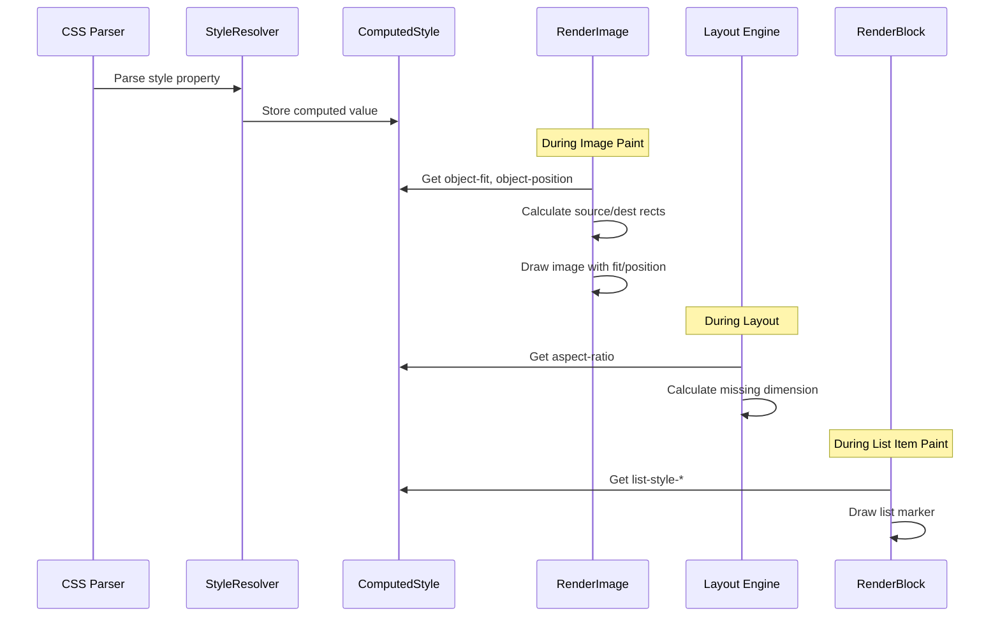

# Design Document: CSS Media and Layout Properties

## Overview

This design document describes the implementation of Phase 2 CSS properties for the MBink rendering engine: `object-fit`, `object-position`, `aspect-ratio`, and `list-style-*`. These properties are essential for proper image/video display, responsive layouts, and styled lists in modern web applications.

The implementation follows the existing architecture patterns in MBink, extending the `ComputedStyle` structure, `StyleResolver` parsing, and rendering pipeline.

## Architecture

### High-Level Architecture

```
┌─────────────────────────────────────────────────────────────────┐
│                        CSS Properties Flow                       │
├─────────────────────────────────────────────────────────────────┤
│                                                                  │
│  CSS Input ──► StyleResolver ──► ComputedStyle ──► Rendering    │
│                    │                   │              │          │
│                    ▼                   ▼              ▼          │
│              ParseStyleProperty   Store Values   Apply Effects   │
│                                                                  │
│  Properties:                                                     │
│  ┌──────────────────┬────────────────┬─────────────────────┐    │
│  │ object-fit       │ ComputedStyle  │ RenderImage::Paint  │    │
│  │ object-position  │ ComputedStyle  │ RenderImage::Paint  │    │
│  │ aspect-ratio     │ ComputedStyle  │ Layout Engine       │    │
│  │ list-style-*     │ ComputedStyle  │ RenderBlock::Paint  │    │
│  └──────────────────┴────────────────┴─────────────────────┘    │
│                                                                  │
└─────────────────────────────────────────────────────────────────┘
```

### Component Interaction



## Components and Interfaces

### 1. ComputedStyle Extensions

Add new properties to `ComputedStyle` in `core/render/render_object.h`:

```cpp
// Object fit/position for replaced elements (img, video)
std::string object_fit = "fill";           // fill, contain, cover, none, scale-down
std::string object_position = "50% 50%";   // position value

// Aspect ratio
struct AspectRatio {
    bool is_auto = true;
    float ratio = 0.0f;  // width / height, 0 means no ratio
    
    bool HasRatio() const { return ratio > 0.0f; }
};
AspectRatio aspect_ratio;

// List style
std::string list_style_type = "disc";      // disc, circle, square, decimal, etc.
std::string list_style_position = "outside"; // inside, outside
std::string list_style_image;              // URL or empty
```

### 2. StyleResolver Extensions

Add parsing logic in `StyleResolver::ParseStyleProperty()`:

```cpp
// Object fit/position parsing
void ParseObjectFit(ComputedStyle& style, const std::string& value);
void ParseObjectPosition(ComputedStyle& style, const std::string& value);

// Aspect ratio parsing
void ParseAspectRatio(ComputedStyle& style, const std::string& value);

// List style parsing
void ParseListStyleType(ComputedStyle& style, const std::string& value);
void ParseListStylePosition(ComputedStyle& style, const std::string& value);
void ParseListStyleImage(ComputedStyle& style, const std::string& value);
void ParseListStyleShorthand(ComputedStyle& style, const std::string& value);
```

### 3. Rendering Components

#### 3.1 Object Fit/Position in RenderImage

```cpp
// core/render/render_object.cpp or dedicated image renderer

struct FitResult {
    SkRect src_rect;   // Source rectangle in image coordinates
    SkRect dst_rect;   // Destination rectangle in element coordinates
};

FitResult CalculateObjectFit(
    const SkSize& image_size,
    const SkRect& container_rect,
    const std::string& object_fit,
    const std::string& object_position
) {
    FitResult result;
    
    float img_aspect = image_size.width() / image_size.height();
    float container_aspect = container_rect.width() / container_rect.height();
    
    if (object_fit == "fill") {
        // Stretch to fill, ignore aspect ratio
        result.src_rect = SkRect::MakeWH(image_size.width(), image_size.height());
        result.dst_rect = container_rect;
    }
    else if (object_fit == "contain") {
        // Fit within container, preserve aspect ratio
        float scale = std::min(
            container_rect.width() / image_size.width(),
            container_rect.height() / image_size.height()
        );
        float scaled_w = image_size.width() * scale;
        float scaled_h = image_size.height() * scale;
        
        // Apply object-position
        auto [offset_x, offset_y] = ParseObjectPosition(object_position, 
            container_rect.width() - scaled_w,
            container_rect.height() - scaled_h);
        
        result.src_rect = SkRect::MakeWH(image_size.width(), image_size.height());
        result.dst_rect = SkRect::MakeXYWH(
            container_rect.x() + offset_x,
            container_rect.y() + offset_y,
            scaled_w, scaled_h
        );
    }
    else if (object_fit == "cover") {
        // Cover container, preserve aspect ratio, clip excess
        float scale = std::max(
            container_rect.width() / image_size.width(),
            container_rect.height() / image_size.height()
        );
        float scaled_w = image_size.width() * scale;
        float scaled_h = image_size.height() * scale;
        
        // Calculate source rect (clipping)
        auto [offset_x, offset_y] = ParseObjectPosition(object_position,
            scaled_w - container_rect.width(),
            scaled_h - container_rect.height());
        
        float src_x = offset_x / scale;
        float src_y = offset_y / scale;
        float src_w = container_rect.width() / scale;
        float src_h = container_rect.height() / scale;
        
        result.src_rect = SkRect::MakeXYWH(src_x, src_y, src_w, src_h);
        result.dst_rect = container_rect;
    }
    else if (object_fit == "none") {
        // Natural size, no scaling
        auto [offset_x, offset_y] = ParseObjectPosition(object_position,
            container_rect.width() - image_size.width(),
            container_rect.height() - image_size.height());
        
        result.src_rect = SkRect::MakeWH(image_size.width(), image_size.height());
        result.dst_rect = SkRect::MakeXYWH(
            container_rect.x() + offset_x,
            container_rect.y() + offset_y,
            image_size.width(), image_size.height()
        );
    }
    else if (object_fit == "scale-down") {
        // Use 'none' or 'contain', whichever is smaller
        if (image_size.width() <= container_rect.width() &&
            image_size.height() <= container_rect.height()) {
            // Image fits naturally, use 'none'
            return CalculateObjectFit(image_size, container_rect, "none", object_position);
        } else {
            // Image too large, use 'contain'
            return CalculateObjectFit(image_size, container_rect, "contain", object_position);
        }
    }
    
    return result;
}
```

#### 3.2 Aspect Ratio in Layout

```cpp
// In layout calculation (NativeLayoutEngine or RenderObject::UpdateLayoutStyle)

void ApplyAspectRatio(ComputedStyle& style, float available_width, float available_height) {
    if (!style.aspect_ratio.HasRatio()) return;
    
    float ratio = style.aspect_ratio.ratio;
    bool has_width = !style.width.IsAuto();
    bool has_height = !style.height.IsAuto();
    
    if (has_width && has_height) {
        // Both specified, ignore aspect-ratio
        return;
    }
    
    if (has_width && !has_height) {
        // Calculate height from width
        float width = style.width.ToPx(available_width);
        style.height = CSSLength(width / ratio, CSSUnit::PX);
    }
    else if (!has_width && has_height) {
        // Calculate width from height
        float height = style.height.ToPx(available_height);
        style.width = CSSLength(height * ratio, CSSUnit::PX);
    }
    else {
        // Neither specified, use available width
        style.width = CSSLength(available_width, CSSUnit::PX);
        style.height = CSSLength(available_width / ratio, CSSUnit::PX);
    }
}
```

#### 3.3 List Style Rendering

```cpp
// In RenderBlock::Paint for <li> elements

void PaintListMarker(SkCanvas* canvas, const ComputedStyle& style, 
                     const LayoutInfo& layout, int item_index) {
    if (style.list_style_type == "none") return;
    
    // Calculate marker position
    float marker_x, marker_y;
    if (style.list_style_position == "outside") {
        marker_x = layout.x - 20.0f;  // Outside content box
    } else {
        marker_x = layout.x + layout.padding_left;  // Inside content box
    }
    marker_y = layout.y + layout.padding_top + style.font_size * 0.5f;
    
    // Check for custom image
    if (!style.list_style_image.empty()) {
        // Draw image marker
        DrawImageMarker(canvas, style.list_style_image, marker_x, marker_y);
        return;
    }
    
    // Draw type-based marker
    std::string marker_text;
    
    if (style.list_style_type == "disc") {
        DrawFilledCircle(canvas, marker_x, marker_y, 3.0f);
    }
    else if (style.list_style_type == "circle") {
        DrawUnfilledCircle(canvas, marker_x, marker_y, 3.0f);
    }
    else if (style.list_style_type == "square") {
        DrawFilledSquare(canvas, marker_x, marker_y, 5.0f);
    }
    else if (style.list_style_type == "decimal") {
        marker_text = std::to_string(item_index + 1) + ".";
    }
    else if (style.list_style_type == "decimal-leading-zero") {
        marker_text = (item_index < 9 ? "0" : "") + std::to_string(item_index + 1) + ".";
    }
    else if (style.list_style_type == "lower-roman") {
        marker_text = ToLowerRoman(item_index + 1) + ".";
    }
    else if (style.list_style_type == "upper-roman") {
        marker_text = ToUpperRoman(item_index + 1) + ".";
    }
    else if (style.list_style_type == "lower-alpha") {
        marker_text = std::string(1, 'a' + (item_index % 26)) + ".";
    }
    else if (style.list_style_type == "upper-alpha") {
        marker_text = std::string(1, 'A' + (item_index % 26)) + ".";
    }
    
    if (!marker_text.empty()) {
        DrawTextMarker(canvas, marker_text, marker_x, marker_y, style);
    }
}

// Roman numeral conversion
std::string ToLowerRoman(int num) {
    static const std::vector<std::pair<int, std::string>> roman = {
        {1000, "m"}, {900, "cm"}, {500, "d"}, {400, "cd"},
        {100, "c"}, {90, "xc"}, {50, "l"}, {40, "xl"},
        {10, "x"}, {9, "ix"}, {5, "v"}, {4, "iv"}, {1, "i"}
    };
    std::string result;
    for (const auto& [value, symbol] : roman) {
        while (num >= value) {
            result += symbol;
            num -= value;
        }
    }
    return result;
}
```

### 4. Inheritance Configuration

Add inheritable properties in `StyleResolver` constructor:

```cpp
StyleResolver::StyleResolver() {
    inheritable_properties_ = {
        // ... existing properties ...
        "list-style-type",
        "list-style-position",
        "list-style-image"
        // Note: object-fit, object-position, aspect-ratio are NOT inherited
    };
}
```

## Data Models

### ObjectFit Enum (Optional Enhancement)

```cpp
enum class CSSObjectFit {
    FILL,
    CONTAIN,
    COVER,
    NONE,
    SCALE_DOWN
};
```

### AspectRatio Structure

```cpp
struct CSSAspectRatio {
    bool is_auto = true;
    float ratio = 0.0f;  // width / height
    
    static CSSAspectRatio Parse(const std::string& value);
    bool HasRatio() const { return ratio > 0.0f; }
};
```

### ListStyleType Enum (Optional Enhancement)

```cpp
enum class CSSListStyleType {
    DISC,
    CIRCLE,
    SQUARE,
    DECIMAL,
    DECIMAL_LEADING_ZERO,
    LOWER_ROMAN,
    UPPER_ROMAN,
    LOWER_ALPHA,
    UPPER_ALPHA,
    NONE
};
```

## Correctness Properties

### Property 1: Object Fit Contain Preserves Aspect Ratio
*For any* image with `object-fit: contain`, the displayed image aspect ratio should equal the original image aspect ratio.
**Validates: Requirements 1.2**

### Property 2: Object Fit Cover Fills Container
*For any* image with `object-fit: cover`, the displayed image should completely cover the container with no empty space.
**Validates: Requirements 1.3**

### Property 3: Object Position Centers by Default
*For any* image without explicit `object-position`, the content should be centered (equivalent to `50% 50%`).
**Validates: Requirements 2.5**

### Property 4: Aspect Ratio Calculates Missing Dimension
*For any* element with `aspect-ratio` set and only one dimension specified, the other dimension should be calculated correctly.
**Validates: Requirements 3.5, 3.6**

### Property 5: Aspect Ratio Ignored When Both Dimensions Set
*For any* element with both width and height explicitly set, the `aspect-ratio` property should have no effect.
**Validates: Requirements 3.4**

### Property 6: List Style Type Inheritance
*For any* `<li>` element without explicit `list-style-type`, it should inherit the value from its parent `<ul>` or `<ol>`.
**Validates: Requirements 4.15**

### Property 7: List Style None Hides Marker
*For any* list item with `list-style-type: none`, no marker should be rendered.
**Validates: Requirements 4.10**

### Property 8: Decimal List Markers Sequential
*For any* ordered list with `list-style-type: decimal`, markers should be sequential integers starting from 1.
**Validates: Requirements 4.4**

## Error Handling

### Invalid Property Values

When parsing CSS properties, invalid values should be ignored and the property should retain its default or inherited value:

```cpp
void StyleResolver::ParseObjectFit(ComputedStyle& style, const std::string& value) {
    if (value == "fill" || value == "contain" || value == "cover" || 
        value == "none" || value == "scale-down") {
        style.object_fit = value;
    }
    // Invalid values are silently ignored (CSS behavior)
}
```

### Edge Cases

1. **Zero-dimension images**: Handle gracefully, display nothing
2. **Negative aspect-ratio**: Treat as invalid, ignore
3. **Missing list-style-image**: Fall back to list-style-type
4. **Invalid Roman numeral range**: Wrap around or use decimal fallback
5. **object-position with single value**: Apply to both axes

## Testing Strategy

### Property-Based Testing

Use property-based tests to verify universal properties:

1. **Object Fit Tests**: Verify aspect ratio preservation, container coverage
2. **Aspect Ratio Tests**: Verify dimension calculations
3. **List Style Tests**: Verify marker rendering and inheritance

### Test Categories

#### 1. Parsing Tests (Unit)
- Test object-fit value parsing
- Test object-position value parsing (keywords, percentages, lengths)
- Test aspect-ratio value parsing (ratios, auto)
- Test list-style shorthand parsing

#### 2. Layout Tests (Property)
- Test aspect-ratio dimension calculations
- Test list-style-position layout impact

#### 3. Rendering Tests (Visual)
- Test object-fit visual output
- Test list marker rendering

### Test File Structure

```
tests/
├── unit/
│   └── render/
│       ├── test_object_fit_parsing.cpp
│       ├── test_aspect_ratio_parsing.cpp
│       └── test_list_style_parsing.cpp
└── property/
    └── render/
        ├── test_object_fit_properties.cpp
        ├── test_aspect_ratio_properties.cpp
        └── test_list_style_properties.cpp
```
