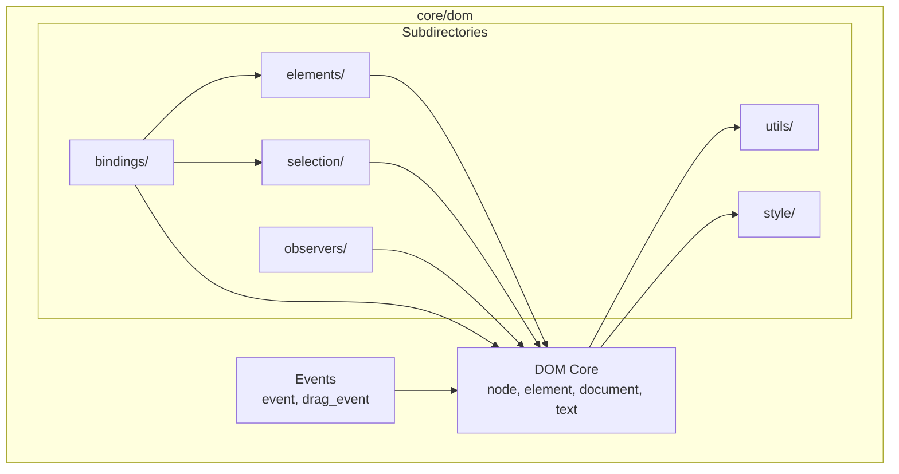

# Design Document: DOM Directory Reorganization

## Overview

本设计文档描述了 `core/dom` 目录的重组方案。目标是将当前包含 18 个源文件的根目录按职责划分为逻辑子目录，使每个目录的文件数量符合代码规范（≤10 个文件为正常，>15 个需重组）。

### 当前状态

```
core/dom/                          # 18 个源文件 🔴 需重组
├── elements/                      # 24 个源文件 ✅ 可接受（单一职责高内聚）
├── node.cpp/h                     # DOM 核心
├── element.cpp/h                  # DOM 核心
├── document.cpp/h                 # DOM 核心
├── text.cpp/h                     # DOM 核心
├── event.cpp/h                    # 事件
├── drag_event.cpp/h               # 事件
├── dom_bindings.cpp/h             # JS 绑定
├── canvas_bindings.cpp/h          # JS 绑定
├── dom_observer.cpp/h             # 观察者
├── mutation_observer.cpp/h        # 观察者
├── dirty_node_tracker.cpp/h       # 观察者
├── selection.cpp/h                # 选择
├── range.cpp/h                    # 选择
├── selector_engine.cpp/h          # 选择
├── css_style_declaration.cpp/h    # 样式
├── incremental_style_recalc.cpp/h # 样式
├── dom_token_list.cpp/h           # 工具
└── dom_string_map.cpp/h           # 工具
```

### 目标状态

```
core/dom/                          # 6 个源文件 ✅ 正常
├── elements/                      # 24 个源文件（保持不变）
├── bindings/                      # 2 个源文件
├── observers/                     # 3 个源文件
├── selection/                     # 3 个源文件
├── style/                         # 2 个源文件
├── utils/                         # 2 个源文件
├── node.cpp/h                     # DOM 核心（保留）
├── element.cpp/h                  # DOM 核心（保留）
├── document.cpp/h                 # DOM 核心（保留）
├── text.cpp/h                     # DOM 核心（保留）
├── event.cpp/h                    # 事件（保留）
└── drag_event.cpp/h               # 事件（保留）
```

## Architecture

### 目录层级结构

```
core/dom/
├── CMakeLists.txt                 # 主构建配置
├── README.md                      # 模块文档（更新）
│
├── node.cpp/h                     # 基础节点类
├── element.cpp/h                  # 元素节点类
├── document.cpp/h                 # 文档对象
├── text.cpp/h                     # 文本节点类
├── event.cpp/h                    # 事件基类
├── drag_event.cpp/h               # 拖拽事件
│
├── bindings/                      # JavaScript 绑定
│   ├── CMakeLists.txt
│   ├── README.md
│   ├── dom_bindings.cpp/h
│   └── canvas_bindings.cpp/h
│
├── observers/                     # 观察者模式实现
│   ├── CMakeLists.txt
│   ├── README.md
│   ├── dom_observer.cpp/h
│   ├── mutation_observer.cpp/h
│   └── dirty_node_tracker.cpp/h
│
├── selection/                     # 文本选择功能
│   ├── CMakeLists.txt
│   ├── README.md
│   ├── selection.cpp/h
│   ├── range.cpp/h
│   └── selector_engine.cpp/h
│
├── style/                         # 样式相关
│   ├── CMakeLists.txt
│   ├── css_style_declaration.cpp/h
│   └── incremental_style_recalc.cpp/h
│
├── utils/                         # 工具类
│   ├── CMakeLists.txt
│   ├── dom_token_list.cpp/h
│   └── dom_string_map.cpp/h
│
└── elements/                      # HTML 元素（保持不变）
    ├── CMakeLists.txt
    ├── README.md
    └── html_*.cpp/h
```

### 依赖关系图



## Components and Interfaces

### 1. DOM Core（根目录保留）

| 文件 | 职责 | 依赖 |
|------|------|------|
| `node.cpp/h` | 基础节点类，树结构管理 | utils/ |
| `element.cpp/h` | 元素节点，属性管理 | node, style/, utils/ |
| `document.cpp/h` | 文档对象，元素创建 | node, element |
| `text.cpp/h` | 文本节点 | node |
| `event.cpp/h` | 事件基类 | - |
| `drag_event.cpp/h` | 拖拽事件 | event |

### 2. bindings/ - JavaScript 绑定

| 文件 | 职责 | 依赖 |
|------|------|------|
| `dom_bindings.cpp/h` | DOM API 绑定到 QuickJS | core, elements/, selection/ |
| `canvas_bindings.cpp/h` | Canvas API 绑定 | core, elements/ |

### 3. observers/ - 观察者模式

| 文件 | 职责 | 依赖 |
|------|------|------|
| `dom_observer.cpp/h` | DOM 变化观察基类 | core |
| `mutation_observer.cpp/h` | MutationObserver 实现 | dom_observer |
| `dirty_node_tracker.cpp/h` | 脏节点追踪 | core |

### 4. selection/ - 文本选择

| 文件 | 职责 | 依赖 |
|------|------|------|
| `selection.cpp/h` | 文本选择管理 | core, range |
| `range.cpp/h` | 范围对象 | core |
| `selector_engine.cpp/h` | CSS 选择器引擎 | core |

### 5. style/ - 样式相关

| 文件 | 职责 | 依赖 |
|------|------|------|
| `css_style_declaration.cpp/h` | style 属性实现 | - |
| `incremental_style_recalc.cpp/h` | 增量样式重算 | core |

### 6. utils/ - 工具类

| 文件 | 职责 | 依赖 |
|------|------|------|
| `dom_token_list.cpp/h` | classList 实现 | - |
| `dom_string_map.cpp/h` | dataset 实现 | - |

## Data Models

### 文件移动映射表

| 原路径 | 新路径 |
|--------|--------|
| `core/dom/dom_bindings.cpp/h` | `core/dom/bindings/dom_bindings.cpp/h` |
| `core/dom/canvas_bindings.cpp/h` | `core/dom/bindings/canvas_bindings.cpp/h` |
| `core/dom/dom_observer.cpp/h` | `core/dom/observers/dom_observer.cpp/h` |
| `core/dom/mutation_observer.cpp/h` | `core/dom/observers/mutation_observer.cpp/h` |
| `core/dom/dirty_node_tracker.cpp/h` | `core/dom/observers/dirty_node_tracker.cpp/h` |
| `core/dom/selection.cpp/h` | `core/dom/selection/selection.cpp/h` |
| `core/dom/range.cpp/h` | `core/dom/selection/range.cpp/h` |
| `core/dom/selector_engine.cpp/h` | `core/dom/selection/selector_engine.cpp/h` |
| `core/dom/css_style_declaration.cpp/h` | `core/dom/style/css_style_declaration.cpp/h` |
| `core/dom/incremental_style_recalc.cpp/h` | `core/dom/style/incremental_style_recalc.cpp/h` |
| `core/dom/dom_token_list.cpp/h` | `core/dom/utils/dom_token_list.cpp/h` |
| `core/dom/dom_string_map.cpp/h` | `core/dom/utils/dom_string_map.cpp/h` |

### Include 路径变更

| 原 Include | 新 Include |
|------------|------------|
| `#include "core/dom/dom_bindings.h"` | `#include "core/dom/bindings/dom_bindings.h"` |
| `#include "core/dom/canvas_bindings.h"` | `#include "core/dom/bindings/canvas_bindings.h"` |
| `#include "core/dom/dom_observer.h"` | `#include "core/dom/observers/dom_observer.h"` |
| `#include "core/dom/mutation_observer.h"` | `#include "core/dom/observers/mutation_observer.h"` |
| `#include "core/dom/dirty_node_tracker.h"` | `#include "core/dom/observers/dirty_node_tracker.h"` |
| `#include "core/dom/selection.h"` | `#include "core/dom/selection/selection.h"` |
| `#include "core/dom/range.h"` | `#include "core/dom/selection/range.h"` |
| `#include "core/dom/selector_engine.h"` | `#include "core/dom/selection/selector_engine.h"` |
| `#include "core/dom/css_style_declaration.h"` | `#include "core/dom/style/css_style_declaration.h"` |
| `#include "core/dom/incremental_style_recalc.h"` | `#include "core/dom/style/incremental_style_recalc.h"` |
| `#include "core/dom/dom_token_list.h"` | `#include "core/dom/utils/dom_token_list.h"` |
| `#include "core/dom/dom_string_map.h"` | `#include "core/dom/utils/dom_string_map.h"` |

## Correctness Properties

*A property is a characteristic or behavior that should hold true across all valid executions of a system-essentially, a formal statement about what the system should do. Properties serve as the bridge between human-readable specifications and machine-verifiable correctness guarantees.*

由于本规范是目录重组（非功能性变更），正确性主要通过以下验证：

Property 1: Build Success
*For any* valid source configuration, after reorganization the project SHALL compile without errors.
**Validates: Requirements 9.3**

Property 2: Test Suite Integrity
*For any* existing test case, after reorganization the test SHALL produce the same result as before.
**Validates: Requirements 9.4**

Property 3: File Count Compliance
*For any* directory in the reorganized structure, the number of source files SHALL not exceed 15.
**Validates: Requirements 1.1**

## Error Handling

### 潜在问题及解决方案

| 问题 | 解决方案 |
|------|----------|
| Include 路径未更新导致编译失败 | 使用全局搜索替换更新所有引用 |
| CMakeLists.txt 路径错误 | 验证每个子目录的 CMakeLists.txt 配置 |
| 循环依赖 | 使用前向声明打破循环 |
| 链接错误 | 确保库依赖顺序正确 |

## Testing Strategy

### 验证方法

1. **编译验证**
   - 在 Windows/Linux/macOS 上执行完整构建
   - 确保无编译错误和警告

2. **测试验证**
   - 运行现有单元测试
   - 运行集成测试
   - 确保所有测试通过

3. **结构验证**
   - 检查每个目录的文件数量
   - 验证 CMakeLists.txt 存在
   - 验证 README.md 存在（3+ 文件的目录）

### 回滚计划

如果重组导致问题：
1. 使用 Git 回滚到重组前的提交
2. 分析失败原因
3. 修复后重新执行重组
