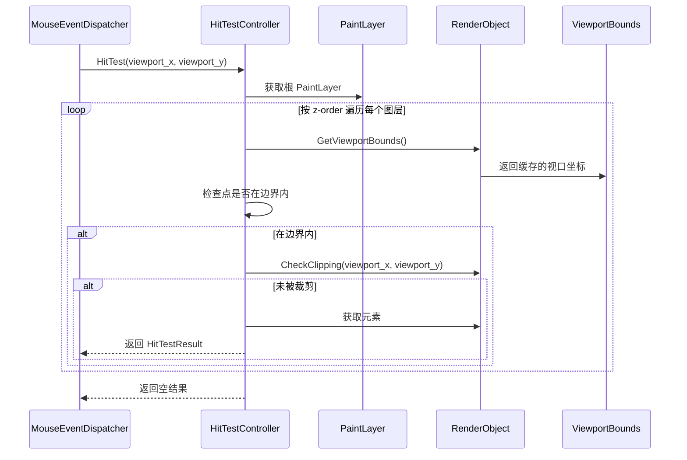
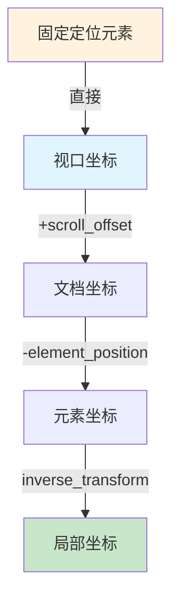

# 设计文档：命中测试系统重构

## 概述

本文档描述了 LightUI 命中测试系统的重构设计。该重构创建了一个统一的命中测试架构，采用**视口坐标缓存策略**，在布局完成后预计算每个元素的视口坐标，命中测试时直接使用缓存进行快速边界检查。

### 当前问题

1. **逻辑分散**：命中测试代码存在于 `HitTesting`、`PaintLayer::HitTest` 和 `HitTestRecursiveInternal` 中，行为不一致
2. **坐标混乱**：没有显式跟踪坐标变换；视口、文档和图层局部坐标混合在一起
3. **特殊情况处理**：固定定位和高 z-index 元素被作为特殊情况处理，而不是通过统一的 z-order 遍历
4. **合成器图层不匹配**：提升到独立合成器图层的元素命中测试不正确，因为边界在文档坐标系中

### 设计目标

1. 所有命中测试的单一入口点
2. 通过 `ViewportBounds` 缓存预计算视口坐标，避免遍历时动态计算
3. 统一的 z-order 遍历（无特殊情况处理）
4. 正确处理固定定位、高 z-index、滚动和变换元素
5. DevTools 集成用于调试

### 核心策略：视口坐标缓存

**唯一策略**：在布局完成后，为每个 `RenderObject` 预计算并缓存其在视口坐标系中的边界（`ViewportBounds`）。命中测试时直接使用缓存的视口坐标进行边界检查，无需在遍历时动态累积变换。

**优点**：
- 命中测试时间复杂度降低（O(1) 边界检查 vs O(depth) 坐标累积）
- 代码逻辑简单，无需维护变换状态栈
- 缓存可在多次命中测试间复用

**缓存更新时机**：
- 布局完成后批量更新
- 滚动时只更新受影响的子树
- 动画帧更新时只更新动画元素

## 架构

```
┌─────────────────────────────────────────────────────────────────────┐
│                        MouseEventDispatcher                          │
│                               │                                      │
│                               ▼                                      │
│                    ┌─────────────────────┐                          │
│                    │   HitTestController  │  ← 单一入口点             │
│                    │   (新类)             │                          │
│                    └─────────────────────┘                          │
│                               │                                      │
│              ┌────────────────┼────────────────┐                    │
│              ▼                ▼                ▼                    │
│    ┌─────────────────┐ ┌─────────────┐ ┌─────────────────┐         │
│    │  ViewportBounds │ │  PaintLayer │ │  HitTestResult  │         │
│    │    (缓存)       │ │  (现有)      │ │  (增强)         │         │
│    │                 │ │             │ │                 │         │
│    └─────────────────┘ └─────────────┘ └─────────────────┘         │
│              │                │                                      │
│              │                ▼                                      │
│              │      ┌─────────────────┐                             │
│              └─────►│ Z-Order 列表    │                             │
│                     │ (正/负)         │                             │
│                     └─────────────────┘                             │
└─────────────────────────────────────────────────────────────────────┘
```

## 组件和接口

### 1. HitTestController（新类）

所有命中测试操作的中央控制器。替换分散的命中测试逻辑。使用预计算的 `ViewportBounds` 缓存进行快速边界检查。

```cpp
/**
 * @file hit_test_controller.h
 * @brief 统一的命中测试控制器
 */

#pragma once

#include <memory>
#include "core/event/input/hit_testing.h"

namespace lightui {

class Document;
class PaintLayer;
class RenderObject;

/**
 * @brief 命中测试请求选项
 */
struct HitTestRequest {
    bool list_based = false;        // 返回所有元素，而不仅仅是最顶层的
    bool ignore_clipping = false;   // 忽略溢出裁剪
    bool ignore_pointer_events = false;  // 忽略 pointer-events:none
    bool for_devtools = false;      // 为 DevTools 包含额外的元数据
};

/**
 * @brief 统一的命中测试控制器
 *
 * 所有命中测试操作的单一入口点。
 * 使用预计算的 ViewportBounds 缓存进行命中测试，无需动态累积变换。
 */
class HitTestController {
public:
    HitTestController();
    ~HitTestController();

    /**
     * @brief 主命中测试入口点
     * @param document 要测试的文档
     * @param viewport_x 视口空间中的 X 坐标
     * @param viewport_y 视口空间中的 Y 坐标
     * @param request 命中测试选项
     * @return 命中测试结果
     */
    HitTestResult HitTest(
        std::shared_ptr<Document> document,
        float viewport_x,
        float viewport_y,
        const HitTestRequest& request = HitTestRequest());

    /**
     * @brief 基于矩形的命中测试
     * @param document 要测试的文档
     * @param rect 视口空间中的命中测试矩形
     * @param request 命中测试选项
     * @return 命中测试结果列表
     */
    std::vector<HitTestResult> HitTestRect(
        std::shared_ptr<Document> document,
        const SkRect& rect,
        const HitTestRequest& request = HitTestRequest());

    /**
     * @brief 解释为什么元素未被命中
     * @param document 文档
     * @param element 要检查的元素
     * @param viewport_x X 坐标
     * @param viewport_y Y 坐标
     * @return 解释字符串
     */
    std::string ExplainMiss(
        std::shared_ptr<Document> document,
        std::shared_ptr<Element> element,
        float viewport_x,
        float viewport_y);

    /**
     * @brief 启用/禁用调试日志
     */
    void SetDebugMode(bool enabled) { debug_mode_ = enabled; }

private:
    /**
     * @brief 在 PaintLayer 树上递归命中测试（使用缓存的视口坐标）
     */
    bool HitTestLayer(
        PaintLayer* layer,
        float viewport_x,
        float viewport_y,
        HitTestResult& result,
        const HitTestRequest& request);

    /**
     * @brief 检查点是否在元素的视口边界内（使用缓存）
     */
    bool IsInsideViewportBounds(
        RenderObject* render_obj,
        float viewport_x,
        float viewport_y);

    /**
     * @brief 检查点是否被裁剪（clip-path、border-radius、overflow）
     */
    bool IsClipped(
        RenderObject* render_obj,
        float viewport_x,
        float viewport_y,
        const HitTestRequest& request);

    /**
     * @brief 计算局部坐标（用于结果返回）
     */
    void ComputeLocalCoordinates(
        RenderObject* render_obj,
        float viewport_x,
        float viewport_y,
        float& local_x,
        float& local_y);

    bool debug_mode_ = false;
};

} // namespace lightui
```

### 2. ViewportBounds（缓存结构）

在 `RenderObject` 中缓存的视口坐标边界。在布局完成后预计算，命中测试时直接使用。

```cpp
/**
 * @brief 视口坐标边界缓存
 *
 * 存储元素在视口坐标系中的边界信息。
 * 在布局完成后计算并缓存，避免命中测试时动态计算。
 */
struct ViewportBounds {
    float x = 0;                    // 视口 X 坐标
    float y = 0;                    // 视口 Y 坐标
    float width = 0;                // 宽度
    float height = 0;               // 高度
    bool valid = false;             // 缓存是否有效

    // CSS Transform 相关
    SkRect transformed_bounds;      // 变换后的边界框（如果有 transform）
    SkMatrix transform;             // CSS 变换矩阵（用于计算局部坐标）
    bool has_transform = false;     // 是否有 CSS 变换
    bool transform_invertible = true; // 变换是否可逆

    /**
     * @brief 检查视口点是否在边界内
     */
    bool Contains(float viewport_x, float viewport_y) const {
        if (!valid) return false;

        const SkRect& rect = has_transform ? transformed_bounds
            : SkRect::MakeXYWH(x, y, width, height);
        return rect.contains(viewport_x, viewport_y);
    }

    /**
     * @brief 将视口坐标转换为局部坐标
     */
    void ToLocalCoordinates(float viewport_x, float viewport_y,
                            float& local_x, float& local_y) const {
        if (has_transform && transform_invertible) {
            SkMatrix inverse;
            if (transform.invert(&inverse)) {
                SkPoint local = inverse.mapPoint(
                    {viewport_x - x, viewport_y - y});
                local_x = local.x();
                local_y = local.y();
                return;
            }
        }
        // 无变换或变换不可逆，直接计算
        local_x = viewport_x - x;
        local_y = viewport_y - y;
    }
};
```

### 3. 增强的 HitTestResult

扩展以包含 DevTools 集成的额外元数据。

```cpp
/**
 * @brief 增强的命中测试结果，包含 DevTools 元数据
 */
struct HitTestResult {
    std::shared_ptr<Element> element;       // 命中的元素
    std::shared_ptr<RenderObject> render_object;  // 命中的渲染对象
    float local_x = 0;                      // 局部 X 坐标
    float local_y = 0;                      // 局部 Y 坐标

    // DevTools 元数据（当 request.for_devtools = true 时填充）
    struct DevToolsInfo {
        int z_index = 0;
        bool is_stacking_context = false;
        std::string stacking_context_reason;
        SkMatrix transform;
        SkRect bounds;
        std::vector<std::string> clip_chain;  // 祖先裁剪
    };
    std::optional<DevToolsInfo> devtools_info;

    bool IsValid() const { return element != nullptr; }
};
```

### 4. 修改的 PaintLayer

现有的 `PaintLayer` 类将被修改以与新的 `HitTestController` 配合工作。

```cpp
// PaintLayer 类的新增内容

class PaintLayer {
public:
    // ... 现有方法 ...

    /**
     * @brief 获取此图层的 CSS 变换
     * @return 变换矩阵，如果没有则为单位矩阵
     */
    SkMatrix GetCSSTransform() const;

    /**
     * @brief 检查此图层是否裁剪其子元素
     * @return 如果是 overflow:hidden 或类似则为 true
     */
    bool ClipsChildren() const;

    /**
     * @brief 获取此图层的裁剪矩形
     * @return 局部坐标中的裁剪矩形
     */
    SkRect GetClipRect() const;

    /**
     * @brief 检查此图层是否有 clip-path
     */
    bool HasClipPath() const;

    /**
     * @brief 测试点是否在 clip-path 内
     * @param local_point 局部坐标中的点
     * @return 如果在内部或没有 clip-path 则为 true
     */
    bool IsInsideClipPath(const SkPoint& local_point) const;

    /**
     * @brief 检查此图层是否有 border-radius 裁剪
     */
    bool HasBorderRadiusClip() const;

    /**
     * @brief 测试点是否在 border-radius 内
     * @param local_point 局部坐标中的点
     * @return 如果在内部或没有 border-radius 则为 true
     */
    bool IsInsideBorderRadius(const SkPoint& local_point) const;
};
```

## 现有代码分析与集成设计

本节详细分析 LightUI 现有的代码结构，并说明新的命中测试系统如何与之集成。

### 现有类结构分析

#### 1. DOM 层：Node 和 Element

```
Node (core/dom/node.h)
├── node_type_: NodeType          // 节点类型（ELEMENT_NODE, TEXT_NODE 等）
├── parent_node_: weak_ptr<Node>  // 父节点（弱引用）
├── child_nodes_: vector<shared_ptr<Node>>  // 子节点列表
├── render_object_: weak_ptr<RenderObject>  // 关联的渲染对象（弱引用）
├── dirty_flags_: uint32_t        // 脏标记（LAYOUT, PAINT, STYLE）
└── node_flags_: uint32_t         // 增量更新标志位

Element (core/dom/element.h) : Node
├── tag_name_: string             // 标签名（div, span 等）
├── attributes_: map<string, string>  // 属性映射
├── styles_: map<string, string>  // 内联样式
├── event_listeners_: map<string, vector<EventListenerEntry>>  // 事件监听器
├── pseudo_classes_: map<string, bool>  // CSS 伪类状态（:hover, :active 等）
└── lexbor_element_: lxb_dom_node_t*  // Lexbor DOM 同步
```

**命中测试相关要点**：
- `Element` 是命中测试的最终目标，`HitTestResult.element` 返回 `shared_ptr<Element>`
- `GetRenderObject()` 获取关联的渲染对象，用于获取布局信息
- `pseudo_classes_` 用于 `:hover`、`:active` 等状态管理，命中测试后需要更新

#### 2. 渲染层：RenderObject

```
RenderObject (core/render/objects/render_object.h)
├── type_: RenderObjectType       // 渲染类型（BLOCK, INLINE, TEXT 等）
├── node_: weak_ptr<Node>         // 关联的 DOM 节点
├── parent_: weak_ptr<RenderObject>  // 父渲染对象
├── children_: vector<shared_ptr<RenderObject>>  // 子渲染对象
│
├── computed_style_: ComputedStyle  // 计算后的样式（关键！）
│   ├── position: string          // static, relative, absolute, fixed
│   ├── z_index: int              // z-index 值
│   ├── overflow/overflow_x/overflow_y: string  // 溢出处理
│   ├── transform: optional<CSSTransform>  // CSS 变换
│   ├── transform_origin: TransformOrigin  // 变换原点
│   ├── opacity: float            // 透明度
│   ├── pointer_events: string    // auto, none
│   ├── clip_path: optional<CSSClipPath>  // 裁剪路径
│   └── border_radius: CSSBorderRadius  // 圆角
│
├── layout_info_: LayoutInfo      // 布局信息（关键！）
│   ├── x, y: float               // 相对于父元素的位置
│   ├── width, height: float      // 尺寸
│   ├── content_rect: SkRect      // 内容区域
│   ├── padding_rect: SkRect      // Padding 区域
│   ├── border_rect: SkRect       // Border 区域
│   └── is_laid_out: bool         // 是否已布局
│
├── scroll_x_, scroll_y_: float   // 滚动偏移
├── content_width_, content_height_: float  // 内容尺寸
│
└── paint_layer_: unique_ptr<PaintLayer>  // 绘制层（可能为空）
```

**命中测试相关要点**：
- `layout_info_` 提供元素的位置和尺寸，是边界检查的基础
- `computed_style_.position` 决定坐标计算方式（fixed 特殊处理）
- `computed_style_.z_index` 决定 z-order 排序
- `computed_style_.pointer_events` 决定是否可命中
- `computed_style_.transform` 需要应用逆变换进行坐标映射
- `scroll_x_/scroll_y_` 需要累积到子元素的坐标计算中

#### 3. 图层系统：PaintLayer

```
PaintLayer (core/render/layer/paint_layer.h)
├── render_object_: RenderObject*  // 关联的渲染对象（原始指针）
├── parent_: PaintLayer*          // 父图层
├── children_: vector<PaintLayer*>  // 子图层
│
├── pos_z_order_list_: vector<PaintLayer*>  // 正 z-index 列表
├── neg_z_order_list_: vector<PaintLayer*>  // 负 z-index 列表
├── z_order_dirty_: bool          // z-order 是否需要更新
│
├── compositor_layer_: shared_ptr<CompositorLayer>  // 合成层（GPU 加速）
└── promotion_reason_: LayerPromotionReason  // 层提升原因
```

**现有命中测试实现分析**：

```cpp
// PaintLayer::HitTest 现有实现（简化）
bool PaintLayer::HitTest(float x, float y, HitTestResult& result) {
    // 1. 更新 z-order 列表
    UpdateZOrderLists();
    
    // 2. 先测试正 z-index 子层（从高到低）
    for (auto it = pos_z_order_list_.rbegin(); ...) {
        if ((*it)->HitTest(x, y, result)) return true;
    }
    
    // 3. 测试 fixed 子元素（特殊处理！）
    for (auto& child : render_object_->GetChildren()) {
        if (child->GetComputedStyle().position == "fixed") {
            if (HitTestRenderObject(child.get(), x, y, 0, 0, result, false))
                return true;
        }
    }
    
    // 4. 测试自身边界
    float abs_x, abs_y;
    GetAbsolutePosition(abs_x, abs_y);
    if (x >= abs_x && x < abs_x + layout.width && ...) {
        // 递归测试子元素
        if (HitTestChildren(x, y, result)) return true;
        
        // 检查 pointer-events
        if (style.pointer_events != "none") {
            result.element = element;
            return true;
        }
    }
    
    // 5. 最后测试负 z-index 子层
    for (auto it = neg_z_order_list_.rbegin(); ...) {
        if ((*it)->HitTest(x, y, result)) return true;
    }
    
    return false;
}
```

**现有实现的问题**：
1. **坐标计算分散**：`GetAbsolutePosition()` 在每个图层单独计算，每次命中测试都重复计算
2. **fixed 元素特殊处理**：在多处代码中重复检查 `position == "fixed"`
3. **滚动偏移处理不一致**：`HitTestChildren` 和 `HitTestRenderObject` 中分别处理滚动
4. **缺少 CSS 变换支持**：没有应用 `transform` 的逆变换
5. **缺少裁剪检查**：没有检查 `clip-path` 和 `border-radius` 裁剪

### 新旧系统对比

| 方面 | 现有实现 | 新实现 |
|------|---------|--------|
| 入口点 | `HitTesting::HitTest` 或 `PaintLayer::HitTest` | `HitTestController::HitTest` |
| 坐标计算 | 每次命中测试动态计算 | `ViewportBounds` 缓存，布局后预计算 |
| fixed 元素 | 特殊 if 分支处理 | 统一处理，缓存中已是视口坐标 |
| CSS 变换 | 不支持 | 缓存变换后边界框 + 逆变换矩阵 |
| 滚动偏移 | 手动累加 `scroll_x_/scroll_y_` | 缓存更新时统一处理 |
| 裁剪检查 | 仅 overflow:hidden | 支持 clip-path、border-radius |
| DevTools | 无 | `HitTestRequest.for_devtools` |

### 集成设计详情

#### 1. ViewportBounds 缓存更新

```cpp
// 在 RenderObject 中实现视口坐标缓存更新
void RenderObject::UpdateViewportBounds() {
    const auto& layout = layout_info_;
    const auto& style = computed_style_;

    if (!layout.is_laid_out) {
        viewport_bounds_.valid = false;
        return;
    }

    // =========================================================================
    // 规则 1：position: fixed 元素
    // =========================================================================
    // Fixed 元素相对于视口定位，layout.x/y 已经是视口坐标
    // 不受任何祖先的滚动影响
    if (style.position == "fixed") {
        viewport_bounds_.x = layout.x;
        viewport_bounds_.y = layout.y;
        viewport_bounds_.width = layout.width;
        viewport_bounds_.height = layout.height;
        viewport_bounds_.valid = true;
        ApplyTransformToBounds();
        return;
    }

    // =========================================================================
    // 规则 2：position: absolute 元素
    // =========================================================================
    // Absolute 元素相对于最近的定位祖先（position != static）定位
    // 如果没有定位祖先，则相对于初始包含块（viewport）
    //
    // 关键点：
    // - layout.x/y 是相对于包含块的坐标
    // - 需要找到包含块，然后累加到视口坐标
    // - 只受包含块到视口之间的滚动影响，不受包含块内部滚动影响
    if (style.position == "absolute") {
        float abs_x = layout.x;
        float abs_y = layout.y;

        // 找到包含块（最近的定位祖先）
        auto containing_block = FindContainingBlock();
        if (containing_block) {
            // 使用包含块的视口坐标
            const auto& cb_bounds = containing_block->GetViewportBounds();
            if (cb_bounds.valid) {
                abs_x += cb_bounds.x;
                abs_y += cb_bounds.y;
            }
        }
        // 如果没有定位祖先，layout.x/y 已经是相对于视口的

        viewport_bounds_.x = abs_x;
        viewport_bounds_.y = abs_y;
        viewport_bounds_.width = layout.width;
        viewport_bounds_.height = layout.height;
        viewport_bounds_.valid = true;
        ApplyTransformToBounds();
        return;
    }

    // =========================================================================
    // 规则 3：position: static/relative 元素（普通流）
    // =========================================================================
    // 普通元素需要累加所有祖先的偏移，并减去滚动偏移
    // relative 元素的 layout.x/y 已经包含了 top/left 偏移
    float abs_x = layout.x;
    float abs_y = layout.y;

    auto parent = parent_.lock();
    while (parent) {
        const auto& parent_style = parent->GetComputedStyle();

        // 遇到 fixed 祖先，使用其缓存的视口坐标
        if (parent_style.position == "fixed") {
            const auto& parent_bounds = parent->GetViewportBounds();
            abs_x += parent_bounds.x;
            abs_y += parent_bounds.y;
            break;
        }

        const auto& parent_layout = parent->GetLayoutInfo();
        abs_x += parent_layout.x;
        abs_y += parent_layout.y;

        // 减去父元素的滚动偏移
        abs_x -= parent->GetScrollX();
        abs_y -= parent->GetScrollY();

        parent = parent->GetParent();
    }

    viewport_bounds_.x = abs_x;
    viewport_bounds_.y = abs_y;
    viewport_bounds_.width = layout.width;
    viewport_bounds_.height = layout.height;
    viewport_bounds_.valid = true;

    ApplyTransformToBounds();
}

// 查找包含块（最近的定位祖先）
std::shared_ptr<RenderObject> RenderObject::FindContainingBlock() const {
    auto parent = parent_.lock();
    while (parent) {
        const auto& parent_style = parent->GetComputedStyle();
        // 定位祖先：position 不是 static，或者有 transform/filter/perspective
        if (parent_style.position != "static" ||
            parent_style.transform.has_value() ||
            parent_style.filter.has_value() ||
            parent_style.perspective.has_value()) {
            return parent;
        }
        parent = parent->GetParent();
    }
    return nullptr;  // 没有定位祖先，使用初始包含块
}
```

#### 2. CSS Transform 边界计算

```cpp
void RenderObject::ApplyTransformToBounds() {
    const auto& style = computed_style_;

    if (!style.transform.has_value() || style.transform->IsEmpty()) {
        viewport_bounds_.has_transform = false;
        return;
    }

    // 计算变换矩阵
    SkRect local_rect = SkRect::MakeWH(viewport_bounds_.width, viewport_bounds_.height);
    SkMatrix transform = style.transform->ToSkMatrix(local_rect, style.transform_origin);

    // 检查是否可逆
    SkMatrix inverse;
    viewport_bounds_.transform_invertible = transform.invert(&inverse);
    viewport_bounds_.transform = transform;

    // 变换四个角点，计算包围盒
    SkPoint corners[4] = {
        {0, 0},
        {viewport_bounds_.width, 0},
        {viewport_bounds_.width, viewport_bounds_.height},
        {0, viewport_bounds_.height}
    };
    transform.mapPoints(corners, 4);

    float min_x = corners[0].x(), max_x = corners[0].x();
    float min_y = corners[0].y(), max_y = corners[0].y();
    for (int i = 1; i < 4; ++i) {
        min_x = std::min(min_x, corners[i].x());
        max_x = std::max(max_x, corners[i].x());
        min_y = std::min(min_y, corners[i].y());
        max_y = std::max(max_y, corners[i].y());
    }

    viewport_bounds_.transformed_bounds = SkRect::MakeLTRB(
        viewport_bounds_.x + min_x,
        viewport_bounds_.y + min_y,
        viewport_bounds_.x + max_x,
        viewport_bounds_.y + max_y
    );
    viewport_bounds_.has_transform = true;
}
```

#### 3. Z-Order 遍历与 PaintLayer 集成（使用 ViewportBounds 缓存）

```cpp
bool HitTestController::HitTestLayer(
    PaintLayer* layer,
    float viewport_x,
    float viewport_y,
    HitTestResult& result,
    const HitTestRequest& request) {

    RenderObject* render_obj = layer->GetRenderObject();
    if (!render_obj) return false;

    // 跳过已提升为独立合成层的元素（已在第一步测试过）
    if (render_obj->HasOwnCompositorLayer()) {
        return false;
    }

    // 更新 z-order 列表
    if (layer->IsStackingContext()) {
        layer->UpdateZOrderLists();
    }

    // 按 z-order 逆序测试（从高到低）

    // 1. 正 z-index 子层
    const auto& pos_list = layer->PosZOrderList();
    for (auto it = pos_list.rbegin(); it != pos_list.rend(); ++it) {
        if (HitTestLayer(*it, viewport_x, viewport_y, result, request)) {
            return true;
        }
    }

    // 2. 测试自身（使用缓存的视口坐标）
    const auto& bounds = render_obj->GetViewportBounds();
    if (bounds.valid && bounds.Contains(viewport_x, viewport_y)) {
        // 检查裁剪
        if (!IsClipped(render_obj, viewport_x, viewport_y, request)) {
            const auto& style = render_obj->GetComputedStyle();

            // 检查 pointer-events
            if (style.pointer_events != "none" || request.ignore_pointer_events) {
                auto node = render_obj->GetNode();
                auto element = std::dynamic_pointer_cast<Element>(node);
                if (element) {
                    result.element = element;
                    result.render_object = render_obj->shared_from_this();

                    // 计算局部坐标
                    bounds.ToLocalCoordinates(viewport_x, viewport_y,
                                              result.local_x, result.local_y);

                    // DevTools 元数据
                    if (request.for_devtools) {
                        FillDevToolsInfo(result, render_obj, layer);
                    }

                    return true;
                }
            }
        }
    }

    // 3. 负 z-index 子层
    const auto& neg_list = layer->NegZOrderList();
    for (auto it = neg_list.rbegin(); it != neg_list.rend(); ++it) {
        if (HitTestLayer(*it, viewport_x, viewport_y, result, request)) {
            return true;
        }
    }

    return false;
}
```

#### 4. 裁剪检查（使用局部坐标）

```cpp
bool HitTestController::IsClipped(
    RenderObject* render_obj,
    float viewport_x,
    float viewport_y,
    const HitTestRequest& request) {

    if (request.ignore_clipping) {
        return false;
    }

    const auto& bounds = render_obj->GetViewportBounds();
    const auto& style = render_obj->GetComputedStyle();

    // 计算局部坐标用于裁剪检查
    float local_x, local_y;
    bounds.ToLocalCoordinates(viewport_x, viewport_y, local_x, local_y);
    SkPoint local_point = SkPoint::Make(local_x, local_y);

    // clip-path 检查
    if (style.clip_path.has_value()) {
        if (!IsInsideClipPath(style.clip_path.value(), local_point,
                              bounds.width, bounds.height)) {
            return true;  // 被裁剪
        }
    }

    // border-radius 检查（仅当 overflow:hidden 时）
    if (style.overflow == "hidden" || style.overflow_x == "hidden" ||
        style.overflow_y == "hidden") {
        if (!IsInsideBorderRadius(style.border_radius, local_point,
                                  bounds.width, bounds.height)) {
            return true;  // 被裁剪
        }
    }

    return false;  // 未被裁剪
}
```

### CSS 变换支持详情

#### CSSTransform 到 SkMatrix 的转换

现有的 `CSSTransform` 类（`core/render/utils/transform.h`）已经支持将 CSS 变换转换为 `SkMatrix`：

```cpp
// 现有实现
SkMatrix CSSTransform::ToSkMatrix(const SkRect& rect,
                                   const TransformOrigin& origin) const {
    SkMatrix result = SkMatrix::I();
    SkPoint origin_point = origin.ToPoint(rect);

    // 移动到变换原点
    result.preTranslate(origin_point.x(), origin_point.y());

    // 应用所有变换
    for (const auto& t : transforms) {
        switch (t.type) {
            case TransformType::TRANSLATE:
                result.preTranslate(t.values[0], t.values[1]);
                break;
            case TransformType::ROTATE:
                result.preRotate(t.values[0]);
                break;
            case TransformType::SCALE:
                result.preScale(t.values[0], t.values[1]);
                break;
            case TransformType::SKEW:
                result.preSkew(t.values[0], t.values[1]);
                break;
            case TransformType::MATRIX:
                // 6 参数矩阵
                break;
        }
    }

    // 移回原点
    result.preTranslate(-origin_point.x(), -origin_point.y());

    return result;
}
```

#### 逆变换用于局部坐标计算

在 `ViewportBounds` 缓存中存储变换矩阵，命中测试时使用逆变换计算局部坐标：

```cpp
// ViewportBounds::ToLocalCoordinates 实现
void ViewportBounds::ToLocalCoordinates(float viewport_x, float viewport_y,
                                        float& local_x, float& local_y) const {
    if (has_transform && transform_invertible) {
        SkMatrix inverse;
        if (transform.invert(&inverse)) {
            // 先转换到元素原点坐标，再应用逆变换
            SkPoint local = inverse.mapPoint({viewport_x - x, viewport_y - y});
            local_x = local.x();
            local_y = local.y();
            return;
        }
    }
    // 无变换或变换不可逆，直接计算偏移
    local_x = viewport_x - x;
    local_y = viewport_y - y;
}
```

### Clip-Path 支持详情

现有的 `CSSClipPath` 类（`core/render/css/css_clip_path.h`）支持以下形状：

```cpp
enum class ClipPathType {
    NONE,
    INSET,      // inset(top right bottom left round radius)
    CIRCLE,     // circle(radius at x y)
    ELLIPSE,    // ellipse(rx ry at x y)
    POLYGON,    // polygon(x1 y1, x2 y2, ...)
    PATH        // path('M...')
};
```

命中测试需要检查点是否在裁剪路径内：

```cpp
bool HitTestController::IsInsideClipPath(
    const CSSClipPath& clip_path,
    const SkPoint& local_point,
    const LayoutInfo& layout) {
    
    switch (clip_path.type) {
        case ClipPathType::CIRCLE: {
            float cx = clip_path.center_x.Resolve(layout.width);
            float cy = clip_path.center_y.Resolve(layout.height);
            float r = clip_path.radius.Resolve(
                std::min(layout.width, layout.height));
            
            float dx = local_point.x() - cx;
            float dy = local_point.y() - cy;
            return (dx * dx + dy * dy) <= (r * r);
        }
        
        case ClipPathType::ELLIPSE: {
            float cx = clip_path.center_x.Resolve(layout.width);
            float cy = clip_path.center_y.Resolve(layout.height);
            float rx = clip_path.radius_x.Resolve(layout.width);
            float ry = clip_path.radius_y.Resolve(layout.height);
            
            float dx = (local_point.x() - cx) / rx;
            float dy = (local_point.y() - cy) / ry;
            return (dx * dx + dy * dy) <= 1.0f;
        }
        
        case ClipPathType::INSET: {
            float top = clip_path.inset_top.Resolve(layout.height);
            float right = clip_path.inset_right.Resolve(layout.width);
            float bottom = clip_path.inset_bottom.Resolve(layout.height);
            float left = clip_path.inset_left.Resolve(layout.width);
            
            return local_point.x() >= left &&
                   local_point.x() <= layout.width - right &&
                   local_point.y() >= top &&
                   local_point.y() <= layout.height - bottom;
        }
        
        case ClipPathType::POLYGON: {
            // 使用射线法检测点是否在多边形内
            return IsPointInPolygon(local_point, clip_path.polygon_points);
        }
        
        default:
            return true;
    }
}
```

### Border-Radius 裁剪支持

```cpp
bool HitTestController::IsInsideBorderRadius(
    const CSSBorderRadius& radius,
    const SkPoint& local_point,
    const LayoutInfo& layout) {
    
    float x = local_point.x();
    float y = local_point.y();
    float w = layout.width;
    float h = layout.height;
    
    // 解析四个角的圆角值
    float tl = radius.top_left.Resolve(std::min(w, h));
    float tr = radius.top_right.Resolve(std::min(w, h));
    float br = radius.bottom_right.Resolve(std::min(w, h));
    float bl = radius.bottom_left.Resolve(std::min(w, h));
    
    // 检查左上角
    if (x < tl && y < tl) {
        float dx = x - tl;
        float dy = y - tl;
        if (dx * dx + dy * dy > tl * tl) return false;
    }
    
    // 检查右上角
    if (x > w - tr && y < tr) {
        float dx = x - (w - tr);
        float dy = y - tr;
        if (dx * dx + dy * dy > tr * tr) return false;
    }
    
    // 检查右下角
    if (x > w - br && y > h - br) {
        float dx = x - (w - br);
        float dy = y - (h - br);
        if (dx * dx + dy * dy > br * br) return false;
    }
    
    // 检查左下角
    if (x < bl && y > h - bl) {
        float dx = x - bl;
        float dy = y - (h - bl);
        if (dx * dx + dy * dy > bl * bl) return false;
    }
    
    return true;
}
```

### 与现有 HitTesting 类的兼容

为了平滑迁移，保留现有的 `HitTesting` 类作为后备：

```cpp
// hit_testing.cpp 修改
HitTestResult HitTesting::HitTestWithLayers(
    std::shared_ptr<Document> document, float x, float y) {
    
    // 使用功能标志切换新旧实现
    if (UseNewHitTestController()) {
        static HitTestController controller;
        return controller.HitTest(document, x, y);
    }
    
    // 旧实现（保留作为后备）
    HitTestResult result;
    // ... 现有代码 ...
    return result;
}
```

## 数据模型

### 坐标系统

```
┌─────────────────────────────────────────────────────────────────────┐
│                         视口（窗口）                                  │
│  ┌─────────────────────────────────────────────────────────────┐    │
│  │ (0,0)                                                        │    │
│  │    ┌─────────────────────────────────────────────────────┐  │    │
│  │    │              文档（可能已滚动）                       │  │    │
│  │    │  scroll_y=100                                        │  │    │
│  │    │    ┌─────────────────────────────────────────────┐  │  │    │
│  │    │    │           元素 (layout.x, layout.y)          │  │  │    │
│  │    │    │    ┌─────────────────────────────────────┐  │  │  │    │
│  │    │    │    │  局部坐标（0,0 在元素处）            │  │  │  │    │
│  │    │    │    └─────────────────────────────────────┘  │  │  │    │
│  │    │    └─────────────────────────────────────────────┘  │  │    │
│  │    └─────────────────────────────────────────────────────┘  │    │
│  └─────────────────────────────────────────────────────────────┘    │
└─────────────────────────────────────────────────────────────────────┘

坐标变换：
- 视口 → 文档：添加滚动偏移
- 文档 → 元素：减去元素位置
- 元素 → 局部：应用逆 CSS 变换
```

### Z-Order 遍历

```
堆叠上下文遍历顺序（用于命中测试，绘制顺序的反向）：

1. 正 z-index 子元素（从高到低）
   └── z-index: 999
   └── z-index: 100
   └── z-index: 1

2. 自身内容（z-index: 0 或 auto）

3. 负 z-index 子元素（从高到低）
   └── z-index: -1
   └── z-index: -999
```

### 定位类型与层叠上下文详解

#### Position 类型处理

| Position 类型 | 视口坐标计算方式 | 滚动影响 | 包含块 |
|--------------|-----------------|---------|--------|
| `static` | 累加所有祖先偏移，减去滚动偏移 | 受所有祖先滚动影响 | 最近的块级祖先 |
| `relative` | 同 static，但 layout 已包含 top/left 偏移 | 受所有祖先滚动影响 | 最近的块级祖先 |
| `absolute` | 相对于包含块的视口坐标 | 只受包含块外部的滚动影响 | 最近的定位祖先 |
| `fixed` | 直接使用 layout 坐标 | 不受任何滚动影响 | 视口 |
| `sticky` | 根据滚动位置动态计算 | 在阈值内固定，超出后滚动 | 最近的滚动祖先 |

#### 层叠上下文创建条件

以下情况会创建新的层叠上下文（影响 z-index 排序范围）：

```cpp
bool RenderObject::CreatesStackingContext() const {
    const auto& style = computed_style_;

    // 1. position: fixed/sticky 总是创建
    if (style.position == "fixed" || style.position == "sticky") {
        return true;
    }

    // 2. position: absolute/relative + z-index != auto
    if ((style.position == "absolute" || style.position == "relative") &&
        style.z_index.has_value()) {
        return true;
    }

    // 3. opacity < 1
    if (style.opacity < 1.0f) {
        return true;
    }

    // 4. transform 不为 none
    if (style.transform.has_value() && !style.transform->IsNone()) {
        return true;
    }

    // 5. filter 不为 none
    if (style.filter.has_value()) {
        return true;
    }

    // 6. will-change 包含特定属性
    if (style.will_change.find("transform") != std::string::npos ||
        style.will_change.find("opacity") != std::string::npos) {
        return true;
    }

    // 7. isolation: isolate
    if (style.isolation == "isolate") {
        return true;
    }

    return false;
}
```

#### 命中测试中的层处理流程

```
┌─────────────────────────────────────────────────────────────────────┐
│                    命中测试层处理流程                                 │
├─────────────────────────────────────────────────────────────────────┤
│                                                                      │
│  第 1 步：独立合成层（CompositorLayer）                              │
│  ├── position: fixed 元素                                           │
│  ├── will-change: transform/opacity 元素                            │
│  ├── 正在进行 transform/opacity 动画的元素                          │
│  └── 按 z-order 从高到低测试                                        │
│                                                                      │
│  第 2 步：PaintLayer 树（按 stacking context 规则）                  │
│  ├── 每个 stacking context 内部按 z-order 排序                      │
│  ├── absolute 元素在其包含块的 stacking context 中排序              │
│  └── relative 元素在父元素的 stacking context 中排序                │
│                                                                      │
│  第 3 步：普通渲染树（无 PaintLayer 的元素）                         │
│  └── 按文档顺序逆序遍历                                              │
│                                                                      │
└─────────────────────────────────────────────────────────────────────┘
```

#### 典型场景示例

**场景 1：下拉菜单逃逸 overflow:hidden**

```html
<div class="card" style="overflow: hidden;">
    <div class="dropdown" style="position: absolute; z-index: 1000;">
        <!-- 下拉选项 -->
    </div>
</div>
```

处理方式：
- dropdown 的 `position: absolute` + `z-index: 1000` 创建新的 stacking context
- 如果被提升为独立合成层，在第 1 步测试，不受 card 的 overflow:hidden 影响
- 否则在 PaintLayer 树中按 z-order 排序，仍可能被裁剪

**场景 2：固定头部 + 页面滚动**

```html
<header style="position: fixed; top: 0; z-index: 100;">固定头部</header>
<main style="margin-top: 60px;">
    <div style="position: relative; z-index: 200;">高 z-index 内容</div>
</main>
```

处理方式：
- header 是 fixed，ViewportBounds 直接使用 layout 坐标，不受滚动影响
- main 内的 div 虽然 z-index 更高，但在不同的 stacking context 中
- 命中测试时，fixed 元素作为独立合成层优先测试

**场景 3：嵌套 absolute 定位**

```html
<div class="outer" style="position: relative;">
    <div class="inner" style="position: absolute; top: 50px;">
        <div class="nested" style="position: absolute; top: 20px;">
        </div>
    </div>
</div>
```

处理方式：
- inner 的包含块是 outer（最近的定位祖先）
- nested 的包含块是 inner（最近的定位祖先）
- ViewportBounds 计算：nested.viewport_y = inner.viewport_y + 20

**场景 4：嵌套独立合成层**

```html
<div class="layer1" style="will-change: transform; transform: translateX(100px);">
    <div class="layer2" style="will-change: transform; transform: translateY(50px);">
        <div class="layer3" style="position: fixed; top: 20px; left: 20px;">
            <button>Click me</button>
        </div>
    </div>
</div>
```

处理方式：
- layer1、layer2、layer3 都是独立合成层
- 命中测试时按 z-order 排序所有独立层，从高到低测试
- layer3 是 fixed，其 ViewportBounds 直接使用 layout 坐标 (20, 20)
- layer2 的 ViewportBounds 需要累加 layer1 的变换
- 关键：独立层之间的父子关系仍然影响坐标计算

```cpp
// 嵌套独立层的 ViewportBounds 计算
void RenderObject::UpdateViewportBoundsForCompositorLayer() {
    const auto& style = computed_style_;

    // Fixed 元素直接使用 layout 坐标
    if (style.position == "fixed") {
        viewport_bounds_.x = layout_info_.x;
        viewport_bounds_.y = layout_info_.y;
        ApplyTransformToBounds();
        return;
    }

    // 非 fixed 的独立层，需要累加祖先独立层的变换
    float abs_x = layout_info_.x;
    float abs_y = layout_info_.y;

    auto parent = parent_.lock();
    while (parent) {
        // 如果父元素也是独立层，使用其已计算的视口坐标
        if (parent->HasOwnCompositorLayer()) {
            const auto& parent_bounds = parent->GetViewportBounds();
            // 需要应用父元素的变换矩阵
            if (parent_bounds.has_transform) {
                SkPoint pt = {abs_x, abs_y};
                parent_bounds.transform.mapPoints(&pt, 1);
                abs_x = parent_bounds.x + pt.x();
                abs_y = parent_bounds.y + pt.y();
            } else {
                abs_x += parent_bounds.x;
                abs_y += parent_bounds.y;
            }
            break;
        }

        // 普通父元素，累加偏移
        abs_x += parent->GetLayoutInfo().x;
        abs_y += parent->GetLayoutInfo().y;
        abs_x -= parent->GetScrollX();
        abs_y -= parent->GetScrollY();

        parent = parent->GetParent();
    }

    viewport_bounds_.x = abs_x;
    viewport_bounds_.y = abs_y;
    ApplyTransformToBounds();
}
```

**场景 5：多重滚动元素嵌套**

```html
<div class="outer-scroll" style="overflow: auto; height: 400px;">
    <!-- 外层滚动了 100px -->
    <div class="middle-scroll" style="overflow: auto; height: 300px; margin-top: 50px;">
        <!-- 中层滚动了 50px -->
        <div class="inner-scroll" style="overflow: auto; height: 200px; margin-top: 30px;">
            <!-- 内层滚动了 25px -->
            <div class="target" style="margin-top: 100px; height: 50px;">
                Target Element
            </div>
        </div>
    </div>
</div>
```

处理方式：
- 每层滚动容器的滚动偏移都需要累积
- target 的视口 Y 坐标 = 50 + 30 + 100 - 100 - 50 - 25 = 5px
  - 50 (middle margin) + 30 (inner margin) + 100 (target margin)
  - -100 (outer scroll) - 50 (middle scroll) - 25 (inner scroll)

```cpp
// 多重滚动的 ViewportBounds 计算
void RenderObject::UpdateViewportBoundsWithNestedScroll() {
    float abs_x = layout_info_.x;
    float abs_y = layout_info_.y;
    float total_scroll_x = 0;
    float total_scroll_y = 0;

    auto parent = parent_.lock();
    while (parent) {
        const auto& parent_style = parent->GetComputedStyle();

        // Fixed 祖先打断滚动累积
        if (parent_style.position == "fixed") {
            const auto& parent_bounds = parent->GetViewportBounds();
            abs_x += parent_bounds.x;
            abs_y += parent_bounds.y;
            // Fixed 元素不受滚动影响，不累积其祖先的滚动
            total_scroll_x = 0;
            total_scroll_y = 0;
            break;
        }

        // 累加父元素位置
        abs_x += parent->GetLayoutInfo().x;
        abs_y += parent->GetLayoutInfo().y;

        // 累积每个滚动容器的滚动偏移
        if (parent->IsScrollContainer()) {
            total_scroll_x += parent->GetScrollX();
            total_scroll_y += parent->GetScrollY();
        }

        parent = parent->GetParent();
    }

    // 最终视口坐标 = 累积位置 - 累积滚动
    viewport_bounds_.x = abs_x - total_scroll_x;
    viewport_bounds_.y = abs_y - total_scroll_y;
    viewport_bounds_.valid = true;
}

// 判断是否是滚动容器
bool RenderObject::IsScrollContainer() const {
    const auto& style = computed_style_;
    return style.overflow == "auto" ||
           style.overflow == "scroll" ||
           style.overflow_x == "auto" ||
           style.overflow_x == "scroll" ||
           style.overflow_y == "auto" ||
           style.overflow_y == "scroll";
}
```

**场景 6：滚动容器内的 Fixed 元素**

```html
<div class="scroll-container" style="overflow: auto; height: 300px;">
    <!-- 滚动了 200px -->
    <div class="content" style="height: 1000px;">
        <div class="fixed-in-scroll" style="position: fixed; top: 10px;">
            Fixed inside scroll
        </div>
    </div>
</div>
```

处理方式：
- fixed-in-scroll 虽然在滚动容器内，但 position: fixed 使其相对于视口定位
- 其 ViewportBounds 直接使用 layout 坐标，不受父容器滚动影响
- 命中测试时，点击 (任意x, 10-60) 应该命中 fixed-in-scroll

```
┌─────────────────────────────────────────────────────────────────────┐
│                    ViewportBounds 缓存计算流程                        │
├─────────────────────────────────────────────────────────────────────┤
│                                                                      │
│  布局完成后，从根到叶遍历，计算每个元素的视口坐标：                    │
│                                                                      │
│  元素 A (普通元素，layout: x=10, y=20)                               │
│  ├── 父元素视口坐标: (0, 0)                                          │
│  ├── 父元素滚动偏移: scroll_y=50                                     │
│  └── ViewportBounds: x=10, y=20-50=-30 (滚动后在视口上方)            │
│                                                                      │
│  元素 B (fixed 元素，layout: x=100, y=50)                            │
│  └── ViewportBounds: x=100, y=50 (直接使用 layout，不受滚动影响)     │
│                                                                      │
│  元素 C (有 transform: rotate(45deg))                                │
│  ├── ViewportBounds: x=200, y=100, width=100, height=100             │
│  ├── transform: rotate(45deg) 矩阵                                   │
│  └── transformed_bounds: 旋转后的包围盒                              │
│                                                                      │
│  命中测试时：                                                         │
│  1. 直接使用缓存的 ViewportBounds.Contains(viewport_x, viewport_y)   │
│  2. 如果命中，用 ToLocalCoordinates() 计算局部坐标                   │
│                                                                      │
└─────────────────────────────────────────────────────────────────────┘
```


## 正确性属性

*属性是系统在所有有效执行中应该保持为真的特征或行为——本质上是关于系统应该做什么的正式声明。属性是人类可读规范和机器可验证正确性保证之间的桥梁。*

### 属性 1：ViewportBounds 缓存正确性

*对于任何*元素，其 `ViewportBounds` 缓存应该正确反映元素在视口坐标系中的位置。对于有 CSS 变换的元素，`transformed_bounds` 应该是变换后的包围盒。

**验证：需求 2.5, 2.6**

### 属性 2：局部坐标计算正确性

*对于任何*视口坐标点，通过 `ViewportBounds.ToLocalCoordinates()` 计算的局部坐标应该正确映射到元素的局部坐标空间。对于有 CSS 变换的元素，应该应用逆变换。

**验证：需求 2.1, 2.2, 2.3, 2.5, 10.3**

### 属性 3：固定定位元素坐标处理

*对于任何*位置的固定定位元素，以及任何文档滚动偏移，在元素的视觉位置（视口坐标）进行命中测试应该命中该元素，忽略所有祖先滚动偏移。

**验证：需求 2.4, 4.1, 4.2, 6.4**

### 属性 4：Z-Order 遍历正确性

*对于任何*具有不同 z-index 的重叠子元素的堆叠上下文，在重叠点进行命中测试应该返回具有最高 z-index 的元素。对于具有相同 z-index 的元素，应该命中文档顺序中较后出现的元素。

**验证：需求 3.1, 3.2, 3.3, 3.4, 4.4, 5.1**

### 属性 5：滚动偏移累积

*对于任何*具有任何滚动位置的嵌套可滚动容器，命中测试应该正确累积所有滚动偏移，使得在滚动元素的视觉位置点击会命中该元素。

**验证：需求 5.4, 6.1, 6.3**

### 属性 6：溢出裁剪正确性

*对于任何*具有 overflow:hidden 的元素以及任何超出父元素边界的子元素，在子元素的裁剪（不可见）部分进行命中测试不应该返回该子元素作为命中目标。

**验证：需求 6.2, 7.1, 7.2**

### 属性 7：独立图层逃逸裁剪

*对于任何*提升到独立图层的元素（固定定位或高 z-index），该元素在命中测试时不应该被祖先的 overflow:hidden 边界裁剪。

**验证：需求 7.3**

### 属性 8：Pointer-Events 处理

*对于任何*具有 pointer-events:none 的元素，命中测试不应该返回该元素。但是，如果后代具有 pointer-events:auto，该后代应该可以通过 pointer-events:none 祖先被命中。

**验证：需求 8.1, 8.2, 8.3**

### 属性 9：命中结果完整性

*对于任何*成功的命中测试，HitTestResult 应该包含非空的 element、非空的 render_object 以及在元素边界内的局部坐标。对于任何未命中所有元素的命中测试，结果应该具有空的 element 和 render_object。

**验证：需求 9.1, 9.2, 9.3, 9.5**

### 属性 10：CSS 变换命中测试

*对于任何*具有 CSS 变换（rotate、scale、translate、skew 或 matrix）的元素，在元素的视觉（变换后）位置进行命中测试应该命中该元素。对于具有不可逆变换的元素（例如 scale(0)），命中测试应该跳过该元素。

**验证：需求 10.1, 10.2**

### 属性 11：Clip-Path 命中测试

*对于任何*具有 clip-path 的元素，在 clip-path 内的点进行命中测试应该命中该元素，而在 clip-path 外（但在元素边界框内）的点进行命中测试不应该命中该元素。

**验证：需求 11.1, 11.2**

### 属性 12：Border-Radius 裁剪

*对于任何*具有 border-radius 和 overflow:hidden 的元素，在 border-radius 曲线外的角落区域的点进行命中测试不应该命中该元素，即使该点在元素的矩形边界内。

**验证：需求 12.1, 12.2, 12.3**

### 属性 13：基于矩形的命中测试

*对于任何*基于矩形的命中测试，结果应该包括所有边界与命中矩形相交的元素。Transform_State 应该通过所有坐标变换正确变换命中矩形。

**验证：需求 13.2, 13.3**

### 属性 14：动画元素命中测试

*对于任何*具有活动 CSS 变换动画的元素，命中测试应该使用当前动画变换值。具有不透明度动画的元素应该保持可命中。动画边界扩展不应该影响命中测试边界。

**验证：需求 15.1, 15.2, 15.5**

## 错误处理

### 无效输入处理

| 错误条件 | 处理方式 |
|---------|---------|
| 空文档 | 返回空的 HitTestResult |
| 空根渲染对象 | 返回空的 HitTestResult |
| 坐标在视口外 | 返回空的 HitTestResult（提前退出）|
| 不可逆变换 | 跳过元素，继续到兄弟元素 |
| 缺少 PaintLayer | 回退到 RenderObject 边界 |
| 循环引用 | 检测并中断，记录错误日志 |

### 边界情况详细处理

#### 1. 循环引用检测

```cpp
bool HitTestController::HitTestLayer(
    PaintLayer* layer,
    float viewport_x,
    float viewport_y,
    HitTestResult& result,
    const HitTestRequest& request) {

    // 防止无限递归（理论上不应该发生，但作为安全措施）
    if (visited_layers_.count(layer) > 0) {
        LOG(ERROR) << "Circular layer reference detected in hit testing";
        return false;
    }

    // 限制递归深度（防止栈溢出）
    if (recursion_depth_ > kMaxRecursionDepth) {
        LOG(WARNING) << "Hit test recursion depth exceeded: " << recursion_depth_;
        return false;
    }

    visited_layers_.insert(layer);
    recursion_depth_++;
    
    // ... 命中测试逻辑 ...
    
    recursion_depth_--;
    visited_layers_.erase(layer);
    
    return false;
}

// 在 HitTestController 类中添加成员
class HitTestController {
private:
    std::unordered_set<PaintLayer*> visited_layers_;
    int recursion_depth_ = 0;
    static constexpr int kMaxRecursionDepth = 500;
};
```

#### 2. 超大文档优化

当文档元素数量超过阈值时，启用空间索引加速：

```cpp
class HitTestController {
public:
    HitTestResult HitTest(...) {
        // 检查是否需要空间索引
        if (ShouldUseSpatialIndex(document)) {
            if (!spatial_index_ || spatial_index_dirty_) {
                RebuildSpatialIndex(document);
            }
            return HitTestWithSpatialIndex(viewport_x, viewport_y);
        }
        
        // 普通命中测试
        return HitTestNormal(viewport_x, viewport_y);
    }

private:
    bool ShouldUseSpatialIndex(std::shared_ptr<Document> document) {
        // 元素数量 > 10000 时启用空间索引
        return CountElements(document) > 10000;
    }
    
    void RebuildSpatialIndex(std::shared_ptr<Document> document) {
        spatial_index_ = std::make_unique<QuadTree>();
        
        // 遍历所有元素，插入到四叉树
        TraverseElements(document, [this](RenderObject* obj) {
            const auto& bounds = obj->GetViewportBounds();
            if (bounds.valid) {
                SkRect rect = SkRect::MakeXYWH(
                    bounds.x, bounds.y, bounds.width, bounds.height);
                spatial_index_->Insert(obj, rect);
            }
        });
        
        spatial_index_dirty_ = false;
    }
    
    HitTestResult HitTestWithSpatialIndex(float x, float y) {
        // 查询空间索引，获取候选元素
        auto candidates = spatial_index_->Query(x, y);
        
        // 按 z-order 排序候选元素
        std::sort(candidates.begin(), candidates.end(), 
                  [](RenderObject* a, RenderObject* b) {
                      return a->GetComputedStyle().z_index > 
                             b->GetComputedStyle().z_index;
                  });
        
        // 对候选元素进行精确命中测试
        HitTestResult result;
        for (auto* obj : candidates) {
            if (HitTestRenderObjectDirect(obj, x, y, result, {})) {
                return result;
            }
        }
        
        return result;
    }
    
    std::unique_ptr<QuadTree> spatial_index_;
    bool spatial_index_dirty_ = true;
};

// 四叉树实现（简化版）
class QuadTree {
public:
    void Insert(RenderObject* obj, const SkRect& bounds);
    std::vector<RenderObject*> Query(float x, float y);
    void Clear();
    
private:
    struct Node {
        SkRect bounds;
        std::vector<RenderObject*> objects;
        std::unique_ptr<Node> children[4];
        
        bool IsLeaf() const { return children[0] == nullptr; }
    };
    
    std::unique_ptr<Node> root_;
    static constexpr int kMaxObjectsPerNode = 10;
    static constexpr int kMaxDepth = 8;
};
```

#### 3. 动画元素处理

```cpp
// 动画元素的视口坐标每帧更新
void AnimationController::UpdateAnimatedElements() {
    for (auto* obj : animated_objects_) {
        // 更新视口坐标缓存
        obj->UpdateViewportBounds();
        
        // 检查是否可以直接更新变换（不重新光栅化）
        if (obj->CanDirectlyUpdateTransform()) {
            // 有独立合成层，直接更新 GPU 变换矩阵
            auto* compositor_layer = obj->GetCompositorLayer().get();
            if (compositor_layer) {
                const auto& style = obj->GetComputedStyle();
                if (style.transform.has_value()) {
                    SkMatrix transform = style.transform->ToSkMatrix(
                        obj->GetLayoutInfo().border_rect,
                        style.transform_origin
                    );
                    compositor_layer->SetTransform(transform);
                }
            }
        } else {
            // 没有独立层，需要标记重绘
            obj->MarkNeedsPaint();
        }
    }
}

// 在 RenderObject 中实现
bool RenderObject::CanDirectlyUpdateTransform() const {
    // 有独立合成层 + transform 动画 = 可以直接更新
    return HasOwnCompositorLayer() && 
           GetLayerInfo().promotion_reason == LayerPromotionReason::ActiveTransformAnimation;
}

bool RenderObject::CanDirectlyUpdateOpacity() const {
    // 有独立合成层 + opacity 动画 = 可以直接更新
    return HasOwnCompositorLayer() && 
           GetLayerInfo().promotion_reason == LayerPromotionReason::ActiveOpacityAnimation;
}
```

#### 4. 零尺寸和负坐标处理

```cpp
bool HitTestController::IsInsideBounds(
    RenderObject* render_obj,
    float viewport_x,
    float viewport_y) {

    const auto& bounds = render_obj->GetViewportBounds();
    if (!bounds.valid) return false;

    // 跳过零尺寸元素
    if (bounds.width <= 0.0f || bounds.height <= 0.0f) {
        return false;
    }

    // 计算局部坐标
    float local_x = viewport_x - bounds.x;
    float local_y = viewport_y - bounds.y;

    // 基本边界检查
    if (local_x < 0 || local_x >= bounds.width ||
        local_y < 0 || local_y >= bounds.height) {
        return false;
    }

    // ... 其他裁剪检查 ...

    return true;
}
```

#### 5. 滚动偏移限制

```cpp
void RenderObject::ScrollTo(float x, float y) {
    // 限制滚动偏移到合理范围
    float max_scroll_x = GetMaxScrollX();
    float max_scroll_y = GetMaxScrollY();
    
    scroll_x_ = std::clamp(x, 0.0f, max_scroll_x);
    scroll_y_ = std::clamp(y, 0.0f, max_scroll_y);
    
    // 使子元素的视口坐标缓存失效
    InvalidateDescendantViewportBounds();
    
    MarkNeedsPaint();
}

float RenderObject::GetMaxScrollX() const {
    float content_width = GetScrollWidth();
    float visible_width = GetEffectiveVisibleWidth();
    return std::max(0.0f, content_width - visible_width);
}

float RenderObject::GetMaxScrollY() const {
    float content_height = GetScrollHeight();
    float visible_height = GetEffectiveVisibleHeight();
    return std::max(0.0f, content_height - visible_height);
}
```

#### 6. 不可逆变换处理

```cpp
// 在 ViewportBounds 缓存更新时处理不可逆变换
void RenderObject::ApplyTransformToBounds() {
    const auto& style = computed_style_;

    if (!style.transform.has_value() || style.transform->IsEmpty()) {
        viewport_bounds_.has_transform = false;
        return;
    }

    // 计算变换矩阵
    SkRect local_rect = SkRect::MakeWH(viewport_bounds_.width, viewport_bounds_.height);
    SkMatrix transform = style.transform->ToSkMatrix(local_rect, style.transform_origin);

    // 检查是否可逆
    SkMatrix inverse;
    viewport_bounds_.transform_invertible = transform.invert(&inverse);
    viewport_bounds_.transform = transform;

    if (!viewport_bounds_.transform_invertible) {
        // 不可逆变换（如 scale(0)），元素不可命中
        viewport_bounds_.valid = false;
        return;
    }

    // 计算变换后的边界框...
    // (省略，与之前相同)

    viewport_bounds_.has_transform = true;
}
```

## 测试策略

### 单元测试

单元测试将验证特定示例和边界情况：

1. **基本命中测试**：点击简单元素，验证返回正确元素
2. **固定定位元素**：在页面滚动时点击固定头部
3. **绝对定位元素**：验证相对于包含块的定位
4. **嵌套绝对定位**：多层 absolute 嵌套的坐标计算
5. **高 z-index 下拉菜单**：点击具有 overflow:hidden 的 Card 内的下拉选项
6. **嵌套滚动**：点击嵌套可滚动容器内的元素
7. **变换**：在旋转元素的视觉位置点击
8. **Clip-path 形状**：测试每种支持的形状类型
9. **Border-radius 角落**：点击曲线外的角落区域
10. **DevTools API**：验证 API 方法返回预期数据
11. **ViewportBounds 缓存**：验证缓存正确更新
12. **层叠上下文**：验证不同 stacking context 中的 z-index 排序

### 定位类型专项测试

```cpp
// 测试 position: absolute 相对于包含块定位
TEST(HitTestPositioning, AbsolutePositionRelativeToContainingBlock) {
    auto document = CreateTestDocument();

    // 创建定位祖先
    auto container = CreateRenderBlock(100, 100, 400, 400);
    container->GetComputedStyle().position = "relative";

    // 创建 absolute 子元素
    auto absolute_child = CreateRenderBlock(50, 50, 100, 100);
    absolute_child->GetComputedStyle().position = "absolute";
    absolute_child->SetParent(container);

    // 更新视口坐标
    container->UpdateViewportBounds();
    absolute_child->UpdateViewportBounds();

    // absolute 子元素的视口坐标 = 包含块视口坐标 + 自身 layout 坐标
    const auto& bounds = absolute_child->GetViewportBounds();
    EXPECT_FLOAT_EQ(bounds.x, 100 + 50);  // container.x + child.layout.x
    EXPECT_FLOAT_EQ(bounds.y, 100 + 50);  // container.y + child.layout.y

    // 命中测试
    HitTestController controller;
    HitTestResult result = controller.HitTest(document, 160, 160);
    EXPECT_EQ(result.element, absolute_child->GetNode());
}

// 测试 position: fixed 不受滚动影响
TEST(HitTestPositioning, FixedPositionIgnoresScroll) {
    auto document = CreateTestDocument();

    // 创建可滚动容器
    auto scrollable = CreateRenderBlock(0, 0, 800, 600);
    scrollable->SetScrollY(500);  // 滚动 500px

    // 创建 fixed 元素
    auto fixed_header = CreateRenderBlock(0, 0, 800, 60);
    fixed_header->GetComputedStyle().position = "fixed";
    fixed_header->SetParent(scrollable);

    // 更新视口坐标
    scrollable->UpdateViewportBounds();
    fixed_header->UpdateViewportBounds();

    // fixed 元素的视口坐标不受滚动影响
    const auto& bounds = fixed_header->GetViewportBounds();
    EXPECT_FLOAT_EQ(bounds.x, 0);
    EXPECT_FLOAT_EQ(bounds.y, 0);  // 仍然是 0，不是 -500

    // 命中测试：点击 (400, 30) 应该命中 fixed header
    HitTestController controller;
    HitTestResult result = controller.HitTest(document, 400, 30);
    EXPECT_EQ(result.element, fixed_header->GetNode());
}

// 测试嵌套 absolute 定位
TEST(HitTestPositioning, NestedAbsolutePositioning) {
    auto document = CreateTestDocument();

    // outer: relative, 作为包含块
    auto outer = CreateRenderBlock(50, 50, 300, 300);
    outer->GetComputedStyle().position = "relative";

    // inner: absolute, 相对于 outer
    auto inner = CreateRenderBlock(20, 20, 200, 200);
    inner->GetComputedStyle().position = "absolute";
    inner->SetParent(outer);

    // nested: absolute, 相对于 inner
    auto nested = CreateRenderBlock(10, 10, 100, 100);
    nested->GetComputedStyle().position = "absolute";
    nested->SetParent(inner);

    // 更新视口坐标
    outer->UpdateViewportBounds();
    inner->UpdateViewportBounds();
    nested->UpdateViewportBounds();

    // 验证坐标链
    EXPECT_FLOAT_EQ(outer->GetViewportBounds().x, 50);
    EXPECT_FLOAT_EQ(inner->GetViewportBounds().x, 50 + 20);  // 70
    EXPECT_FLOAT_EQ(nested->GetViewportBounds().x, 50 + 20 + 10);  // 80

    // 命中测试
    HitTestController controller;
    HitTestResult result = controller.HitTest(document, 100, 100);
    EXPECT_EQ(result.element, nested->GetNode());
}

// 测试 absolute 元素在无定位祖先时相对于视口
TEST(HitTestPositioning, AbsoluteWithNoPositionedAncestor) {
    auto document = CreateTestDocument();

    // 普通容器（position: static）
    auto container = CreateRenderBlock(100, 100, 400, 400);
    // 不设置 position，默认是 static

    // absolute 子元素
    auto absolute_child = CreateRenderBlock(50, 50, 100, 100);
    absolute_child->GetComputedStyle().position = "absolute";
    absolute_child->SetParent(container);

    // 更新视口坐标
    container->UpdateViewportBounds();
    absolute_child->UpdateViewportBounds();

    // 没有定位祖先，absolute 相对于初始包含块（视口）
    const auto& bounds = absolute_child->GetViewportBounds();
    EXPECT_FLOAT_EQ(bounds.x, 50);  // 直接使用 layout.x
    EXPECT_FLOAT_EQ(bounds.y, 50);  // 直接使用 layout.y
}

// 测试嵌套独立合成层
TEST(HitTestPositioning, NestedCompositorLayers) {
    auto document = CreateTestDocument();

    // layer1: will-change: transform, translateX(100px)
    auto layer1 = CreateRenderBlock(0, 0, 400, 400);
    layer1->GetComputedStyle().will_change = "transform";
    layer1->GetComputedStyle().transform = CSSTransform::Translate(100, 0);
    layer1->PromoteToCompositorLayer();

    // layer2: will-change: transform, translateY(50px), 嵌套在 layer1 中
    auto layer2 = CreateRenderBlock(20, 20, 300, 300);
    layer2->GetComputedStyle().will_change = "transform";
    layer2->GetComputedStyle().transform = CSSTransform::Translate(0, 50);
    layer2->PromoteToCompositorLayer();
    layer2->SetParent(layer1);

    // target: 普通元素在 layer2 中
    auto target = CreateRenderBlock(10, 10, 100, 100);
    target->SetParent(layer2);

    // 更新视口坐标（从根到叶）
    layer1->UpdateViewportBounds();
    layer2->UpdateViewportBounds();
    target->UpdateViewportBounds();

    // layer1 视口坐标：(0+100, 0) = (100, 0) 应用 translateX
    // layer2 视口坐标：(100+20, 0+20+50) = (120, 70) 累加 layer1 + translateY
    // target 视口坐标：(120+10, 70+10) = (130, 80)

    EXPECT_FLOAT_EQ(target->GetViewportBounds().x, 130);
    EXPECT_FLOAT_EQ(target->GetViewportBounds().y, 80);

    // 命中测试
    HitTestController controller;
    HitTestResult result = controller.HitTest(document, 150, 100);
    EXPECT_EQ(result.element, target->GetNode());
}

// 测试多重滚动元素嵌套
TEST(HitTestPositioning, NestedScrollContainers) {
    auto document = CreateTestDocument();

    // outer-scroll: 滚动了 100px
    auto outer = CreateRenderBlock(0, 0, 800, 400);
    outer->GetComputedStyle().overflow = "auto";
    outer->SetScrollY(100);

    // middle-scroll: margin-top: 50px, 滚动了 50px
    auto middle = CreateRenderBlock(0, 50, 700, 300);
    middle->GetComputedStyle().overflow = "auto";
    middle->SetScrollY(50);
    middle->SetParent(outer);

    // inner-scroll: margin-top: 30px, 滚动了 25px
    auto inner = CreateRenderBlock(0, 30, 600, 200);
    inner->GetComputedStyle().overflow = "auto";
    inner->SetScrollY(25);
    inner->SetParent(middle);

    // target: margin-top: 100px
    auto target = CreateRenderBlock(50, 100, 200, 50);
    target->SetParent(inner);

    // 更新视口坐标
    outer->UpdateViewportBounds();
    middle->UpdateViewportBounds();
    inner->UpdateViewportBounds();
    target->UpdateViewportBounds();

    // target 视口 Y = 50 + 30 + 100 - 100 - 50 - 25 = 5
    // (middle.margin + inner.margin + target.margin - outer.scroll - middle.scroll - inner.scroll)
    const auto& bounds = target->GetViewportBounds();
    EXPECT_FLOAT_EQ(bounds.y, 5);

    // 命中测试：点击 (100, 20) 应该命中 target
    HitTestController controller;
    HitTestResult result = controller.HitTest(document, 100, 20);
    EXPECT_EQ(result.element, target->GetNode());
}

// 测试滚动容器内的 Fixed 元素
TEST(HitTestPositioning, FixedInsideScrollContainer) {
    auto document = CreateTestDocument();

    // scroll-container: 滚动了 200px
    auto scroll_container = CreateRenderBlock(0, 0, 800, 300);
    scroll_container->GetComputedStyle().overflow = "auto";
    scroll_container->SetScrollY(200);

    // content: 高度 1000px
    auto content = CreateRenderBlock(0, 0, 800, 1000);
    content->SetParent(scroll_container);

    // fixed-in-scroll: position: fixed, top: 10px
    auto fixed_elem = CreateRenderBlock(0, 10, 200, 50);
    fixed_elem->GetComputedStyle().position = "fixed";
    fixed_elem->SetParent(content);

    // 更新视口坐标
    scroll_container->UpdateViewportBounds();
    content->UpdateViewportBounds();
    fixed_elem->UpdateViewportBounds();

    // fixed 元素不受父容器滚动影响
    const auto& bounds = fixed_elem->GetViewportBounds();
    EXPECT_FLOAT_EQ(bounds.y, 10);  // 仍然是 10，不是 10 - 200

    // 命中测试
    HitTestController controller;
    HitTestResult result = controller.HitTest(document, 100, 30);
    EXPECT_EQ(result.element, fixed_elem->GetNode());
}
```

### 基于属性的测试

基于属性的测试使用 Google Test 的循环测试验证通用属性：

```cpp
// 属性测试：ViewportBounds 缓存正确性
TEST(HitTestProperties, ViewportBoundsCacheCorrectness) {
    /**
     * Property Test: ViewportBounds 缓存正确性
     *
     * Feature: hit-testing-refactor, Property 1: ViewportBounds Cache Correctness
     * Validates: Requirements 2.5, 2.6
     */

    std::mt19937 rng(12345);
    std::uniform_real_distribution<float> pos_dist(0.0f, 500.0f);
    std::uniform_real_distribution<float> size_dist(50.0f, 200.0f);
    std::uniform_real_distribution<float> scroll_dist(0.0f, 100.0f);

    for (int i = 0; i < 100; ++i) {
        // 创建测试元素
        auto elem = CreateRenderBlock(pos_dist(rng), pos_dist(rng),
                                      size_dist(rng), size_dist(rng));
        auto parent = CreateRenderBlock(0, 0, 1000, 1000);
        parent->SetScrollX(scroll_dist(rng));
        parent->SetScrollY(scroll_dist(rng));
        elem->SetParent(parent);

        // 更新视口坐标缓存
        parent->UpdateViewportBounds();
        elem->UpdateViewportBounds();

        const auto& bounds = elem->GetViewportBounds();
        const auto& layout = elem->GetLayoutInfo();

        // 验证：视口坐标 = 布局坐标 + 父元素视口坐标 - 父元素滚动偏移
        float expected_x = layout.x + parent->GetViewportBounds().x - parent->GetScrollX();
        float expected_y = layout.y + parent->GetViewportBounds().y - parent->GetScrollY();

        EXPECT_NEAR(bounds.x, expected_x, 0.01f)
            << "Iteration " << i << ": ViewportBounds.x incorrect";
        EXPECT_NEAR(bounds.y, expected_y, 0.01f)
            << "Iteration " << i << ": ViewportBounds.y incorrect";
    }
}

// 属性测试：局部坐标计算正确性
TEST(HitTestProperties, LocalCoordinateCalculation) {
    /**
     * Property Test: 局部坐标计算正确性
     *
     * Feature: hit-testing-refactor, Property 2: Local Coordinate Calculation
     * Validates: Requirements 2.1, 2.2, 2.3
     */

    std::mt19937 rng(23456);
    std::uniform_real_distribution<float> coord_dist(0.0f, 1000.0f);
    std::uniform_real_distribution<float> angle_dist(0.0f, 360.0f);

    for (int i = 0; i < 100; ++i) {
        // 创建有变换的元素
        auto elem = CreateRenderBlock(100, 100, 200, 200);
        float angle = angle_dist(rng);
        elem->GetComputedStyle().transform = CSSTransform::Rotate(angle);

        // 更新视口坐标缓存
        elem->UpdateViewportBounds();

        const auto& bounds = elem->GetViewportBounds();

        // 在元素中心点测试
        float center_viewport_x = bounds.x + bounds.width / 2;
        float center_viewport_y = bounds.y + bounds.height / 2;

        float local_x, local_y;
        bounds.ToLocalCoordinates(center_viewport_x, center_viewport_y, local_x, local_y);

        // 中心点的局部坐标应该接近 (width/2, height/2)
        EXPECT_NEAR(local_x, bounds.width / 2, 1.0f)
            << "Iteration " << i << ": Local X coordinate incorrect";
        EXPECT_NEAR(local_y, bounds.height / 2, 1.0f)
            << "Iteration " << i << ": Local Y coordinate incorrect";
    }
}

// Z-Order 遍历正确性测试
TEST(HitTestProperties, ZOrderTraversalCorrectness) {
    /**
     * Property Test: Z-Order 遍历正确性
     * 
     * Feature: hit-testing-refactor, Property 4: Z-Order Traversal Correctness
     * Validates: Requirements 3.1, 3.2, 3.3, 3.4, 4.4, 5.1
     */
    
    std::mt19937 rng(54321);
    std::uniform_int_distribution<int> z_dist(-100, 100);
    std::uniform_real_distribution<float> pos_dist(0.0f, 500.0f);
    
    for (int i = 0; i < 100; ++i) {
        // 创建多个重叠元素，随机 z-index
        auto document = CreateTestDocument();
        auto root = CreateRenderBlock(0, 0, 600, 600);
        
        std::vector<std::pair<int, std::shared_ptr<RenderObject>>> elements;
        int num_elements = rng() % 10 + 3;
        
        for (int j = 0; j < num_elements; ++j) {
            int z_index = z_dist(rng);
            auto elem = CreateRenderBlock(100, 100, 200, 200);
            elem->GetComputedStyle().z_index = z_index;
            elem->GetComputedStyle().position = "absolute";
            elem->SetParent(root);
            root->AppendChild(elem);
            elements.push_back({z_index, elem});
        }
        
        // 排序找出最高 z-index
        std::sort(elements.begin(), elements.end(), 
                  [](const auto& a, const auto& b) { return a.first > b.first; });
        
        // 命中测试重叠区域
        HitTestController controller;
        HitTestResult result = controller.HitTest(document, 200, 200);
        
        // 应该命中最高 z-index 的元素
        ASSERT_TRUE(result.IsValid()) 
            << "Iteration " << i << ": Hit test should find an element";
        
        auto expected_elem = elements[0].second->GetNode();
        EXPECT_EQ(result.element, expected_elem)
            << "Iteration " << i << ": Should hit element with highest z-index ("
            << elements[0].first << ")";
    }
}
```

### 测试配置

- 属性测试：每个属性最少 100 次迭代
- 使用随机生成器生成：
  - 随机视口坐标（-1000 到 1000）
  - 随机元素位置和大小（0 到 1000）
  - 随机 z-index 值（-100 到 100）
  - 随机滚动偏移（0 到 10000）
  - 随机 CSS 变换（旋转 0-360°、缩放 0.1-3.0、平移 -1000 到 1000）
  - 随机 clip-path 形状（circle、ellipse、polygon）
  - 随机 border-radius 值（0 到 50）
- 使用固定种子确保测试可重现

### 性能测试

验证新系统的性能改进：

```cpp
// 性能基准测试
TEST(HitTestPerformance, LargeDocumentHitTest) {
    // 创建包含 10000 个元素的文档
    auto document = CreateLargeDocument(10000);
    
    HitTestController controller;
    
    // 预热
    for (int i = 0; i < 10; ++i) {
        controller.HitTest(document, 500, 500);
    }
    
    // 测量 1000 次命中测试的平均时间
    auto start = std::chrono::high_resolution_clock::now();
    for (int i = 0; i < 1000; ++i) {
        float x = (i % 100) * 10.0f;
        float y = (i / 100) * 10.0f;
        controller.HitTest(document, x, y);
    }
    auto end = std::chrono::high_resolution_clock::now();
    
    auto duration = std::chrono::duration_cast<std::chrono::microseconds>(end - start);
    float avg_time_us = duration.count() / 1000.0f;
    
    // 目标：平均每次命中测试 < 100 微秒（0.1 毫秒）
    EXPECT_LT(avg_time_us, 100.0f)
        << "Average hit test time: " << avg_time_us << " μs";
    
    std::cout << "[PERF] Average hit test time: " << avg_time_us << " μs" << std::endl;
}

// 缓存效果测试
TEST(HitTestPerformance, ViewportBoundsCacheEffectiveness) {
    auto document = CreateTestDocument();
    auto root = CreateRenderBlock(0, 0, 1000, 1000);
    
    // 添加 1000 个元素
    for (int i = 0; i < 1000; ++i) {
        auto elem = CreateRenderBlock(i % 100 * 10, i / 100 * 10, 50, 50);
        elem->SetParent(root);
        root->AppendChild(elem);
    }
    
    // 第一次：更新所有缓存
    auto start1 = std::chrono::high_resolution_clock::now();
    root->UpdateViewportBounds();
    auto end1 = std::chrono::high_resolution_clock::now();
    auto duration1 = std::chrono::duration_cast<std::chrono::microseconds>(end1 - start1);
    
    // 第二次：使用缓存
    auto start2 = std::chrono::high_resolution_clock::now();
    for (int i = 0; i < 100; ++i) {
        HitTestController controller;
        controller.HitTest(document, 500, 500);
    }
    auto end2 = std::chrono::high_resolution_clock::now();
    auto duration2 = std::chrono::duration_cast<std::chrono::microseconds>(end2 - start2);
    
    std::cout << "[PERF] Cache update time: " << duration1.count() << " μs" << std::endl;
    std::cout << "[PERF] 100 cached hit tests: " << duration2.count() << " μs" << std::endl;
    
    // 缓存命中应该比重新计算快至少 10 倍
    EXPECT_LT(duration2.count() / 100.0f, duration1.count() / 10.0f);
}
```

### 集成测试

集成测试将验证完整的命中测试流程：

1. **鼠标事件 → 命中测试 → 事件分发**：验证点击触发正确的事件处理程序
2. **DevTools 集成**：验证元素选择器高亮正确的元素
3. **动画命中测试**：验证动画元素在当前位置被命中
4. **滚动交互**：验证滚动后命中测试仍然正确
5. **层提升场景**：验证独立合成层的命中测试优先级

## 文件变更

| 文件 | 操作 | 描述 |
|------|------|------|
| `core/event/input/hit_test_controller.h` | 新建 | HitTestController 类定义 |
| `core/event/input/hit_test_controller.cpp` | 新建 | HitTestController 实现 |
| `core/event/input/hit_testing.h` | 修改 | 增强 HitTestResult 结构，添加 ViewportBounds |
| `core/event/input/hit_testing.cpp` | 修改 | 委托给 HitTestController |
| `core/render/objects/render_object.h` | 修改 | 添加 ViewportBounds 缓存和相关方法 |
| `core/render/objects/render_object.cpp` | 修改 | 实现 UpdateViewportBounds() 等方法 |
| `core/render/layer/paint_layer.h` | 修改 | 添加裁剪/变换查询方法 |
| `core/render/layer/paint_layer.cpp` | 修改 | 实现裁剪/变换方法，重构 HitTest |
| `core/event/dispatch/mouse_event_dispatcher.cpp` | 修改 | 使用 HitTestController |
| `core/devtools/inspector/element_inspector.cpp` | 修改 | 使用新的命中测试 API |
| `core/event/input/CMakeLists.txt` | 修改 | 添加新源文件 |
| `tests/unit/event/test_hit_test_controller.cpp` | 新建 | 单元测试 |
| `tests/property/event/test_hit_test_properties.cpp` | 新建 | 属性测试 |

### 关键修改详情

#### render_object.h 新增内容

```cpp
class RenderObject {
private:
    // 视口坐标缓存
    struct ViewportBounds {
        float x = 0;
        float y = 0;
        float width = 0;
        float height = 0;
        bool valid = false;
        SkRect transformed_bounds;
        bool has_transform = false;
    };
    ViewportBounds viewport_bounds_;

public:
    void UpdateViewportBounds();
    const ViewportBounds& GetViewportBounds() const;
    void InvalidateViewportBounds();
    bool ContainsViewportPoint(float viewport_x, float viewport_y) const;
};
```

#### paint_layer.h 新增内容

```cpp
class PaintLayer {
public:
    // 新的命中测试方法（使用视口坐标）
    bool HitTestWithViewportCoords(
        float viewport_x, 
        float viewport_y, 
        HitTestResult& result,
        const HitTestRequest& request);
    
    // 裁剪检查
    bool IsPointClipped(float viewport_x, float viewport_y) const;
    
    // 获取排序后的独立合成层列表
    static std::vector<CompositorLayer*> GetSortedCompositorLayers(
        std::shared_ptr<Document> document);
};
```

## 迁移计划

### 阶段 1：创建新类（非破坏性）

**目标**：建立新的命中测试基础设施，不影响现有功能

**任务**：
1. 创建 `HitTestController` 类（`core/event/input/hit_test_controller.h/cpp`）
2. 在 `RenderObject` 中添加 `ViewportBounds` 结构
3. 为新类添加单元测试（`tests/unit/event/test_hit_test_controller.cpp`）
4. 不改变现有代码路径

**验收标准**：
- 所有新类的单元测试通过
- 现有测试不受影响
- 代码编译无警告

**预计时间**：2-3 天

### 阶段 2：扩展 RenderObject 和 PaintLayer

**目标**：添加视口坐标缓存和裁剪检查支持

**任务**：
1. 在 `RenderObject` 中添加 `ViewportBounds` 结构和相关方法
2. 实现 `UpdateViewportBounds()` 方法
3. 向 `PaintLayer` 添加裁剪/变换查询方法
4. 添加 border-radius 和 clip-path 检查
5. 更新现有测试

**验收标准**：
- `ViewportBounds` 缓存正确计算
- 裁剪检查通过单元测试
- 现有布局和绘制测试不受影响

**预计时间**：3-4 天

### 阶段 3：集成 HitTestController（功能标志）

**目标**：在生产环境中启用新系统，但保留回退选项

**任务**：
1. 修改 `MouseEventDispatcher` 以使用 `HitTestController`
2. 保留旧的 `HitTesting` 类作为后备
3. 添加功能标志 `USE_NEW_HIT_TEST_SYSTEM`（环境变量或配置文件）
4. 运行集成测试和性能测试
5. 修复发现的问题

**验收标准**：
- 所有集成测试通过（新旧系统）
- 性能测试显示改进或持平
- 可以通过功能标志在新旧系统间切换

**预计时间**：4-5 天

### 阶段 4：DevTools 集成和调试支持

**目标**：为 DevTools 提供增强的命中测试信息

**任务**：
1. 实现 `HitTestRequest.for_devtools` 支持
2. 填充 `HitTestResult.devtools_info` 元数据
3. 更新 `ElementPicker` 使用新 API
4. 实现 `ExplainMiss()` 调试方法
5. 添加命中测试可视化（可选）

**验收标准**：
- DevTools 元素选择器正常工作
- 可以查看元素的 z-index、stacking context 等信息
- `ExplainMiss()` 提供有用的调试信息

**预计时间**：2-3 天

### 阶段 5：性能优化和稳定化

**目标**：优化性能，修复边界情况

**任务**：
1. 实现空间索引（如果性能测试显示需要）
2. 优化视口坐标缓存更新策略
3. 修复发现的边界情况和 bug
4. 进行压力测试（大文档、深度嵌套）
5. 性能分析和优化

**验收标准**：
- 性能测试达到目标（< 100μs per hit test）
- 所有边界情况测试通过
- 无内存泄漏
- 稳定运行 1 周无崩溃

**预计时间**：3-4 天

### 阶段 6：移除旧代码和文档更新

**目标**：清理代码库，完成迁移

**任务**：
1. 移除旧的命中测试代码路径
2. 移除功能标志
3. 更新 API 文档
4. 更新架构文档
5. 编写迁移指南（如果有外部 API 用户）

**验收标准**：
- 旧代码完全移除
- 文档更新完成
- 代码审查通过

**预计时间**：1-2 天

### 总预计时间：15-21 天

### 风险评估与缓解措施

| 风险 | 影响 | 概率 | 缓解措施 |
|------|------|------|---------|
| 破坏现有命中测试 | 高 | 中 | 保留旧代码作为后备，使用功能标志切换 |
| 性能回归 | 高 | 低 | 添加性能基准测试，对比新旧实现 |
| 内存占用增加 | 中 | 低 | ViewportBounds 缓存仅 32 字节/元素，可接受 |
| 与 DevTools 不兼容 | 中 | 低 | 同步更新 DevTools 的命中测试调用 |
| 边界情况未覆盖 | 中 | 中 | 全面的单元测试和属性测试 |
| 动画元素命中测试错误 | 中 | 中 | 专门的动画命中测试用例 |
| 超大文档性能问题 | 低 | 低 | 实现空间索引作为优化 |

### 回滚计划

如果在阶段 3 或阶段 4 发现严重问题：

1. **立即回滚**：设置功能标志 `USE_NEW_HIT_TEST_SYSTEM=false`
2. **问题分析**：收集日志和复现步骤
3. **修复问题**：在开发环境修复
4. **重新测试**：确保问题解决
5. **重新部署**：启用功能标志

### 成功指标

- ✅ 所有单元测试通过（100%）
- ✅ 所有集成测试通过（100%）
- ✅ 性能测试达标（< 100μs per hit test）
- ✅ 无内存泄漏
- ✅ 稳定运行 1 周无崩溃
- ✅ DevTools 功能正常
- ✅ 代码审查通过

## Mermaid 图表

### 命中测试流程



### 坐标变换



---

## 详细设计说明（基于现有代码分析）

### 现有代码结构分析

#### 1. DOM 层次结构

```
Document
└── Element (body)
    ├── Element (div.container)
    │   ├── Element (div.card)
    │   │   └── Element (div.dropdown) [z-index: 1000]
    │   └── Element (div.content)
    └── Element (div.fixed-header) [position: fixed]
```

#### 2. 渲染对象层次结构

```cpp
// 核心类关系
Node (base)
├── Element : Node
│   ├── tag_name_
│   ├── attributes_
│   ├── styles_
│   └── render_object_ (weak_ptr)
│
RenderObject (base)
├── type_ (BLOCK, INLINE, TEXT, etc.)
├── node_ (weak_ptr to Element)
├── parent_ (weak_ptr)
├── children_ (vector<shared_ptr>)
├── computed_style_ (ComputedStyle)
├── layout_info_ (LayoutInfo: x, y, width, height)
├── paint_layer_ (unique_ptr<PaintLayer>)
├── scroll_x_, scroll_y_
└── compositor_layer_ (via layer_info_)
```

#### 3. 现有命中测试的问题

**问题 1：坐标计算分散且不一致**

```cpp
// hit_testing.cpp 中的 HitTestRecursiveInternal
float current_abs_x, current_abs_y;
if (is_fixed) {
    current_abs_x = layout.x;  // fixed 直接用 layout
    current_abs_y = layout.y;
} else {
    current_abs_x = offset_x + layout.x - scroll_offset_x;  // 普通元素累加偏移
    current_abs_y = offset_y + layout.y - scroll_offset_y;
}

// paint_layer.cpp 中的 GetAbsolutePosition
if (style.position == "fixed") {
    abs_x = layout.x;  // 重复的 fixed 处理
    abs_y = layout.y;
} else if (parent_) {
    parent_->GetAbsolutePosition(parent_x, parent_y);  // 递归累加
    abs_x = parent_x + layout.x;
    abs_y = parent_y + layout.y;
}
```

**问题 2：独立层的命中测试不正确**

当元素被提升为独立合成层（CompositorLayer）时：
- 元素的 `layout.x/y` 是相对于父元素的
- 但独立层的绘制是在自己的坐标系中
- 命中测试时没有正确转换坐标

**问题 3：z-order 遍历不统一**

```cpp
// 现有代码在多处分别处理 fixed 和普通元素
// 第一遍：测试 fixed 元素
for (auto it = children.rbegin(); it != children.rend(); ++it) {
    if (child_style.position == "fixed") { ... }
}
// 第二遍：测试非 fixed 元素
for (auto it = children.rbegin(); it != children.rend(); ++it) {
    if (child_style.position != "fixed") { ... }
}
```

### 新设计：统一视口坐标系统

#### 核心原则

1. **所有元素都缓存视口坐标** - 在布局完成后计算并缓存
2. **命中测试只使用视口坐标** - 不再在遍历时动态计算
3. **从高层到低层遍历** - 命中即返回，不穿透
4. **独立层有自己的视口边界** - 正确处理合成层

#### 与现有系统的集成

新的命中测试系统需要与现有的多个系统协同工作：

##### 1. 与增量更新系统集成

```cpp
// 在 RenderPipeline::OnLayoutComplete() 中批量更新
void RenderPipeline::OnLayoutComplete() {
    // 布局完成后，批量更新所有元素的视口坐标缓存
    UpdateAllViewportBounds(root_render_object_);
}

// 在滚动时只更新受影响的子树
void RenderPipeline::OnScroll(RenderObject* scrollable) {
    // 使滚动容器的所有子元素的视口坐标缓存失效
    InvalidateDescendantViewportBounds(scrollable);
    
    // 标记需要重新计算
    scrollable->MarkNeedsPaint();
}

// 在动画帧更新时只更新动画元素
void AnimationController::OnAnimationFrame() {
    for (auto* animated_obj : animated_objects_) {
        // 动画元素的视口坐标每帧更新
        animated_obj->UpdateViewportBounds();
        
        // 如果有独立层，可以直接更新变换，不需要重新光栅化
        if (animated_obj->CanDirectlyUpdateTransform()) {
            // GPU 合成层直接更新变换矩阵
            UpdateCompositorTransform(animated_obj);
        }
    }
}
```

##### 2. 与层提升系统集成

复用现有的 `LayerPromotionReason` 枚举和判断逻辑：

```cpp
// 使用现有的层提升判断（不重新实现）
bool HitTestController::HitTestCompositorLayer(
    CompositorLayer* layer, ...) {
    
    // 获取层提升原因（复用现有逻辑）
    LayerPromotionReason reason = layer->GetPromotionReason();
    
    // 根据提升原因决定命中测试策略
    switch (reason) {
        case LayerPromotionReason::PositionFixed:
            // Fixed 元素使用视口坐标，不受滚动影响
            break;
        case LayerPromotionReason::ActiveTransformAnimation:
            // 动画元素使用当前动画变换值
            break;
        case LayerPromotionReason::OverflowScroll:
            // 滚动容器需要检查滚动偏移
            break;
        // ... 其他情况
    }
}

// 获取排序后的独立合成层列表
std::vector<CompositorLayer*> HitTestController::GetSortedCompositorLayers(
    std::shared_ptr<Document> document) {
    
    // 复用 LayerTreeManager 的层列表
    auto& layer_manager = document->GetLayerTreeManager();
    return layer_manager.GetSortedLayers();  // 已按 z-order 排序
}
```

##### 3. 与 PaintLayer 系统集成

扩展现有的 `PaintLayer::HitTest()` 方法，而不是添加新方法：

```cpp
// paint_layer.h 修改
class PaintLayer {
public:
    // 现有方法签名保持不变
    bool HitTest(float x, float y, HitTestResult& result);
    
    // 内部实现改为使用 HitTestController
    // 这样可以保持 API 兼容性
};

// paint_layer.cpp 实现
bool PaintLayer::HitTest(float x, float y, HitTestResult& result) {
    // 使用功能标志切换新旧实现
    if (UseNewHitTestSystem()) {
        // 委托给 HitTestController
        static HitTestController controller;
        HitTestRequest request;
        return controller.HitTestPaintLayerTree(this, x, y, result, request);
    } else {
        // 旧实现（保留作为后备）
        return HitTestOld(x, y, result);
    }
}
```

##### 4. 与 DevTools 集成

确保 DevTools 的元素选择器使用新的命中测试 API：

```cpp
// devtools/inspector/element_picker.cpp 修改
std::shared_ptr<Element> ElementPicker::HitTest(int x, int y) {
    if (!document_) return nullptr;
    
    // 使用新的命中测试 API，启用 DevTools 元数据
    HitTestController controller;
    HitTestRequest request;
    request.for_devtools = true;  // 包含额外的调试信息
    
    HitTestResult result = controller.HitTest(document_, x, y, request);
    
    // 使用 DevTools 元数据进行高亮
    if (result.IsValid() && result.devtools_info.has_value()) {
        const auto& info = result.devtools_info.value();
        // 显示 z-index、stacking context 等信息
        ShowDebugInfo(info);
    }
    
    return result.element;
}
```

##### 5. 与现有 HitTesting 类的兼容

为了平滑迁移，保留现有的 `HitTesting` 类作为后备：

```cpp
// hit_testing.cpp 修改
HitTestResult HitTesting::HitTestWithLayers(
    std::shared_ptr<Document> document, float x, float y) {
    
    // 使用功能标志切换新旧实现
    if (UseNewHitTestController()) {
        static HitTestController controller;
        return controller.HitTest(document, x, y);
    }
    
    // 旧实现（保留作为后备）
    HitTestResult result;
    // ... 现有代码 ...
    return result;
}

// 功能标志实现
bool UseNewHitTestController() {
    // 从环境变量或配置文件读取
    static bool use_new = []() {
        const char* env = std::getenv("USE_NEW_HIT_TEST_SYSTEM");
        return env && std::string(env) == "1";
    }();
    return use_new;
}
```

#### 新增：RenderObject 视口坐标缓存

```cpp
// render_object.h 新增成员
class RenderObject {
private:
    // 视口坐标缓存（布局后更新）
    struct ViewportBounds {
        float x = 0;           // 视口 X 坐标
        float y = 0;           // 视口 Y 坐标
        float width = 0;       // 宽度
        float height = 0;      // 高度
        bool valid = false;    // 缓存是否有效
        
        // 变换后的边界（如果有 CSS transform）
        SkRect transformed_bounds;
        bool has_transform = false;
    };
    ViewportBounds viewport_bounds_;

public:
    /**
     * @brief 更新视口坐标缓存
     * 在布局完成后调用，计算元素在视口中的绝对位置
     */
    void UpdateViewportBounds();
    
    /**
     * @brief 获取视口坐标边界
     * @return 视口坐标系中的边界矩形
     */
    const ViewportBounds& GetViewportBounds() const { return viewport_bounds_; }
    
    /**
     * @brief 使视口坐标缓存失效
     * 当布局改变或滚动时调用
     */
    void InvalidateViewportBounds();
    
    /**
     * @brief 检查点是否在元素的视口边界内
     * @param viewport_x 视口 X 坐标
     * @param viewport_y 视口 Y 坐标
     * @return true 如果点在边界内
     */
    bool ContainsViewportPoint(float viewport_x, float viewport_y) const;
    
    /**
     * @brief 使所有子元素的视口坐标缓存失效
     * 当滚动或布局改变时调用
     */
    void InvalidateDescendantViewportBounds();
};
```

**注意**：这个结构扩展了现有的 `GetViewportBoundingRect()` 方法，添加了缓存和变换支持。
