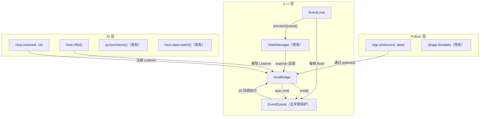
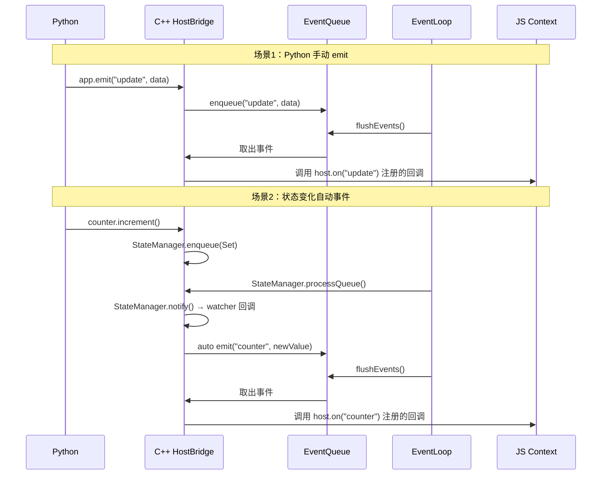

# 设计文档：Host Event System

## 概述

本设计为 LightUI 的 HostBridge 添加事件分发系统，使宿主层（C++/Python）能主动向 JS 端推送事件。核心思路是在 HostBridge 中维护一个事件监听器注册表和一个线程安全的事件队列，EventLoop 每帧 flush 队列并在 JS 上下文中执行回调。同时与 StateManager 的 watch 机制集成，实现状态变化自动触发 JS 事件。

设计遵循以下原则：
- 最小侵入：复用现有 StateManager watch 机制，不改变其核心逻辑
- 线程安全：事件入队用互斥锁保护，JS 回调仅在主线程执行
- 向后兼容：现有 `py.funcName()` 和 `host.state.watch()` 行为不变

## 架构



### 事件处理时序



## 组件与接口

### 1. HostBridge 扩展（C++）

在现有 `HostBridge` 类中添加事件系统相关成员和方法：

```cpp
// host_bridge.h 新增部分

struct EventListener {
    int id;                 // 唯一 ListenerId
    std::string eventName;  // 事件名
    JSValue callback;       // JS 回调函数（引用计数管理）
};

struct PendingEvent {
    std::string eventName;
    std::string dataJson;   // JSON 序列化的事件数据
};

class HostBridge {
public:
    // ... 现有接口保持不变 ...

    // 新增：事件系统
    int on(const std::string& eventName, JSValue callback);
    void off(int listenerId);
    void emit(const std::string& eventName, const std::string& dataJson);
    void flushEvents();  // EventLoop 每帧调用

private:
    // 事件监听器
    std::vector<EventListener> listeners_;
    int nextListenerId_ = 0;

    // 事件队列（线程安全）
    std::vector<PendingEvent> eventQueue_;
    std::mutex eventQueueMutex_;

    // 状态自动事件的 watcher 管理
    // key: stateName, value: {watcherId, listenerCount}
    struct AutoWatcher {
        int watcherId;
        int listenerCount;
    };
    std::unordered_map<std::string, AutoWatcher> autoWatchers_;

    // JS 回调
    static JSValue jsHostOn(JSContext* ctx, JSValueConst thisVal,
                            int argc, JSValueConst* argv, int magic, JSValue* func_data);
    static JSValue jsHostOff(JSContext* ctx, JSValueConst thisVal,
                             int argc, JSValueConst* argv, int magic, JSValue* func_data);
};
```

### 2. JS 全局 API

在 `registerGlobal()` 中扩展 `host` 对象：

```javascript
// JS 端可用 API
host.on(eventName, callback)  // → 返回 listenerId (int)
host.off(listenerId)          // → 取消监听

// 现有 API 保持不变
host.state.get(name)
host.state.set(name, value)
host.state.watch(name, callback)
host.state.unwatch(watchId)
host.call(name, args)
py.funcName(args)
```

### 3. Python 绑定扩展

```cpp
// bindings.cpp PyHostBridge 新增
class PyHostBridge {
public:
    // ... 现有接口 ...

    // 新增：从 Python 端 emit 事件
    void emit(const std::string& eventName, const py::object& data);
};
```

```python
# app.py App 类新增
class App:
    def emit(self, event: str, data: JsonValue = None) -> None:
        """向 JS 端发送自定义事件"""
        # 序列化 data 为 JSON，调用 bridge.emit()
```

### 4. EventLoop 集成

在 EventLoop 的每帧 Update 中，在 `StateManager::processQueue()` 之后调用 `HostBridge::flushEvents()`：

```
每帧 Update 顺序：
1. StateManager::processQueue()  ← 现有，处理状态写入并触发 watcher
2. HostBridge::flushEvents()     ← 新增，flush 事件队列并执行 JS 回调
3. 用户 Update 回调              ← 现有
```

## 数据模型

### EventListener

| 字段 | 类型 | 说明 |
|------|------|------|
| id | int | 唯一标识，由 `nextListenerId_++` 生成 |
| eventName | string | 事件名称 |
| callback | JSValue | JS 回调函数，需要 `JS_DupValue` 增加引用计数 |

### PendingEvent

| 字段 | 类型 | 说明 |
|------|------|------|
| eventName | string | 事件名称 |
| dataJson | string | JSON 序列化的事件数据 |

### AutoWatcher

| 字段 | 类型 | 说明 |
|------|------|------|
| watcherId | int | StateManager 的 watch ID |
| listenerCount | int | 当前监听该状态名的 Listener 数量 |

### 状态自动事件的生命周期

1. 首次 `host.on("counter", cb)` 时，检查 StateManager 中是否存在 "counter" 状态
2. 若存在，调用 `StateManager::watch("counter", ...)` 注册 watcher，watcher 回调中调用 `emit("counter", newValue)`
3. `autoWatchers_["counter"] = {watcherId, listenerCount: 1}`
4. 后续 `host.on("counter", cb2)` 时，仅 `listenerCount++`
5. `host.off(cb_id)` 时，`listenerCount--`；当 `listenerCount == 0` 时，调用 `StateManager::unwatch(watcherId)` 并移除 autoWatcher 条目


## 正确性属性

*正确性属性是一种在系统所有有效执行中都应成立的特征或行为——本质上是关于系统应该做什么的形式化陈述。属性是人类可读规范与机器可验证正确性保证之间的桥梁。*

基于需求文档中的验收标准，以下属性经过分析和去重后，覆盖了所有可测试的功能需求：

### Property 1：Listener ID 唯一性

*For any* 事件名序列和对应的回调函数，多次调用 `host.on()` 返回的 ListenerId 应全部互不相同。

**Validates: Requirements 1.1**

### Property 2：On/Off 移除有效性

*For any* 已注册的 Listener，调用 `host.off(listenerId)` 后，再 emit 对应事件并 flush，该 Listener 的回调不应被调用。

**Validates: Requirements 1.2**

### Property 3：Listener 调用顺序

*For any* 事件名，注册 N 个 Listener 后 emit 该事件，所有 Listener 应按注册顺序被调用。

**Validates: Requirements 1.3**

### Property 4：Emit-Flush-Callback 投递

*For any* 事件名和数据，emit 后调用 flushEvents，所有已注册的 Listener 应收到该事件数据，且 flush 后队列为空。

**Validates: Requirements 2.1, 2.2**

### Property 5：Emit 顺序保持

*For any* 事件名，同一帧内按顺序 emit N 个事件，Listener 收到的事件数据序列应与 emit 顺序一致。

**Validates: Requirements 2.4**

### Property 6：状态自动事件传递正确值

*For any* 已存在的状态和已注册 `host.on(stateName, cb)` 的 Listener，当状态值变化并经过 processQueue + flushEvents 后，Listener 应收到新的状态值。

**Validates: Requirements 3.1, 3.2**

### Property 7：Auto-Watcher 清理

*For any* 状态名，当该状态名的所有 Listener 都被 `host.off()` 移除后，修改状态值不应触发任何事件回调。

**Validates: Requirements 3.3**

### Property 8：Python Emit 序列化往返

*For any* Python 基本类型值（None、bool、int、float、str、list、dict），通过 `app.emit()` 发送后，JS 端 Listener 收到的值应与原始值等价。

**Validates: Requirements 4.1, 4.2**

### Property 9：Watch 与 On 共存独立性

*For any* 状态名，同时通过 `host.state.watch()` 和 `host.on()` 注册回调后，状态变化应分别触发两种回调，且移除其中一种不影响另一种。

**Validates: Requirements 5.4**

### Property 10：状态队列先于事件队列处理

*For any* 状态修改和手动 emit 同时存在的场景，EventLoop 每帧 Update 中 StateManager 队列应先于 EventQueue 被处理，使得事件回调执行时能读取到最新的状态值。

**Validates: Requirements 6.3**

## 错误处理

### JS 端错误

| 场景 | 处理方式 |
|------|----------|
| `host.on()` 参数无效（非字符串事件名、非函数回调） | 忽略调用，返回 -1 |
| `host.off()` 传入不存在的 listenerId | 忽略调用，无副作用 |
| Listener 回调执行时抛出 JS 异常 | 捕获异常，输出错误日志，继续执行后续 Listener |
| emit 的事件名无 Listener | 丢弃事件，无错误 |

### Python 端错误

| 场景 | 处理方式 |
|------|----------|
| `app.emit()` 的 data 为不可序列化类型 | 抛出 TypeError，附带描述性错误信息 |
| `app.emit()` 的 eventName 为空字符串 | 抛出 ValueError |
| HostBridge 未初始化时调用 emit | 抛出 RuntimeError |

### C++ 层错误

| 场景 | 处理方式 |
|------|----------|
| flushEvents 时 JS 上下文无效 | 跳过事件分发，清空队列 |
| JSValue 回调已被 GC 回收 | 通过 JS_DupValue 引用计数防止此情况 |
| 事件队列内存增长 | 每帧 flush 清空队列，正常情况下不会无限增长 |

## 测试策略

### 双重测试方法

本功能采用单元测试 + 属性测试的双重策略：

- **单元测试**：验证具体示例、边界情况和错误条件
- **属性测试**：验证跨所有输入的通用属性

### 测试框架

- **C++ 层**：通过 JS 测试脚本间接测试（使用 `esm_loader` 运行）
- **Python 层**：使用 `hypothesis` 库进行属性测试
- **JS 层**：使用 `tests/js/test_host_event.js` 脚本，配合 `[TEST_PASS]`/`[TEST_FAIL]` 日志标记

### 属性测试配置

- 每个属性测试最少运行 100 次迭代
- 每个属性测试必须包含注释引用设计文档中的属性编号
- 注释格式：`Feature: host-event-system, Property {number}: {property_text}`

### JS 测试脚本

JS 端属性测试通过在测试脚本中生成随机输入来实现：

```javascript
// 伪随机生成器（简单 LCG）
function randomInt(min, max) { /* ... */ }
function randomString(len) { /* ... */ }

// 属性测试运行器
function runProperty(name, iterations, testFn) {
    var passed = true;
    for (var i = 0; i < iterations; i++) {
        if (!testFn(i)) { passed = false; break; }
    }
    logTest(name, passed);
}
```

### Python 属性测试

Python 端使用 hypothesis 库：

```python
from hypothesis import given, strategies as st

@given(st.one_of(st.none(), st.booleans(), st.integers(), st.floats(allow_nan=False), st.text(), st.lists(st.integers()), st.dictionaries(st.text(), st.integers())))
def test_emit_serialization_round_trip(data):
    """
    Feature: host-event-system, Property 8: Python Emit 序列化往返
    Validates: Requirements 4.1, 4.2
    """
    # app.emit("test", data) → JS callback 收到的值应与 data 等价
```

### 单元测试覆盖

| 测试类别 | 覆盖内容 |
|----------|----------|
| 基本注册/取消 | host.on/off 基本流程 |
| 无效参数 | 非字符串事件名、非函数回调、不存在的 ID |
| 重复 off | 同一 ID 多次 off |
| 无 Listener emit | emit 到无人监听的事件 |
| 向后兼容 | py.funcName()、host.state.watch/get/set 仍正常工作 |
| Python emit 错误 | 不可序列化类型、空事件名 |

### 测试文件规划

- `tests/js/test_host_event.js`：JS 端事件系统单元测试 + 属性测试
- `bindings/python/tests/test_host_event.py`：Python 端 emit API 测试 + hypothesis 属性测试
