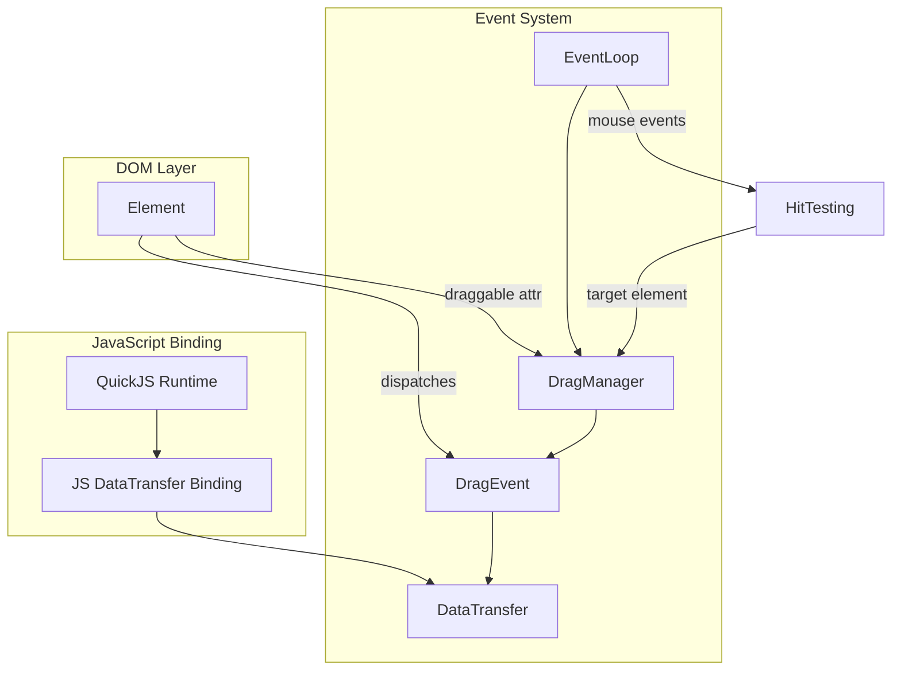
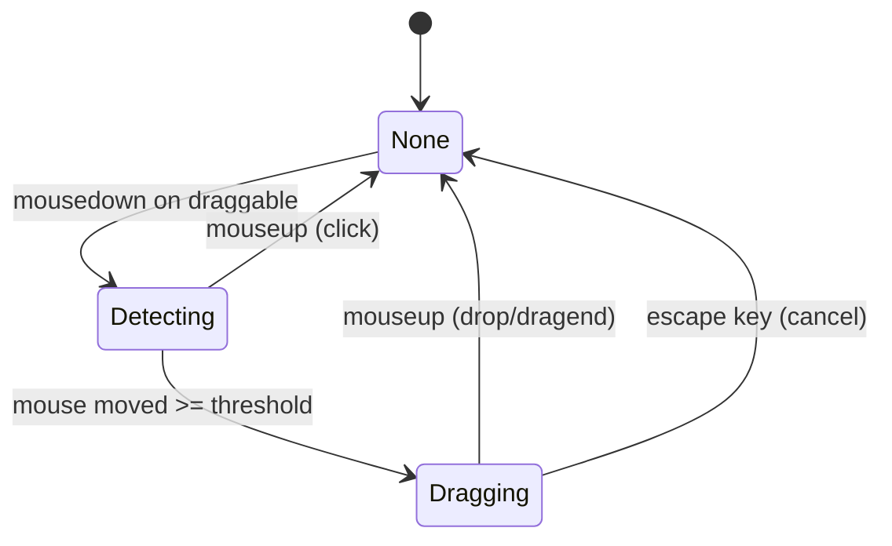
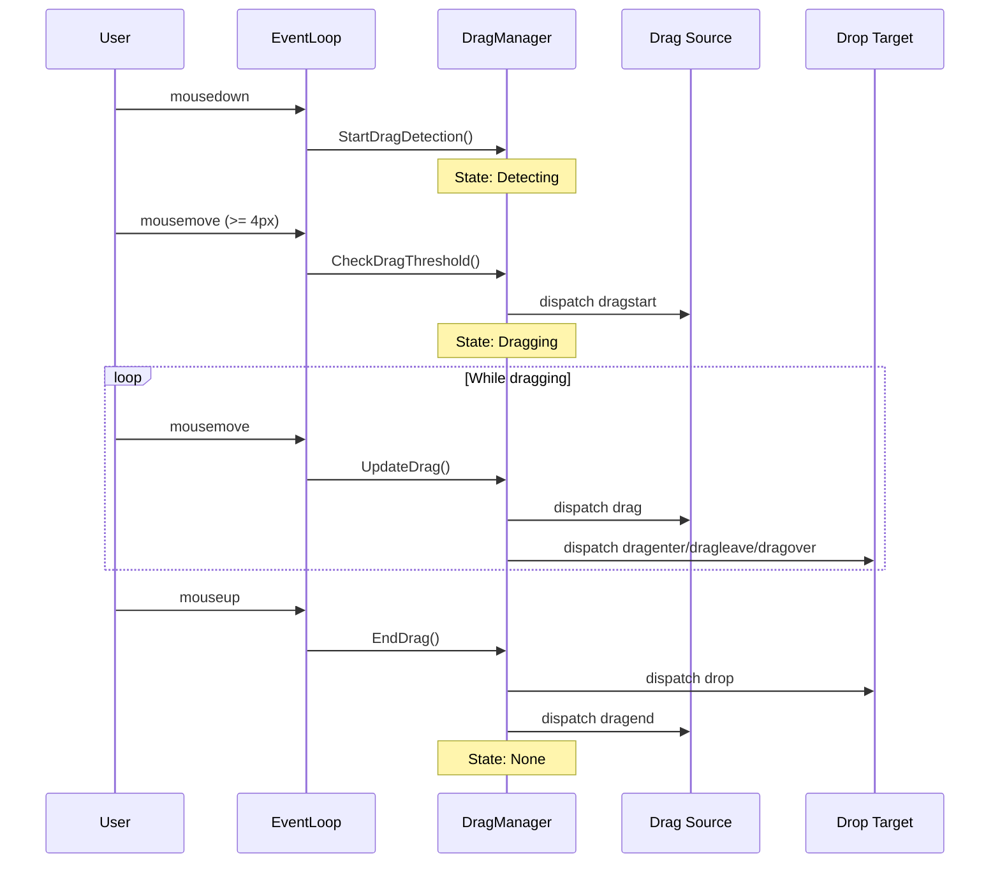

# Design Document: HTML5 Drag and Drop

## Overview

本设计文档描述了 LightUI 中实现标准 HTML5 Drag and Drop API 的技术方案。设计目标是在保持与现有 RmlUi 风格拖拽系统兼容的同时，完全支持 W3C HTML5 拖拽规范。

主要改造点：
1. 扩展 `DragManager` 支持 `draggable` 属性
2. 添加标准事件名称（dragenter, dragleave, drop）
3. 创建 `DragEvent` 类继承自 `MouseEvent`
4. 实现拖拽阈值检测
5. 添加 JavaScript DataTransfer 绑定

## Architecture



## Components and Interfaces

### 1. DragEvent Class

新增 `DragEvent` 类，继承自 `MouseEvent`，添加 `dataTransfer` 属性。

```cpp
// core/dom/drag_event.h
class DragEvent : public MouseEvent {
public:
    DragEvent(const std::string& type, int client_x, int client_y, 
              int button, std::shared_ptr<DataTransfer> data_transfer);
    
    // DataTransfer 访问
    std::shared_ptr<DataTransfer> GetDataTransfer() const;
    
    // 事件类型常量
    static const std::string DRAG_START;   // "dragstart"
    static const std::string DRAG;         // "drag"
    static const std::string DRAG_END;     // "dragend"
    static const std::string DRAG_ENTER;   // "dragenter"
    static const std::string DRAG_LEAVE;   // "dragleave"
    static const std::string DRAG_OVER;    // "dragover"
    static const std::string DROP;         // "drop"

private:
    std::shared_ptr<DataTransfer> data_transfer_;
};
```

### 2. DragManager Enhancements

扩展现有 `DragManager` 类以支持 HTML5 标准。

```cpp
// core/event/drag_manager.h (modifications)
class DragManager {
public:
    // 新增：检查元素是否可拖拽（支持 draggable 和 drag 属性）
    bool IsElementDraggable(std::shared_ptr<Element> element);
    
    // 新增：拖拽阈值检测
    bool CheckDragThreshold(float mouse_x, float mouse_y);
    
    // 修改：支持标准事件名称
    void UpdateDragHoverChain(float mouse_x, float mouse_y, 
                              std::shared_ptr<Document> document);

private:
    // 新增：拖拽阈值（像素）
    static constexpr float DRAG_THRESHOLD = 4.0f;
    
    // 新增：拖拽检测状态
    enum class DragState {
        None,           // 无拖拽
        Detecting,      // 检测中（等待超过阈值）
        Dragging        // 拖拽中
    };
    DragState drag_state_ = DragState::None;
    
    // 新增：检测起始位置
    float detect_start_x_ = 0.0f;
    float detect_start_y_ = 0.0f;
};
```

### 3. DataTransfer Enhancements

扩展现有 `DataTransfer` 类以完全符合 W3C 规范。

```cpp
// core/event/data_transfer.h (modifications)
class DataTransfer {
public:
    // 现有方法保持不变
    
    // 新增：files 属性（预留，暂不实现文件拖拽）
    // std::vector<File> GetFiles() const;
    
    // 新增：items 属性（DataTransferItemList）
    // DataTransferItemList GetItems() const;
    
    // 新增：setDragImage（预留）
    // void SetDragImage(Element* image, int x, int y);
};
```

### 4. JavaScript Binding

为 DataTransfer 添加 QuickJS 绑定。

```cpp
// bindings/quickjs/js_data_transfer.h
class JSDataTransfer {
public:
    static void Register(JSContext* ctx);
    
    // 属性访问器
    static JSValue GetSetData(JSContext* ctx, JSValueConst this_val, 
                              int argc, JSValueConst* argv);
    static JSValue GetGetData(JSContext* ctx, JSValueConst this_val, 
                              int argc, JSValueConst* argv);
    static JSValue GetClearData(JSContext* ctx, JSValueConst this_val, 
                                int argc, JSValueConst* argv);
    static JSValue GetTypes(JSContext* ctx, JSValueConst this_val);
    static JSValue GetEffectAllowed(JSContext* ctx, JSValueConst this_val);
    static JSValue SetEffectAllowed(JSContext* ctx, JSValueConst this_val, 
                                    JSValueConst val);
    static JSValue GetDropEffect(JSContext* ctx, JSValueConst this_val);
    static JSValue SetDropEffect(JSContext* ctx, JSValueConst this_val, 
                                 JSValueConst val);
};
```

## Data Models

### DragState 状态机



### 事件序列



### DataTransfer 数据结构

```cpp
struct DataTransferData {
    std::unordered_map<std::string, std::string> data;  // format -> data
    DragEffect effect_allowed = DragEffect::Uninitialized;
    DragEffect drop_effect = DragEffect::None;
};
```


## Correctness Properties

*A property is a characteristic or behavior that should hold true across all valid executions of a system-essentially, a formal statement about what the system should do. Properties serve as the bridge between human-readable specifications and machine-verifiable correctness guarantees.*

Based on the acceptance criteria analysis, the following correctness properties have been identified:

### Property 1: Draggable attribute parsing

*For any* element with a `draggable` attribute set to "true" or "false", the `IsElementDraggable()` function should return `true` when the attribute is "true" and `false` when the attribute is "false".

**Validates: Requirements 1.1, 1.2**

### Property 2: DataTransfer setData/getData round-trip

*For any* valid format string and data string, calling `setData(format, data)` followed by `getData(format)` should return the original data string unchanged.

**Validates: Requirements 3.2, 3.3**

### Property 3: DataTransfer types contains all formats

*For any* set of format strings used with `setData()`, the `types` property should contain exactly those format strings (no more, no less).

**Validates: Requirements 3.5**

### Property 4: Effect compatibility enforcement

*For any* combination of `effectAllowed` and `dropEffect` values, if `dropEffect` is not compatible with `effectAllowed`, then `dropEffect` should be set to "none".

**Validates: Requirements 4.3**

### Property 5: Event propagation order

*For any* drag event dispatched to an element in a DOM tree, event listeners should be called in the order: capture phase (root to target), target phase, bubble phase (target to root).

**Validates: Requirements 5.1, 5.2, 5.3**

### Property 6: Drag threshold behavior

*For any* mousedown on a draggable element followed by mouse movement, the drag operation should start (dragstart dispatched) if and only if the mouse moves 4 or more pixels from the initial position.

**Validates: Requirements 6.2, 6.3**

### Property 7: Attribute precedence

*For any* element with both `draggable` and `drag` attributes, the `draggable` attribute value should determine the draggable state, ignoring the `drag` attribute.

**Validates: Requirements 7.5**

### Property 8: DragEvent contains all required properties

*For any* DragEvent created with mouse coordinates and modifier key states, the event should contain correct values for `clientX`, `clientY`, `screenX`, `screenY`, `ctrlKey`, `shiftKey`, `altKey`, `metaKey`, and `button` properties.

**Validates: Requirements 8.1, 8.2, 8.3, 8.4**

### Property 9: JavaScript DataTransfer round-trip

*For any* format and data strings, calling `dataTransfer.setData(format, data)` from JavaScript followed by `dataTransfer.getData(format)` should return the original data string.

**Validates: Requirements 9.2, 9.3**

## Error Handling

### Invalid Attribute Values

| Scenario | Behavior |
|----------|----------|
| `draggable` attribute with invalid value (not "true"/"false") | Treat as "false" (not draggable) |
| Empty `draggable` attribute | Treat as "true" (HTML5 spec) |
| `drag` attribute with unknown value | Treat as DragMode::None |

### DataTransfer Errors

| Scenario | Behavior |
|----------|----------|
| `getData()` with non-existent format | Return empty string |
| `setData()` with empty format | Ignore the call |
| `clearData()` with non-existent format | No-op (silent success) |

### Event Dispatch Errors

| Scenario | Behavior |
|----------|----------|
| Drag source element removed during drag | Dispatch dragend to document, cancel drag |
| Drop target element removed during dragover | Update hover chain, dispatch dragleave |
| Exception in event handler | Log error, continue event propagation |

## Testing Strategy

### Property-Based Testing Framework

使用 [RapidCheck](https://github.com/emil-e/rapidcheck) 作为 C++ 属性测试库。

配置：每个属性测试运行至少 100 次迭代。

### Unit Tests

1. **DragEvent 构造测试**
   - 验证所有属性正确初始化
   - 验证 DataTransfer 对象正确关联

2. **DragManager 状态机测试**
   - 测试 None -> Detecting -> Dragging -> None 状态转换
   - 测试取消拖拽的状态转换

3. **DataTransfer API 测试**
   - 测试 setData/getData/clearData 基本功能
   - 测试 effectAllowed/dropEffect 设置

4. **事件分发测试**
   - 测试各种拖拽事件的分发顺序
   - 测试 preventDefault 和 stopPropagation 效果

### Property-Based Tests

每个属性测试必须使用以下格式标注：

```cpp
// **Feature: html5-drag-drop, Property {number}: {property_text}**
// **Validates: Requirements X.Y**
```

测试生成器策略：
- 元素生成器：生成带有各种 draggable/drag 属性组合的元素
- 坐标生成器：生成有效的鼠标坐标对
- 格式/数据生成器：生成有效的 MIME 类型和数据字符串
- 效果生成器：生成 DragEffect 枚举值的组合

### Integration Tests

1. **完整拖拽流程测试**
   - 模拟从 mousedown 到 drop 的完整流程
   - 验证所有事件按正确顺序分发

2. **JavaScript 绑定测试**
   - 从 JavaScript 代码测试 DataTransfer API
   - 验证 C++ 和 JavaScript 之间的数据同步
