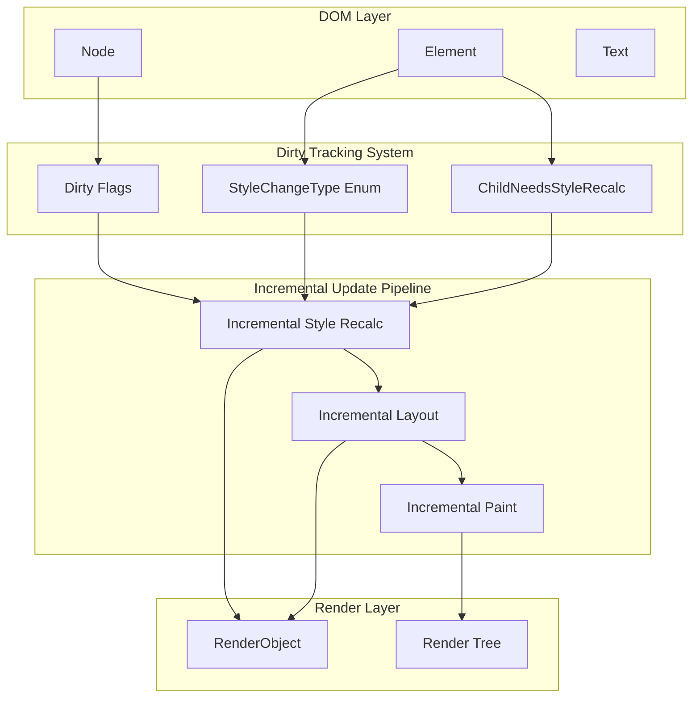

# Design Document: Incremental Rendering Optimization

## Overview

本设计文档描述了 LightUI 渲染引擎的增量渲染优化方案。核心目标是参考 Chromium Blink 引擎的增量更新机制，实现精细化的脏标记系统，使简单的 DOM 变化（如文本更新）只触发局部更新，而非全量渲染树重建。

### 核心问题

当前实现的问题：
1. `MarkDirty()` 向上传播到根节点，导致整个树被标记为脏
2. 缺乏样式变化类型区分（LocalStyleChange vs SubtreeStyleChange）
3. 文本更新触发全量重建
4. 缺乏 `ChildNeedsStyleRecalc` 机制
5. 节点添加/删除总是调用 `InvalidateRenderTree()`

### 解决方案

参考 Blink 的设计，引入：
1. `StyleChangeType` 枚举区分样式变化级别
2. `ChildNeedsStyleRecalc` 标志精确追踪脏子树
3. `MarkAncestorsWithChildNeedsStyleRecalc()` 方法只标记祖先链
4. 增量样式重算和布局更新
5. DOM 结构变化的增量处理

## Architecture



## Components and Interfaces

### 1. StyleChangeType 枚举

```cpp
// 参考 Blink: third_party/blink/renderer/core/dom/node.h
enum class StyleChangeType : uint32_t {
    kNoStyleChange = 0,      // 无样式变化
    kLocalStyleChange = 1,   // 只影响当前节点
    kSubtreeStyleChange = 2, // 影响整个子树
};
```

### 2. Node 类扩展

```cpp
class Node {
public:
    // 样式变化类型
    StyleChangeType GetStyleChangeType() const;
    void SetStyleChange(StyleChangeType type);
    
    // 子节点需要样式重算标志
    bool ChildNeedsStyleRecalc() const;
    void SetChildNeedsStyleRecalc();
    void ClearChildNeedsStyleRecalc();
    
    // 是否需要样式重算
    bool NeedsStyleRecalc() const {
        return GetStyleChangeType() != StyleChangeType::kNoStyleChange;
    }
    
    // 是否脏（需要样式重算或子节点需要）
    bool IsDirtyForStyleRecalc() const {
        return NeedsStyleRecalc() || ChildNeedsStyleRecalc();
    }
    
    // 设置需要样式重算（核心方法）
    void SetNeedsStyleRecalc(StyleChangeType change_type);
    
    // 标记祖先链（只设置 ChildNeedsStyleRecalc）
    void MarkAncestorsWithChildNeedsStyleRecalc();
    
    // 清除样式重算标志
    void ClearNeedsStyleRecalc();
    
    // 布局相关
    bool NeedsLayout() const;
    bool ChildNeedsLayout() const;
    void SetNeedsLayout();
    void MarkAncestorsWithChildNeedsLayout();
    void ClearNeedsLayout();

protected:
    uint32_t node_flags_ = 0;
    
    // 标志位定义
    static constexpr uint32_t kStyleChangeMask = 0x3;           // 2 bits for StyleChangeType
    static constexpr uint32_t kChildNeedsStyleRecalcFlag = 1 << 2;
    static constexpr uint32_t kNeedsLayoutFlag = 1 << 3;
    static constexpr uint32_t kChildNeedsLayoutFlag = 1 << 4;
    static constexpr uint32_t kNeedsPaintFlag = 1 << 5;
};
```

### 3. IncrementalStyleRecalc 类

```cpp
class IncrementalStyleRecalc {
public:
    // 执行增量样式重算
    void RecalcStyle(Document* document);
    
    // 获取统计信息
    int GetNodesVisited() const { return nodes_visited_; }
    int GetNodesRecalculated() const { return nodes_recalculated_; }
    int GetSubtreesSkipped() const { return subtrees_skipped_; }

private:
    // 递归处理节点
    void RecalcStyleForNode(Node* node, const ComputedStyle* parent_style);
    
    // 处理子节点
    void RecalcStyleForChildren(Element* element, const ComputedStyle* parent_style);
    
    // 统计
    int nodes_visited_ = 0;
    int nodes_recalculated_ = 0;
    int subtrees_skipped_ = 0;
};
```

### 4. IncrementalLayout 类

```cpp
class IncrementalLayout {
public:
    // 执行增量布局
    void PerformLayout(RenderObject* root, float width, float height);
    
    // 获取统计信息
    int GetNodesVisited() const { return nodes_visited_; }
    int GetNodesLayouted() const { return nodes_layouted_; }

private:
    // 递归布局
    void LayoutNode(RenderObject* node);
    
    // 检查是否需要布局
    bool NeedsLayoutRecursive(RenderObject* node);
    
    int nodes_visited_ = 0;
    int nodes_layouted_ = 0;
};
```

### 5. WindowDOMObserver 优化

```cpp
class WindowDOMObserver : public DOMObserver {
public:
    void OnTextChanged(Node* node, const std::string& old_text, 
                       const std::string& new_text) override {
        // 关键优化：文本变化只触发局部更新
        if (auto render_obj = GetRenderObjectForNode(node)) {
            // 更新文本内容
            if (auto render_text = dynamic_cast<RenderText*>(render_obj)) {
                render_text->SetText(new_text);
            }
            
            // 只标记局部布局
            render_obj->MarkNeedsLayout();
            
            // 标记祖先链（不重建渲染树）
            node->MarkAncestorsWithChildNeedsLayout();
            
            // 记录脏区域
            window_->AddDirtyRect(render_obj->GetBoundingRect());
            window_->SetNeedsRepaint();
            
            // 关键：不调用 InvalidateRenderTree()
        }
    }
    
    void OnNodeAdded(Node* node, Node* parent) override {
        // 优化：尝试增量插入
        if (CanIncrementalInsert(node, parent)) {
            IncrementalInsertNode(node, parent);
        } else {
            // 回退到全量重建
            window_->InvalidateRenderTree();
        }
    }
};
```

## Data Models

### 节点标志位布局

```
Bit 0-1:  StyleChangeType (0=None, 1=Local, 2=Subtree)
Bit 2:    ChildNeedsStyleRecalc
Bit 3:    NeedsLayout
Bit 4:    ChildNeedsLayout
Bit 5:    NeedsPaint
Bit 6-31: Reserved
```

### 帧统计数据

```cpp
struct IncrementalUpdateStats {
    int style_nodes_visited = 0;
    int style_nodes_recalculated = 0;
    int style_subtrees_skipped = 0;
    
    int layout_nodes_visited = 0;
    int layout_nodes_computed = 0;
    int layout_subtrees_skipped = 0;
    
    float dirty_region_percentage = 0.0f;
    
    bool used_incremental_update = false;
    float optimization_ratio = 0.0f;  // 1.0 = full update, 0.1 = 10% of full
};
```

## Correctness Properties

*A property is a characteristic or behavior that should hold true across all valid executions of a system-essentially, a formal statement about what the system should do. Properties serve as the bridge between human-readable specifications and machine-verifiable correctness guarantees.*

### Property Reflection

After analyzing the prework, the following properties can be consolidated:

1. Properties 1.1, 1.2, 1.3 can be combined into a single "text change locality" property
2. Properties 2.3, 2.4 can be combined into "ancestor marking correctness"
3. Properties 3.1, 3.2, 3.3, 3.4 can be combined into "incremental style recalc correctness"
4. Properties 4.1, 4.2, 4.3 can be combined into "incremental layout correctness"
5. Properties 5.1, 5.2, 5.5 can be combined into "incremental DOM update correctness"
6. Properties 6.1, 6.2 can be combined into "paint-only optimization"

### Correctness Properties

Property 1: Text change locality
*For any* DOM tree with a Text node, when the text content changes, only the Text node and its direct parent should have layout dirty flags set, and the render tree should remain valid (not rebuilt).
**Validates: Requirements 1.1, 1.2, 1.3**

Property 2: Ancestor marking correctness
*For any* node marked with SetNeedsStyleRecalc, all ancestors up to the root should have ChildNeedsStyleRecalc flag set, but should NOT have their own StyleChangeType modified.
**Validates: Requirements 2.3, 2.4**

Property 3: Incremental style recalc correctness
*For any* DOM tree with some nodes marked dirty, performing style recalc should visit only nodes with NeedsStyleRecalc or ChildNeedsStyleRecalc flags, and should skip clean subtrees entirely.
**Validates: Requirements 3.1, 3.2, 3.3, 3.4**

Property 4: Incremental layout correctness
*For any* render tree with some nodes marked for layout, performing layout should visit only nodes with NeedsLayout or ChildNeedsLayout flags, and should skip clean subtrees.
**Validates: Requirements 4.1, 4.2, 4.3**

Property 5: Incremental DOM update correctness
*For any* single node addition or removal, the system should create/remove only that node's RenderObject without rebuilding the entire render tree.
**Validates: Requirements 5.1, 5.2, 5.5**

Property 6: Paint-only optimization
*For any* paint-only property change (color, background-color, opacity, visibility), the system should NOT set any layout dirty flags, only paint dirty flags.
**Validates: Requirements 6.1, 6.2**

Property 7: Dirty flag clearing correctness
*For any* node that has been processed during style recalc or layout, all its dirty flags should be cleared after processing.
**Validates: Requirements 2.5, 3.5, 4.5**

Property 8: Batch update optimization
*For any* sequence of multiple text changes in the same frame, they should be processed together in a single update pass, not individually.
**Validates: Requirements 1.4**

## Error Handling

1. **Invalid Node State**: If a node has inconsistent dirty flags (e.g., ChildNeedsStyleRecalc without any dirty children), the system should log a warning and perform a full recalc as fallback.

2. **Render Tree Mismatch**: If incremental update detects a mismatch between DOM and render tree, it should fall back to full rebuild.

3. **Layout Overflow**: If incremental layout causes layout overflow or invalid bounds, the system should trigger a full layout pass.

4. **Performance Degradation**: If incremental update takes longer than full update (detected via metrics), the system should switch to full update mode.

## Testing Strategy

### Dual Testing Approach

本设计采用单元测试和属性测试相结合的方式：

1. **单元测试**: 验证具体的边界情况和错误处理
2. **属性测试**: 验证增量更新的正确性属性

### Property-Based Testing

使用 RapidCheck (C++ property-based testing library) 进行属性测试。

每个属性测试应配置运行至少 100 次迭代。

### Test Annotations

每个属性测试必须使用以下格式标注：
```cpp
// **Feature: incremental-rendering-optimization, Property {number}: {property_text}**
// **Validates: Requirements X.Y**
```

### Unit Tests

1. **StyleChangeType Tests**
   - Test kNoStyleChange, kLocalStyleChange, kSubtreeStyleChange transitions
   - Test flag clearing

2. **Ancestor Marking Tests**
   - Test MarkAncestorsWithChildNeedsStyleRecalc propagation
   - Test that ancestors don't get their own StyleChangeType modified

3. **Incremental Style Recalc Tests**
   - Test that clean subtrees are skipped
   - Test LocalStyleChange vs SubtreeStyleChange behavior

4. **Incremental Layout Tests**
   - Test that clean subtrees are skipped
   - Test layout propagation to ancestors

5. **DOM Update Tests**
   - Test single node insertion
   - Test single node removal
   - Test node replacement

6. **Paint-Only Tests**
   - Test that paint-only properties don't trigger layout

### Property-Based Tests

1. **Text Change Locality Property Test**
   - Generate random DOM trees
   - Change random text nodes
   - Verify only local dirty flags are set

2. **Ancestor Marking Property Test**
   - Generate random DOM trees
   - Mark random nodes dirty
   - Verify ancestor chain has correct flags

3. **Incremental Recalc Property Test**
   - Generate random DOM trees with random dirty nodes
   - Run incremental recalc
   - Verify only dirty nodes are visited

4. **Incremental Layout Property Test**
   - Generate random render trees with random dirty nodes
   - Run incremental layout
   - Verify only dirty nodes are computed

5. **Paint-Only Property Test**
   - Generate random elements
   - Change paint-only properties
   - Verify no layout flags are set
