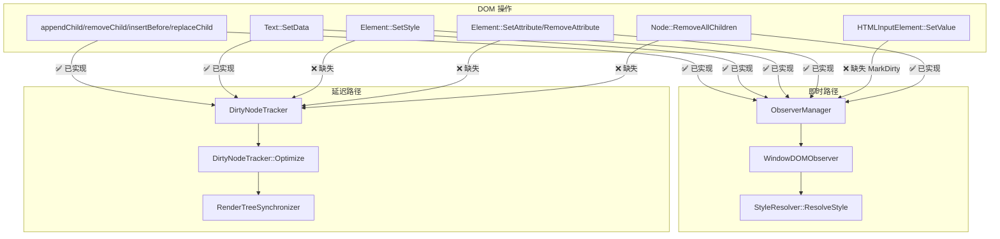
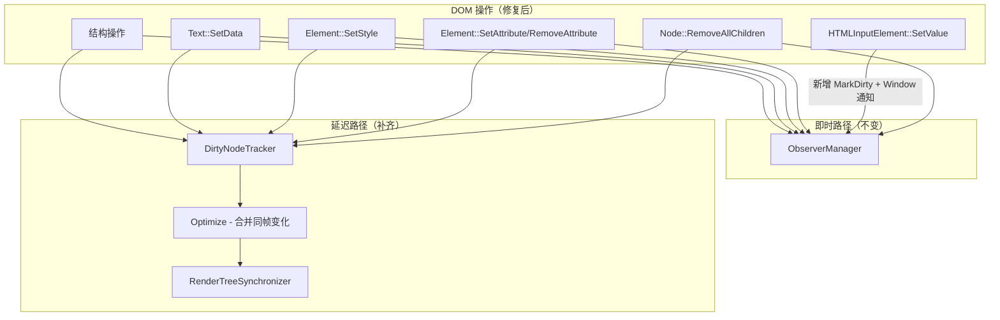

# 设计文档：增量更新系统优化

## 概述

本设计针对 LightUI 框架增量更新系统中已确认的 6 个问题进行修复和优化。核心目标是：

1. 修复 `HTMLInputElement::SetValue()` 缺失脏标记的实际 Bug
2. 补齐 `RemoveAllChildren()`、`SetStyle()`、`SetAttribute()`/`RemoveAttribute()` 对 DirtyNodeTracker 延迟路径的覆盖
3. 修复 JS 绑定层 classList 的子串误匹配缺陷
4. 确保 `RenderTreeSynchronizer::ProcessStyleChanges()` 能正确处理新增的样式/属性变化记录

设计原则：最小侵入性修改，保持现有即时路径（ObserverManager）不变，仅补充延迟路径（DirtyNodeTracker）记录。

## 架构

### 当前双路径架构



### 修复后架构

所有 DOM 操作统一走双路径：即时路径保持不变（向后兼容），延迟路径补齐缺失的记录。`HTMLInputElement::SetValue()` 额外补充 `MarkDirty()` 调用。



## 组件与接口

### 修改 1：HTMLInputElement::SetValue()

文件：`core/dom/elements/html_input_element.cpp`

当前 `SetValue()` 在更新 `value_` 后不调用 `MarkDirty()`，也不通知 Window 重绘。修复方案：

```cpp
void HTMLInputElement::SetValue(const std::string& value, bool trigger_events) {
    // ... 现有 maxlength 检查和 value_ 赋值逻辑不变 ...

    std::string old_value = value_;
    value_ = new_value;

    // ... 现有 selection 调整逻辑不变 ...

    // 【新增】值变化时标记脏并通知重绘
    if (old_value != new_value) {
        MarkDirty(DirtyType::PAINT);

        auto doc = GetOwnerDocument();
        if (doc) {
            Window* window = doc->GetWindow();
            if (window) {
                window->SetNeedsRepaint();
            }
        }
    }

    // 触发事件（保持不变）
    if (trigger_events && old_value != new_value) {
        TriggerInputEvent();
        TriggerChangeEvent();
    }
}
```

### 修改 2：Node::RemoveAllChildren()

文件：`core/dom/node.cpp`

当前 `RemoveAllChildren()` 只通知 ObserverManager，不记录到 DirtyNodeTracker。修复方案：

```cpp
void Node::RemoveAllChildren() {
    auto doc = GetOwnerDocument();
    if (doc) {
        for (size_t i = 0; i < child_nodes_.size(); ++i) {
            auto& child = child_nodes_[i];
            // 记录到 DirtyNodeTracker（延迟处理）
            doc->GetDirtyTracker().RecordNodeRemoved(child, shared_from_this(), i);
            // 通知观察者（即时处理）
            doc->GetObserverManager().NotifyNodeRemoved(child.get(), this);
        }
    }

    for (auto& child : child_nodes_) {
        child->SetParentNode(nullptr);
    }
    child_nodes_.clear();
    MarkDirty();
}
```

### 修改 3：Element::SetStyle() 增加 DirtyNodeTracker 记录

文件：`core/dom/element.cpp`

在现有 `SetStyle()` 末尾的 ObserverManager 通知之前，增加 DirtyNodeTracker 记录：

```cpp
void Element::SetStyle(const std::string& property, const std::string& value) {
    // ... 现有全部逻辑不变 ...

    // 【新增】记录到 DirtyNodeTracker（延迟处理，支持同帧合并）
    auto doc = GetOwnerDocument();
    if (doc) {
        doc->GetDirtyTracker().RecordStyleChanged(
            std::static_pointer_cast<Element>(shared_from_this()),
            property, old_value, value);
    }

    // 通知观察者（即时处理，保持不变）
    if (doc) {
        doc->GetObserverManager().NotifyStyleChanged(this, property, old_value, value);
    }
}
```

注意：需要将 `doc` 的获取提前到函数开头（或合并两处 `GetOwnerDocument()` 调用），避免重复调用。

### 修改 4：Element::SetAttribute() 和 RemoveAttribute() 增加 DirtyNodeTracker 记录

文件：`core/dom/element.cpp`

在 `SetAttribute()` 中，ObserverManager 通知之前增加 DirtyNodeTracker 记录：

```cpp
// 在 SetAttribute() 的 ObserverManager 通知之前：
if (doc) {
    doc->GetDirtyTracker().RecordStyleChanged(
        std::static_pointer_cast<Element>(shared_from_this()),
        name, old_value, value);
}
```

在 `RemoveAttribute()` 中，ObserverManager 通知之前增加 DirtyNodeTracker 记录：

```cpp
void Element::RemoveAttribute(const std::string& name) {
    std::string old_value = GetAttribute(name);
    attributes_.erase(name);
    MarkDirty();
    MarkLexborDirty();

    // 【新增】记录到 DirtyNodeTracker
    auto doc = GetOwnerDocument();
    if (doc && !old_value.empty()) {
        doc->GetDirtyTracker().RecordStyleChanged(
            std::static_pointer_cast<Element>(shared_from_this()),
            name, old_value, "");
    }

    // 通知观察者（保持不变）
    if (!old_value.empty() && doc) {
        doc->GetObserverManager().NotifyAttributeChanged(this, name, old_value, "");
    }
}
```

### 修改 5：JS classList 绑定精确匹配

文件：`core/quickjs/bindings/js_element.cpp`

当前 `classList` 的 add/remove/toggle/contains 全部使用 `string::find()` 做子串匹配，需要改为按空格分词后精确匹配。

提取一个辅助函数用于精确匹配：

```cpp
// 辅助函数：精确匹配 class 名称（按空格分词）
static bool HasExactClass(const std::string& class_list, const std::string& class_name) {
    std::istringstream iss(class_list);
    std::string token;
    while (iss >> token) {
        if (token == class_name) {
            return true;
        }
    }
    return false;
}

// 辅助函数：精确移除 class 名称
static std::string RemoveExactClass(const std::string& class_list, const std::string& class_name) {
    std::istringstream iss(class_list);
    std::string token;
    std::string result;
    while (iss >> token) {
        if (token != class_name) {
            if (!result.empty()) result += " ";
            result += token;
        }
    }
    return result;
}
```

然后将 4 个 lambda 中的 `string::find()` 替换为上述辅助函数调用。这与 `Element::HasClass()` 和 `Element::RemoveClass()` 的 C++ 实现保持一致（它们已经使用 `istringstream` 分词）。

### 修改 6：RenderTreeSynchronizer 无需额外修改

经代码审查，`RenderTreeSynchronizer::ProcessStyleChanges()` 已经正确实现了对 `DirtyNodeTracker::GetStyleChanges()` 的处理逻辑：
- 遍历所有 StyleChange 记录
- 对每个元素重新解析样式（`StyleResolver::ResolveStyle()`）
- 更新 RenderObject 的 ComputedStyle
- 同步到 LayoutEngine
- 标记祖先链布局失效

当前 `ProcessStyleChanges()` 未被触发仅仅是因为 `SetStyle()`/`SetAttribute()` 没有向 DirtyNodeTracker 记录样式变化。补齐记录后，现有的 `ProcessStyleChanges()` 即可正常工作。

`Synchronize()` 方法中的调用顺序也已正确：先 `ProcessStructuralChanges()`，再 `ProcessStyleChanges()`，最后 `ProcessTextChanges()`。

## 数据模型

### DirtyNodeTracker 变化记录（无需修改）

现有 `DirtyNodeTracker` 已定义了完整的数据结构，无需新增：

```
StructuralChange:
  type: Added | Removed | Moved | Replaced
  node, parent, old_parent, new_node, old_node: weak_ptr<Node>
  index: size_t

StyleChange:
  element: weak_ptr<Element>
  property: string        // 属性名（CSS 属性或 HTML 属性名）
  old_value: string
  new_value: string

TextChange:
  node: weak_ptr<Node>
  old_text: string
  new_text: string
```

`StyleChange` 结构同时用于 CSS 内联样式变化和 HTML 属性变化。`property` 字段存储属性名（如 CSS 的 `"color"` 或 HTML 的 `"class"`），`RenderTreeSynchronizer::ProcessStyleChanges()` 统一触发样式重解析，无需区分来源。

### DirtyNodeTracker::Optimize() 合并规则（已实现）

- 同一元素同一属性的多次 StyleChange → 保留第一条的 old_value 和最后一条的 new_value
- 同一文本节点的多次 TextChange → 保留第一条的 old_text 和最后一条的 new_text
- 结构变化：Add+Remove 同一节点 → 取消；Remove+Add 同一节点 → 转为 Moved


## 正确性属性

*正确性属性是系统在所有合法执行中都应保持为真的特征或行为——本质上是关于系统应该做什么的形式化陈述。属性是人类可读规范与机器可验证正确性保证之间的桥梁。*

### Property 1：SetValue 脏标记不变量

*对于任意* HTMLInputElement 和任意两个不同的字符串 old_value 和 new_value，将元素的值设为 old_value 后清除脏标记，再调用 SetValue(new_value)，元素的脏标记应包含 PAINT 位。

**Validates: Requirements 1.1**

### Property 2：RemoveAllChildren 移除记录计数不变量

*对于任意* 挂载到 Document 的 Node 和任意 N 个子节点（N ≥ 0），调用 RemoveAllChildren() 后，DirtyNodeTracker 中应恰好新增 N 条 StructuralChangeType::Removed 记录，且每条记录的 parent 指向该 Node。

**Validates: Requirements 2.1**

### Property 3：SetTextContent 追踪器记录完整性

*对于任意* 挂载到 Document 的 Element（含 N 个子节点，N ≥ 2）和任意非空文本字符串，调用 SetTextContent() 后，DirtyNodeTracker 中应包含 N 条 Removed 记录（对应旧子节点）和 1 条 Added 记录（对应新 Text 节点）。

**Validates: Requirements 2.3**

### Property 4：Optimize 取消 Add+Remove 对称操作

*对于任意* 挂载到 Document 的 Node，先 AppendChild 一个新子节点（产生 Added 记录），再 RemoveAllChildren（产生 Removed 记录），调用 DirtyNodeTracker::Optimize() 后，该子节点的 Added 和 Removed 记录应被取消（不出现在优化后的列表中）。

**Validates: Requirements 2.4**

### Property 5：SetStyle 延迟路径记录

*对于任意* 挂载到 Document 的 Element 和任意 CSS 属性名/值对，调用 SetStyle() 后，DirtyNodeTracker 的 StyleChanges 中应包含一条记录，其 element 指向该 Element，property 等于属性名，old_value 和 new_value 分别等于变化前后的值。

**Validates: Requirements 3.1**

### Property 6：Optimize 样式变化合并不变量

*对于任意* 挂载到 Document 的 Element 和任意 K 个不同的 CSS 属性名，对每个属性调用 M 次 SetStyle()（M ≥ 1），调用 DirtyNodeTracker::Optimize() 后，该 Element 的 StyleChange 记录数应恰好等于 K（每个属性一条），且每条记录的 old_value 等于该属性的最初旧值，new_value 等于最终新值。

**Validates: Requirements 3.2, 3.3**

### Property 7：SetAttribute 延迟路径记录

*对于任意* 挂载到 Document 的 Element 和任意属性名/值对（值与当前值不同），调用 SetAttribute() 后，DirtyNodeTracker 的 StyleChanges 中应包含一条对应记录。

**Validates: Requirements 4.1**

### Property 8：RemoveAttribute 延迟路径记录

*对于任意* 挂载到 Document 的 Element 和任意已存在的属性名，调用 RemoveAttribute() 后，DirtyNodeTracker 的 StyleChanges 中应包含一条记录，其 new_value 为空字符串。

**Validates: Requirements 4.2**

### Property 9：classList 精确匹配一致性

*对于任意* 由空格分隔的 class 列表字符串和任意 class 名称，JS 绑定的 classList.contains/add/remove/toggle 操作结果应与按空格分词后精确匹配的参考实现一致。具体而言：
- contains(name) 返回 true 当且仅当 name 作为完整 token 出现在列表中
- add(name) 后，name 恰好出现一次，其余 token 不变
- remove(name) 后，name 不再出现，其余 token 不变
- toggle(name) 等价于：若 contains(name) 则 remove(name)，否则 add(name)

**Validates: Requirements 5.1, 5.2, 5.3, 5.4, 5.5**

## 错误处理

### 空指针防护

所有新增的 DirtyNodeTracker 记录调用都遵循现有模式：先检查 `GetOwnerDocument()` 返回非空，再访问 `GetDirtyTracker()`。对于不属于任何 Document 的孤立节点，跳过记录。

### weak_ptr 过期处理

DirtyNodeTracker 中所有节点引用使用 `weak_ptr`。在 `Optimize()` 和 `RenderTreeSynchronizer::ProcessStyleChanges()` 中，已有 `lock()` 检查，过期的引用会被自动跳过。

### SetValue 向后兼容

`SetValue()` 的脏标记修复不影响 `trigger_events` 参数的语义。事件触发和脏标记是独立的关注点：
- `trigger_events = false`：不触发 input/change 事件，但仍标记脏（视觉更新）
- `trigger_events = true`：触发事件且标记脏

### classList 空字符串和空格处理

classList 的辅助函数使用 `istringstream` 分词，自动处理：
- 多个连续空格
- 前导/尾随空格
- 空字符串输入

## 测试策略

### 属性测试（Property-Based Testing）

使用项目现有的 C++ 属性测试框架（Google Test + 手动随机生成器），遵循 `tests/property/` 目录的现有模式。

每个属性测试：
- 最少 100 次迭代
- 使用随机生成器创建测试输入
- 标注对应的设计属性编号和需求编号

测试文件规划：
- `tests/property/dom/test_dirty_tracking_properties.cpp` — Property 2, 3, 4, 5, 6, 7, 8
- `tests/property/dom/test_input_dirty_properties.cpp` — Property 1
- `tests/property/dom/test_classlist_properties.cpp` — Property 9

属性测试库：Google Test + 自定义随机生成器（与项目现有模式一致）

### 单元测试

单元测试聚焦于具体示例和边界情况：

- `HTMLInputElement::SetValue()` 相同值不标脏
- `HTMLInputElement::SetValue()` 空字符串处理
- `RemoveAllChildren()` 对无 Document 的孤立节点不崩溃
- `classList` 的 "btn" vs "btn-primary" 子串误匹配回归测试
- `RenderTreeSynchronizer` 端到端集成测试（结构+样式变化混合场景）

### 测试标注格式

```
Feature: incremental-update-optimization, Property N: [属性标题]
Validates: Requirements X.Y
```
