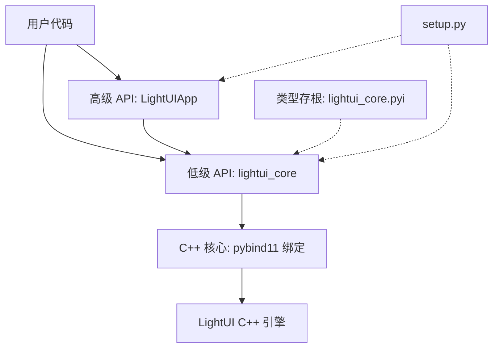

# 设计文档

## 概述

本设计文档描述 LightUI Python 绑定完善工作的技术方案。工作分为五个方面：Bug 修复、类型存根更新、示例代码补全、安装脚本更新和测试覆盖补充。所有修改均在 `bindings/python/` 目录内完成，不涉及 C++ 核心层变更。

## 架构

LightUI Python 绑定采用两层架构：



本次修改不改变架构，仅完善各层的一致性和完整性。

## 组件与接口

### 1. 版本号统一（需求 1）

涉及文件及修改：

| 文件 | 当前值 | 目标值 |
|------|--------|--------|
| `bindings/python/src/bindings.cpp` | `"0.5.0"` | `"0.5.0"`（无需修改） |
| `bindings/python/lightui/__init__.py` | `"0.4.0"` | `"0.5.0"` |
| `bindings/python/setup.py` | `"0.1.0"` | `"0.5.0"` |
| `bindings/python/tests/test_binding.py` | `"0.3.0"` | `"0.5.0"` |
| `bindings/python/tests/test_window.py` | `"0.3.0"` | `"0.5.0"` |

### 2. `_states` 初始化修复（需求 2）

在 `LightUIApp.__init__` 中，在 `self._bound_functions` 初始化之前添加：

```python
# 状态缓存
self._states: Dict[str, Any] = {}
```

### 3. 类型存根更新（需求 3）

需要在 `lightui_core.pyi` 中补充以下 API：

**新增类：**
- `DevToolsManager`：单例，提供 `get_instance()`、`initialize()`、`open()`、`close()`、`toggle()`、`is_open()`、`shutdown()`
- `TaskScheduler`：简单类，仅有构造函数

**Window 类新增方法：**
- `set_js_runtime(runtime: Runtime) -> None`
- `get_task_scheduler() -> TaskScheduler`
- `needs_repaint() -> bool`
- `mark_dirty() -> None`

**Document 类新增方法：**
- `set_base_path(path: str) -> None`
- `load_external_stylesheets() -> None`
- `execute_scripts() -> None`

**Runtime 类新增方法：**
- `register_module(name: str, code: str) -> None`
- `set_base_module_path(path: str) -> None`
- `init_fetch_bindings(task_scheduler: TaskScheduler) -> None`

**EventLoop 类更新：**
- 构造函数重载：`__init__(task_scheduler: TaskScheduler)`
- `set_quickjs_runtime(runtime: Runtime) -> None`
- `set_window(window: Window) -> None`
- `set_state_manager(app: App) -> None`

**ListState 类新增方法：**
- `shift() -> JsonValue`
- `unshift(item: JsonValue) -> None`

**全局函数：**
- `cleanup_dom_bindings(runtime: Runtime) -> None`
- `clear_font_cache() -> None`
- `set_image_base_path(path: str) -> None`

### 4. 示例代码（需求 4）

三个示例文件放在 `bindings/python/examples/` 目录：

**counter.py** — 计数器示例：
- 创建 IntState 管理计数
- 绑定 increment/decrement 函数供 JS 调用
- 加载包含按钮的 HTML

**todo_app.py** — 待办事项示例：
- 创建 ListState 管理待办列表
- 绑定 addTodo/removeTodo/getTodos 函数
- 演示列表操作和 DOM 更新

**state_demo.py** — 状态类型演示：
- 展示 IntState、StringState、ListState、DictState 的创建和操作
- 演示 watch 监听和 batch 批量操作
- 包含详细注释说明每种状态类型的 API

### 5. setup.py 更新（需求 5）

修改内容：
- 版本号更新为 `"0.5.0"`
- 添加 `package_data={'lightui': ['bin/*.pyd', 'bin/*.so']}`
- 更新 `python_requires='>=3.8'`
- 在 `extras_require['dev']` 中添加 `hypothesis>=6.0.0`
- 移除已注释的 C 扩展配置（改用预编译 pyd 分发）

### 6. 测试补充（需求 6）

新增测试文件 `bindings/python/tests/test_phase3.py`，覆盖：
- DevToolsManager 单例获取和基本操作
- ES 模块注册与导入（register_module + eval_module）
- 资源清理函数（cleanup_dom_bindings、clear_font_cache）
- HostBridge JSON 数据往返属性测试

更新现有测试文件中的版本号断言。

## 数据模型

本次修改不引入新的数据模型。现有数据模型保持不变：

- **State 层级**：State（基类）→ IntState / StringState / ListState / DictState
- **JSON 类型映射**：Python `None/bool/int/float/str/list/dict` ↔ C++ `nlohmann::json` ↔ JS 原生类型
- **回调类型**：`Callable[[JsonValue], JsonValue]`（HostBridge 回调）、`Callable[[JsonValue], None]`（State watch 回调）


## 正确性属性

*属性是系统在所有有效执行中应保持为真的特征或行为——本质上是关于系统应该做什么的形式化陈述。属性是人类可读规范与机器可验证正确性保证之间的桥梁。*

基于验收标准的 prework 分析，本项目有两个可测试的属性：

### Property 1: State 代理身份与缓存一致性

*对于任意*有效的状态名称和初始值，在 LightUIApp 上调用 `state(name, value)` 两次（第二次使用不同初始值），两次调用应返回同一个 Python 对象（`is` 身份相同），且该对象的值等于第一次创建时的初始值。

**Validates: Requirements 2.2, 2.3**

### Property 2: HostBridge JSON 往返一致性

*对于任意* JSON 兼容值（None、bool、int、float、str、list、dict 的嵌套组合），将一个回显函数绑定到 HostBridge，通过 JS 调用该函数传入该值，返回的结果应与原始值相等。

**Validates: Requirements 6.6**

## 错误处理

### 版本号不匹配
- 不需要运行时错误处理，通过代码修改确保一致性
- 测试用例作为回归保护

### `_states` 未初始化
- 修复后，`state()` 方法在任何时机调用都不会抛出 `AttributeError`
- 如果传入无效的状态名称（空字符串），行为由 C++ 层 `StateManager` 决定，Python 层不额外处理

### 类型存根不完整
- 类型存根不影响运行时行为，仅影响 IDE 体验
- 如果 C++ API 后续变更，类型存根需要同步更新

### 示例代码
- 示例代码使用 `try/except ImportError` 保护 lightui_core 导入
- 示例在无 pyd 环境下应给出清晰的错误提示而非崩溃

### 资源清理
- `cleanup_dom_bindings` 和 `clear_font_cache` 在重复调用时不应抛出异常
- `LightUIApp.cleanup()` 使用 `_cleaned_up` 标志防止重复清理

## 测试策略

### 测试框架

- **单元测试**：使用现有的手动测试框架（`test_*.py` 脚本，配合 `[TEST_PASS]/[TEST_FAIL]` 标记）
- **属性测试**：使用 `hypothesis` 库（已在 `test_property.py` 中使用）
- 每个属性测试配置最少 100 次迭代

### 双重测试方法

**单元测试**覆盖：
- 版本号一致性验证（具体值断言）
- `_states` 初始化验证
- DevToolsManager 单例获取和基本操作
- ES 模块注册与导入
- 资源清理函数不抛异常
- 示例代码导入检查

**属性测试**覆盖：
- Property 1: State 代理身份（`test_property.py` 中已有 `test_property_state_proxy_identity`，需确认 LightUIApp 层也覆盖）
- Property 2: HostBridge JSON 往返（新增属性测试）

### 属性测试标注格式

每个属性测试必须包含注释引用设计文档中的属性编号：

```python
"""
Property Test: State 代理身份与缓存一致性

Feature: python-binding-polish, Property 1: State 代理身份与缓存一致性
Validates: Requirements 2.2, 2.3
"""
```

### 测试文件组织

| 文件 | 内容 |
|------|------|
| `test_binding.py` | 更新版本号断言为 "0.5.0" |
| `test_window.py` | 更新版本号断言为 "0.5.0" |
| `test_app.py` | 新增 `_states` 初始化测试 |
| `test_phase3.py`（新增） | DevTools、ES 模块、资源清理测试 |
| `test_property.py` | 新增 HostBridge JSON 往返属性测试、LightUIApp state 代理属性测试 |
