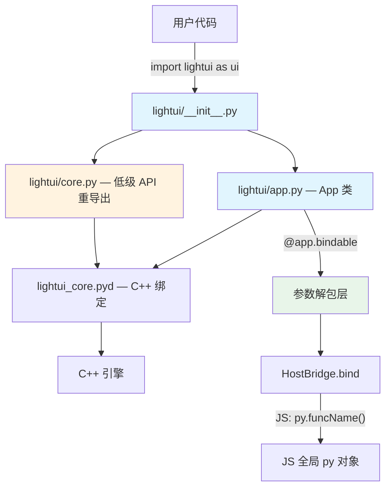

# 设计文档

## 概述

本设计重新组织 LightUI Python 绑定的高级 API 层，目标是让 Python 开发者能以最自然的方式构建桌面应用。核心改动包括：

1. 重构模块结构，`import lightui as ui` 即可获得所有常用 API
2. 新增 `@app.bindable` 装饰器，自动推断函数名、支持多参数解包
3. 统一 JS 调用约定为 `py.funcName()`，移除 `host.call()` 的推荐
4. 为 IntState 补充 `decrement()` 便捷方法
5. 更新所有示例代码使用新 API
6. 保持向后兼容

所有修改限定在 `bindings/python/` 目录内，不修改 C++ 代码。C++ 层 HostBridge 已原生支持 `py.funcName()` 调用方式（bind 时自动注册到 JS 全局 `py` 对象）。

## 架构



**分层设计：**

| 层 | 模块 | 职责 |
|---|---|---|
| 用户层 | `import lightui as ui` | 仅导出 `App`、`version` |
| 高级 API | `lightui/app.py` | App 类、`@bindable` 装饰器、参数解包 |
| 低级 API | `lightui/core.py` | 重导出 `lightui_core` 的所有类（Window、Runtime 等） |
| C++ 绑定 | `lightui_core.pyd` | pybind11 绑定层（不修改） |

## 组件与接口

### 1. 模块结构重组（需求 1）

**`lightui/__init__.py`** — 精简顶层导出：

```python
"""LightUI — 用 Python 构建桌面应用"""
__version__ = "0.5.0"

from .app import App
from .core import version

# 向后兼容
LightUIApp = App

__all__ = ["App", "version"]
```

**`lightui/core.py`** — 低级 API 集中导出：

```python
"""LightUI 低级 API — 直接访问 C++ 绑定"""
import sys, os

_bin_path = os.path.join(os.path.dirname(__file__), 'bin')
if _bin_path not in sys.path:
    sys.path.insert(0, _bin_path)

import lightui_core

# 重导出所有低级类
Window = lightui_core.Window
Document = lightui_core.Document
Element = lightui_core.Element
Runtime = lightui_core.Runtime
EventLoop = lightui_core.EventLoop
HostBridge = lightui_core.HostBridge
# ... 其余类
version = lightui_core.version
```

### 2. `@app.bindable` 装饰器（需求 2、7）

核心设计：装饰器自动使用函数名注册到 HostBridge，并在调用时根据函数签名自动解包参数。

```python
import inspect

def bindable(self, func):
    """将 Python 函数注册为 JS 可调用函数
    
    自动使用函数名，支持多参数解包。
    JS 端通过 py.funcName(args) 调用。
    """
    name = func.__name__
    sig = inspect.signature(func)
    params = list(sig.parameters.values())
    
    def wrapper(args):
        # 参数解包逻辑
        if not params:
            return func()
        elif len(params) == 1 and params[0].kind in (
            inspect.Parameter.POSITIONAL_ONLY,
            inspect.Parameter.POSITIONAL_OR_KEYWORD
        ):
            return func(args)
        elif isinstance(args, dict):
            # 尝试关键字参数解包
            try:
                return func(**args)
            except TypeError:
                return func(args)
        elif isinstance(args, list):
            try:
                return func(*args)
            except TypeError:
                return func(args)
        else:
            return func(args)
    
    self._bridge.bind(name, wrapper)
    self._bound_functions[name] = func
    return func
```

**参数解包规则：**

| Python 函数签名 | JS 调用 | 解包行为 |
|---|---|---|
| `def func()` | `py.func()` | 无参调用 |
| `def func(x)` | `py.func(42)` | 单参传递 |
| `def func(a, b)` | `py.func({a: 1, b: 2})` | dict → `**kwargs` |
| `def func(a, b)` | `py.func([1, 2])` | list → `*args` |
| 解包失败 | 任意 | 回退为单参传递 |

### 3. JS 调用约定统一（需求 3）

C++ HostBridge 的 `bind()` 方法已经同时注册到 `host.call()` 和 `py.funcName()` 两个入口。Python 层无需额外修改，只需：

- 示例代码和文档统一使用 `py.funcName()` 
- 移除所有 `host.call()` 的示例和推荐

### 4. IntState `decrement()` 方法（需求 4）

在 Python 高级 API 层为 IntState 添加便捷方法：

```python
# 在 App 类中，state() 返回的 IntState 对象本身由 C++ 提供
# decrement() 通过 increment(-delta) 实现
# 可以在 Python 层包装，或直接利用 C++ IntState.increment(-1)
```

由于 C++ IntState 已有 `increment(delta)` 方法（delta 可为负数），`decrement()` 可以在 Python 层通过包装实现，无需修改 C++。方案：在 `app.py` 中对 `state()` 返回的对象做轻量包装，为 IntState 添加 `decrement` 方法。

### 5. 向后兼容策略（需求 9）

| 旧 API | 新 API | 兼容方式 |
|---|---|---|
| `from lightui import LightUIApp` | `from lightui import App` | `LightUIApp = App` 别名 |
| `@app.bind("name")` | `@app.bindable` | `bind()` 方法保留 |
| `host.call('func', args)` | `py.func(args)` | C++ 层两者均可用，文档仅推荐 `py.` |

### 6. 示例代码更新（需求 6）

**counter.py 新版：**

```python
import lightui as ui

app = ui.App("计数器", 400, 300)
counter = app.state("counter", 0)

@app.bindable
def increment():
    counter.increment()
    return counter.get()

@app.bindable
def decrement():
    counter.decrement()
    return counter.get()

app.load_html('''
<button onclick="document.getElementById('count').textContent = py.increment()">+</button>
<span id="count">0</span>
<button onclick="document.getElementById('count').textContent = py.decrement()">-</button>
''')

app.run()
```

JS 端直接使用 `py.funcName()` 的返回值更新 DOM，无需额外包装。这是最简洁的调用方式。

**设计评估：**

当前方案选择函数式风格（`app.state()` + `@app.bindable`）而非类继承式（`class MyApp(ui.App)`），原因：
- 更贴近 C++ 层的实际能力（HostBridge 是实例级别的函数注册）
- 学习曲线更低，不需要理解 metaclass 或 descriptor protocol
- 与 Flask/FastAPI 等流行框架的装饰器风格一致
- 对于轻量级桌面 UI 框架，过度抽象反而增加复杂度

参数解包采用 `inspect.signature` 自动推断，规则简单可预测：
- 0 参数 → 忽略 JS 传入值
- 1 参数 → 直接传递
- 多参数 + dict → `**kwargs`
- 多参数 + list → `*args`
- 不匹配 → 回退为单参传递

这比强制 `def func(args)` 单参数签名更自然，同时 fallback 机制保证不会因签名不匹配而崩溃。

## 数据模型

本次重设计不引入新的数据模型。现有数据模型保持不变：

- **State 层级**：State（基类）→ IntState / StringState / ListState / DictState
- **JSON 类型映射**：Python `None/bool/int/float/str/list/dict` ↔ C++ `nlohmann::json` ↔ JS 原生类型
- **回调类型**：
  - `HostCallback = Callable[[JsonValue], JsonValue]`（HostBridge 底层回调，单参数）
  - `@app.bindable` 装饰的函数：任意签名，由解包层适配为 HostCallback

**模块文件结构变更：**

```
bindings/python/lightui/
├── __init__.py      # 精简：仅导出 App, version
├── app.py           # App 类 + @bindable 装饰器 + 参数解包
├── core.py          # 新增：低级 API 重导出
└── bin/
    └── lightui_core.pyd
```


## 正确性属性

*属性是系统在所有有效执行中应保持为真的特征或行为——本质上是关于系统应该做什么的形式化陈述。属性是人类可读规范与机器可验证正确性保证之间的桥梁。*

基于验收标准的 prework 分析，识别出以下可测试属性：

### Property 1: Bindable 注册正确性

*对于任意*合法的 Python 函数名，使用 `@app.bindable` 装饰后，该函数应被注册到 HostBridge 中，且注册名称等于函数的 `__name__` 属性。

**Validates: Requirements 2.1, 2.4, 3.3**

### Property 2: 参数解包正确性

*对于任意*函数签名和匹配的参数组合：
- 无参函数 + `None` 参数 → 正确调用无参函数
- 单参函数 + 任意 JSON 值 → 值作为第一个位置参数传递
- 多参函数 + dict 参数（键匹配参数名）→ dict 解包为关键字参数
- 多参函数 + list 参数（长度匹配）→ list 解包为位置参数

解包后函数应返回正确的结果。

**Validates: Requirements 2.2, 2.3, 7.1, 7.2, 7.3**

### Property 3: 参数解包回退

*对于任意*函数签名和不匹配的参数，当解包失败时，应回退为将原始 JSON 值作为单个参数传递给函数。

**Validates: Requirements 7.4**

### Property 4: 异常捕获

*对于任意*通过 `@app.bindable` 绑定的函数，当该函数抛出任意异常时，调用方应收到包含 `"error"` 键的 dict 对象，而非未捕获的异常。

**Validates: Requirements 2.6**

### Property 5: Bindable 数据往返一致性

*对于任意* JSON 兼容值（None、bool、int、float、str、list、dict），将一个回显函数通过 `@app.bindable` 绑定到 HostBridge，通过 JS 调用该函数传入该值，返回的结果应与原始值相等。

**Validates: Requirements 10.4**

### Property 6: Bindable 与 Bind 等价性

*对于任意*函数名和 JSON 兼容参数，使用 `@app.bindable` 绑定的函数与使用 `@app.bind("name")` 绑定的同一函数，通过 JS 调用时应返回相同的结果。

**Validates: Requirements 10.5**

### Property 7: IntState decrement 正确性

*对于任意*整数初始值和任意整数 delta，调用 `decrement(delta)` 后状态值应等于 `initial - delta`。

**Validates: Requirements 4.2**

### Property 8: Cleanup 幂等性

*对于任意* App 实例，调用 `cleanup()` N 次（N ≥ 1）的效果应与调用一次相同，不应抛出异常。

**Validates: Requirements 5.3**

## 错误处理

### 参数解包失败
- `@app.bindable` 的参数解包层在 `**kwargs` 或 `*args` 解包失败时，回退为单参数传递
- 如果单参数传递也失败（函数签名完全不匹配），捕获 `TypeError` 并返回错误 JSON

### 绑定函数异常
- 所有通过 `@app.bindable` 或 `@app.bind()` 绑定的函数，异常由 C++ HostBridge 层捕获
- Python 异常转换为 `{"error": "..."}` JSON 返回给 JS 端
- 不会导致应用崩溃

### 导入错误
- `lightui/__init__.py` 在 `lightui_core.pyd` 不可用时，仅导出高级 API 的类定义
- `lightui/core.py` 在导入失败时抛出清晰的 `ImportError` 提示

### 资源清理
- `cleanup()` 使用 `_cleaned_up` 标志防止重复清理
- 每个清理步骤独立 try/except，单步失败不影响后续步骤

## 测试策略

### 测试框架

- **单元测试**：使用 pytest + `[TEST_PASS]/[TEST_FAIL]` 标记格式
- **属性测试**：使用 `hypothesis` 库，每个属性测试最少 100 次迭代
- 测试文件放在 `bindings/python/tests/` 目录

### 双重测试方法

**单元测试**覆盖：
- 模块导入结构验证（`import lightui as ui`、`from lightui.core import ...`）
- 向后兼容性验证（`LightUIApp` 别名、`@app.bind()` 装饰器）
- IntState `decrement()` 基本功能
- 示例代码导入检查
- Cleanup 基本行为

**属性测试**覆盖（每个对应设计文档中的一个 Property）：
- Property 1: Bindable 注册正确性
- Property 2: 参数解包正确性
- Property 3: 参数解包回退
- Property 4: 异常捕获
- Property 5: Bindable 数据往返一致性
- Property 6: Bindable 与 Bind 等价性
- Property 7: IntState decrement 正确性
- Property 8: Cleanup 幂等性

### 属性测试标注格式

```python
"""
Property Test: {属性名称}

Feature: python-binding-redesign, Property {number}: {property_text}
Validates: Requirements {requirement_numbers}
"""
```

### 属性测试库

使用 `hypothesis`（已在项目中使用），配置 `@settings(max_examples=100)`。
