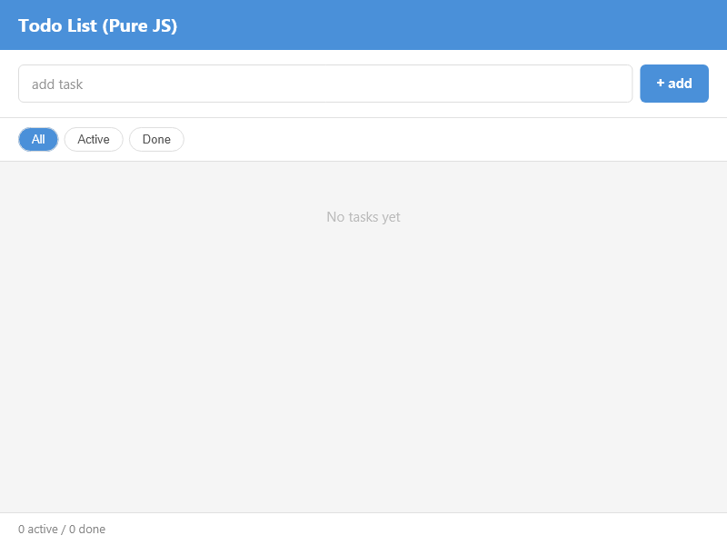
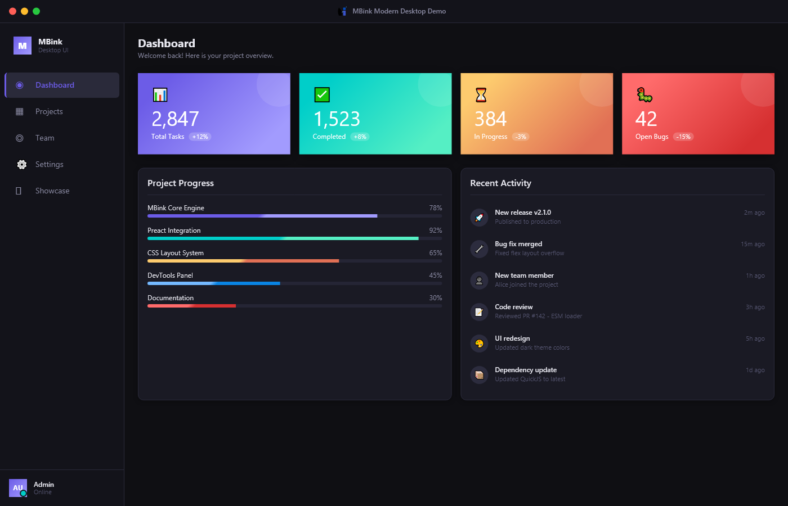
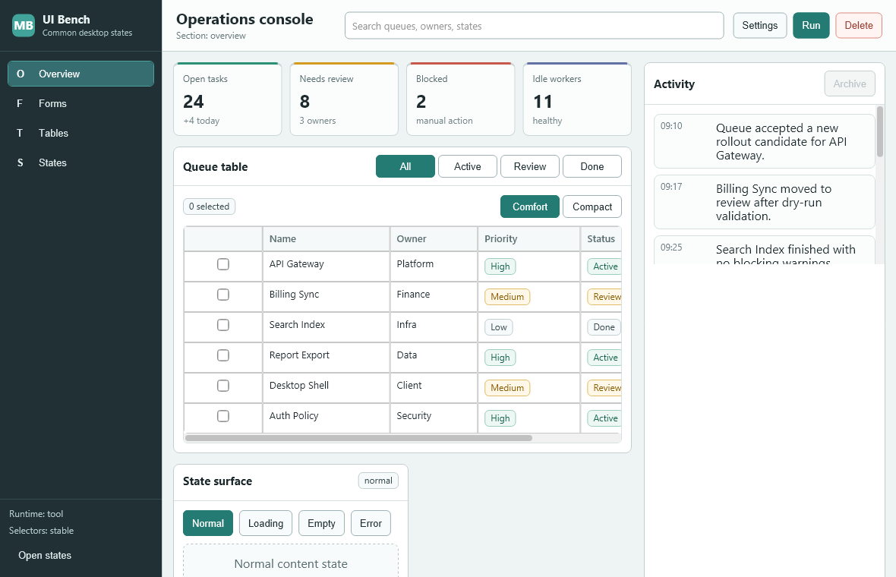
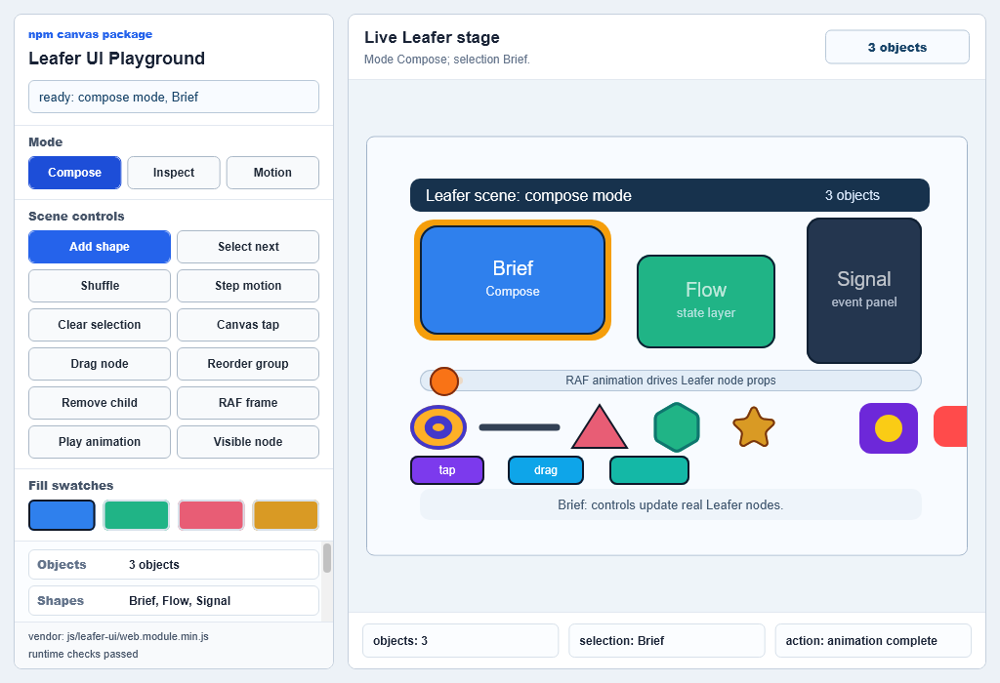
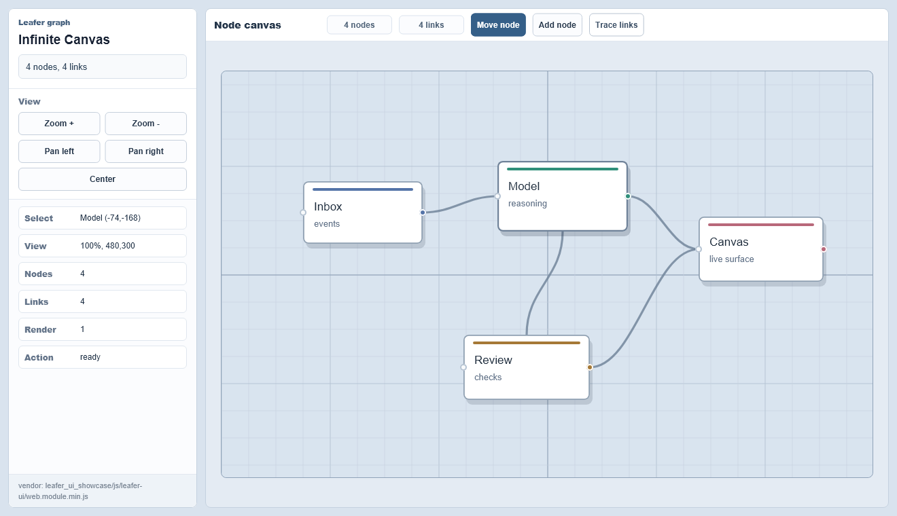
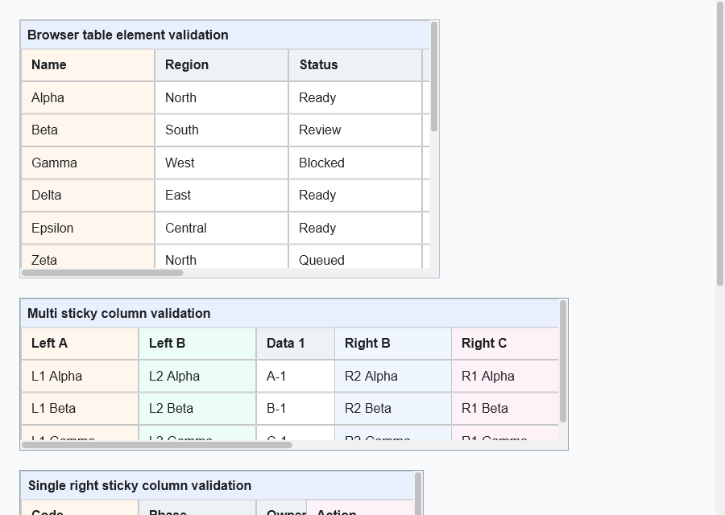
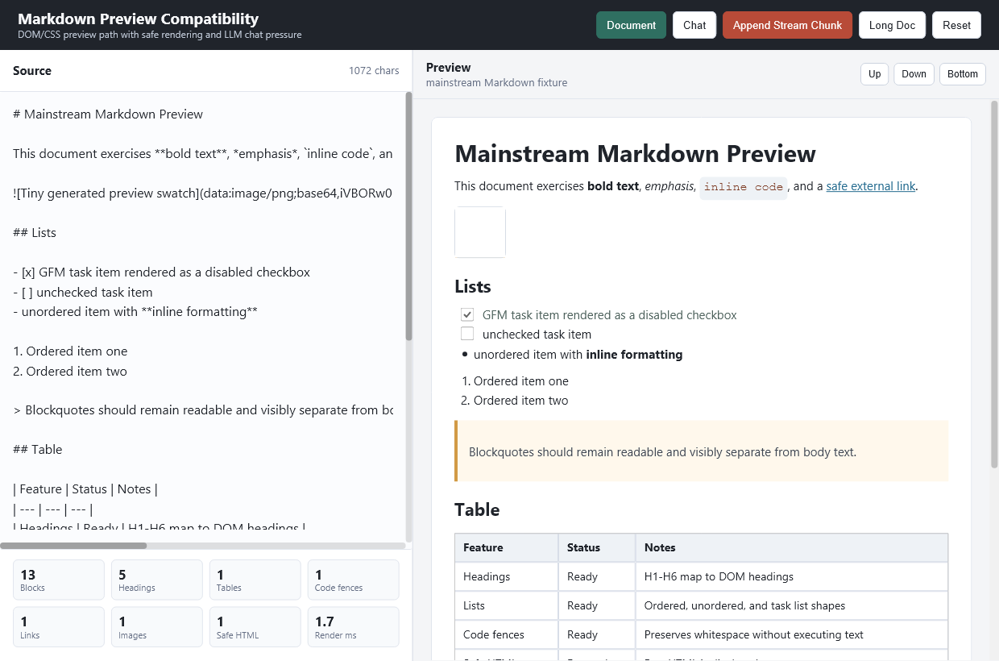

<p align="center">
  
</p>

# MBlink Desktop

English | [Chinese](README.zh-CN.md)

MBlink is a Windows-first desktop UI framework and tooling stack for building
small and medium desktop apps with a lightweight native runtime, modern JS UI,
and AI-friendly development workflows.

## What MBlink is

- A shared runtime centered on `mblink.dll`
- A thin manual runner in `esm_loader.exe`
- An AI-first development surface in `mblink-ui-dev.exe`
- Python, Rust, and Go host bindings built around the same C API contract

## What MBlink is not

- Not a complete browser
- Not a WebView wrapper
- Not a polished cross-platform release yet

MBlink is aimed at desktop apps that want a smaller, more controllable runtime
and a development loop that works well for both humans and AI agents.

## Current UI compatibility target

MBlink currently centers its JS UI compatibility around the lightweight official
Preact ESM path:

- `preact`
- `preact/hooks`
- `preact/jsx-runtime`
- `preact/jsx-dev-runtime`

Those modules are registered as embedded runtime modules, so the verified default
experience is based on direct ESM imports such as:

- `import { h, render } from 'preact'`
- `import { useState } from 'preact/hooks'`
- `import { jsx } from 'preact/jsx-runtime'`

Other framework layers may partly work, but they are not a supported compatibility
target yet. Do not assume full React support or compatibility with large
browser-oriented scaffolds unless the repository documents that with fresh
verification evidence.

## Planned Optional Runtime Capabilities

The following capabilities are planned as optional runtime work, not current
support promises:

- WebGL-backed canvas support through an optional native plugin, likely backed by
  ANGLE on Windows, so `canvas.getContext('webgl')` can return a real
  `WebGLRenderingContext` when the plugin is present and initialized.
- Basic 3D canvas validation on top of that WebGL path, starting with simple
  shader, buffer, texture, resize, repaint, `readPixels`, screenshot, and
  minimal three.js scene checks.
- HTML media element support, starting with `<video>` playback as an optional
  media runtime capability with explicit load, play, pause, seek, sizing,
  frame-present, audio, error, and cleanup verification.
- PDF document viewing as an optional runtime or plugin-backed capability,
  covering local file or byte input, page count, page rasterization, zoom,
  scroll, text/search hooks where feasible, errors, and cleanup.
- Markdown document rendering as a verified runtime/tooling path, covering
  headings, lists, links, images, code fences, tables, safe HTML handling,
  theme styling, and live reload or incremental preview behavior.

Until those features land with runtime tests and `mblink-ui-dev` screenshot or
pixel evidence, WebGL/WebGPU, audio/video media APIs, PDF viewing, and Markdown
rendering remain unsupported contracts. Projects should not rely on CSS or
app-side JavaScript shims to claim these features; missing APIs need runtime,
tooling, or optional-plugin implementation.

## Imports and package model

MBlink supports real ESM `import`-based UI code. The runtime and tooling can
handle:

- local relative imports inside your project
- the embedded official Preact modules above
- some simple third-party packages after bundling and runtime verification

What this does not mean:

- the UI runtime is not Node.js
- CommonJS (`require`, `module.exports`) is not the default path
- Node built-ins such as `fs`, `path`, `process`, and `Buffer` are not a
  supported UI contract
- large browser-oriented React scaffolds should not be assumed to work

For the current supported API surface, read [docs/SKILLS.md](docs/SKILLS.md),
[docs/AI_WORKFLOW.md](docs/AI_WORKFLOW.md), and the supported API references
those pages point to.

## Why it is interesting

- `mblink-ui-dev` gives you a practical loop for `open`, `build`, `snapshot`,
  `query`, `inspect`, `click`, and `serve`
- `mblink.dll` stays the core runtime surface across tools and bindings
- `esm_loader` gives you a direct manual lane for running a single entry file
  without hiding the DLL/runtime shape
- The repository already contains runnable examples for app shells, todo apps,
  log views, native controls, and desktop-style layouts

## What it looks like

The screenshots below were captured from real `mblink-ui-dev` sessions on
Windows.









## Quick Start

From the repository root on Windows:

```powershell
powershell -NoProfile -ExecutionPolicy Bypass -File .\scripts\download_deps.ps1 -NonInteractive
cmake -B build
cmake --build build --config Release --target mblink_ui_dev esm_loader -- /m:1
build\bin\Release\mblink-ui-dev.exe open --project "examples\todo_app_js"
build\bin\Release\mblink-ui-dev.exe snapshot --project "examples\todo_app_js"
build\bin\Release\mblink-ui-dev.exe snapshot --project "examples\todo_app_js" --response file --include-screenshot
```

The dependency bootstrap prepares QuickJS-ng and SDL3. The default native build
still requires prepared Skia Debug and Release libraries under the layout
documented in [docs/BUILD.md](docs/BUILD.md); the script reports that requirement
instead of pretending a fresh checkout can build Skia automatically.

What the runtime commands give you after a successful build:

- a real MBlink runtime window for `examples/todo_app_js`
- a structured UI snapshot you can inspect from the CLI
- an optional PNG screenshot written by the same runtime path when you add
  `--include-screenshot`

If you prefer the manual DLL-facing lane:

```powershell
build\bin\Release\esm_loader.exe examples\todo_app_js\app.js
```

Start with the full guide in [docs/QUICKSTART.md](docs/QUICKSTART.md).

## AI-First Workflow

MBlink is designed so an AI agent can work through the same development surface a
human uses:

- shell/CLI agents can drive `mblink-ui-dev.exe` directly
- MCP-capable clients can use `mblink-ui-dev.exe serve`
- direct C API hosts can expose live UI analysis through the optional
  `mblink_devtools.dll`

The repository ships a reusable skill at
[tools/mblink_ui_dev/skills/mblink-ui-dev/SKILL.md](tools/mblink_ui_dev/skills/mblink-ui-dev/SKILL.md).

Start with [docs/SKILLS.md](docs/SKILLS.md) for the skillbook layout and how to
use it with AI agents, then read [docs/AI_WORKFLOW.md](docs/AI_WORKFLOW.md) for
the recommended workflow.

## Manual Runtime Model

If you want to understand the project surface without the dev tooling layer,
start here:

- `mblink.dll`: the shared runtime
- `esm_loader.exe`: the thinnest manual host in this repository
- `mblink-ui-dev.exe`: project tooling, snapshots, build/watch, MCP, and
  inspection
- `mblink_devtools.dll`: optional development companion for UI snapshots,
  control, and runtime HTTP MCP

Read [docs/BINDINGS.md](docs/BINDINGS.md) and
[docs/C_API_RUNTIME_PARITY.md](docs/C_API_RUNTIME_PARITY.md) for the runtime
model.

## Example Apps

Good starting points in `examples/`:

- `todo_app_js`: smallest verified `mblink-ui-dev` example for quick checks
- `modern_desktop_demo`: desktop-style app shell and layout demo
- `terminal_logview_demo`: MBlink native terminal/logview elements
- `component_demo`: smaller UI component combinations
- `official_preact_jsx_dev`: a tracked reference for the official Preact ESM path

Read [examples/README.md](examples/README.md) for example smoke commands and
validation expectations.

## Project Status

MBlink is in an early but usable repository stage:

- Windows has the strongest build and runtime evidence
- the dev tooling and example workflow are more mature than the public packaging
  story
- Python, Rust, and Go bindings share the same runtime contract
- release readiness requires fresh Python, Rust, and Go binding checks
- Node.js is not a supported binding yet

The goal of this repository is not "ship a full browser." It is to make modern
desktop app development more efficient, lightweight, and inspectable.

## Project Reality

MBlink is primarily maintained as a personal project.

Because development time and testing capacity are limited, not every example,
platform, binding, framework combination, or edge case can be verified one by one
before public release.

That is why the public docs stay close to fresh, repository-local evidence and
keep steering readers toward the Windows-first, Preact-centered paths that have
actually been checked.

If a path is not clearly documented with current verification evidence, treat it
as experimental rather than promised support.

## Support the Author

If MBlink is useful to you, sponsorship helps fund more time for:

- more example and workflow testing
- better documentation and onboarding
- compatibility fixes
- tool and binding maintenance

For support or sponsorship inquiries, contact: 1801509469@qq.com.

## Open Source Acknowledgements

MBlink builds on and learns from open-source projects. In particular, thanks to:

- [Preact](https://github.com/preactjs/preact) for the lightweight ESM UI path
  used by many examples.
- [LeaferJS / leafer-ui](https://github.com/leaferjs/leafer-ui) for the canvas
  engine used by the Leafer showcase and infinite-canvas examples.
- [QuickJS-ng](https://github.com/quickjs-ng/quickjs),
  [SDL](https://github.com/libsdl-org/SDL), and
  [Skia](https://github.com/google/skia) for important runtime building blocks.

See [THIRD_PARTY_NOTICES.md](THIRD_PARTY_NOTICES.md) for tracked dependency and
license notes.

## Docs

- [docs/QUICKSTART.md](docs/QUICKSTART.md)
- [docs/AI_WORKFLOW.md](docs/AI_WORKFLOW.md)
- [docs/SKILLS.md](docs/SKILLS.md)
- [docs/BUILD.md](docs/BUILD.md)
- [docs/RELEASE.md](docs/RELEASE.md)
- [docs/BINDINGS.md](docs/BINDINGS.md)
- [docs/C_API_RUNTIME_PARITY.md](docs/C_API_RUNTIME_PARITY.md)
- [docs/BROWSER_COMPATIBILITY.md](docs/BROWSER_COMPATIBILITY.md)
- [examples/README.md](examples/README.md)
- [THIRD_PARTY_NOTICES.md](THIRD_PARTY_NOTICES.md)
- [docs/README.md](docs/README.md)

## Repository Layout

```text
core/        Runtime, DOM, layout, render, and public C API
tools/       mblink-ui-dev, esm_loader, and build tooling
bindings/    Python, Rust, and Go bindings
examples/    Runnable examples and validation targets
docs/        Project documentation
tests/       Test and regression assets
```

## Contributing

Start with [docs/CONTRIBUTING.md](docs/CONTRIBUTING.md).

If you use AI coding tools in this repository, the canonical automation and
contributor guidance lives in [AGENTS.md](AGENTS.md).

## License

MIT. See [LICENSE](LICENSE).
